# 四幺四(4A4)扑克游戏 - 后端与前端架构分析文档

> 所有流程图、时序图、架构图均使用 Mermaid 格式

---

## 目录

1. [整体架构概览](#1-整体架构概览)
2. [后端入口 server.py 详解](#2-后端入口-serverpy-详解)
3. [REST API 路由详解](#3-rest-api-路由详解)
4. [WebSocket 事件处理详解](#4-websocket-事件处理详解)
5. [游戏核心逻辑详解](#5-游戏核心逻辑详解)
6. [牌型系统详解](#6-牌型系统详解)
7. [房间与升级系统详解](#7-房间与升级系统详解)
8. [AI玩家系统详解](#8-ai玩家系统详解)
9. [前端完整流程详解](#9-前端完整流程详解)
10. [核心时序图](#10-核心时序图)
11. [数据流与状态同步](#11-数据流与状态同步)
12. [通信协议完整规范](#12-通信协议完整规范)

---

## 1. 整体架构概览

### 1.1 系统分层架构图

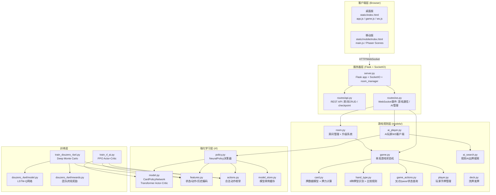

### 1.2 部署架构图

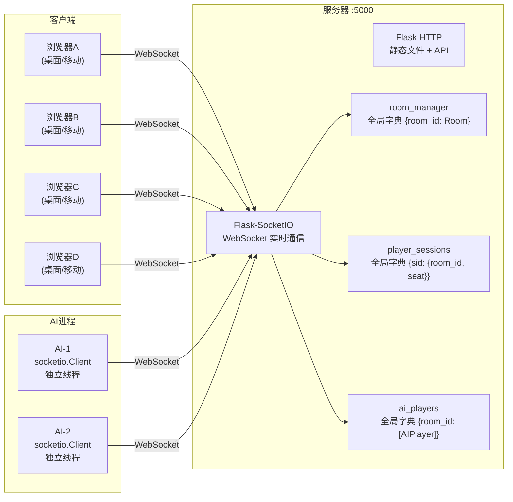

---

## 2. 后端入口 server.py 详解

### 2.1 入口函数流程图

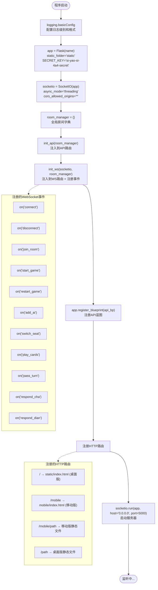

### 2.2 函数清单

| 函数 | 位置 | 签名 | 职责 |
|------|------|------|------|
| `main()` | server.py | `def main()` | 程序入口：创建Flask/SocketIO，注册路由，启动服务 |
| `init_ws(sio, rm)` | routes/ws.py | `def init_ws(sio, rm)` | 注入全局socketio和room_manager引用，调用register_events |
| `register_events(sio)` | routes/ws.py | `def register_events(sio)` | 注册所有WebSocket事件处理器 |
| `init_api(room_manager)` | routes/api.py | `def init_api(room_manager)` | 注入全局room_manager引用，注册API路由 |
| `broadcast_state(room_id)` | routes/ws.py | `def broadcast_state(room_id)` | 向房间内每个玩家发送其独立视角的游戏状态 |
| `broadcast_action(room_id, action_data)` | routes/ws.py | `def broadcast_action(room_id, action_data)` | 向房间内所有人广播游戏动作 |
| `_next_ai_name(room)` | routes/ws.py | `def _next_ai_name(room)` | 生成不重复的AI名字(AI-1, AI-2, ...) |
| `_add_ai_player(room_id, room, model_name)` | routes/ws.py | `def _add_ai_player(room_id, room, model_name='rule')` | 创建AIPlayer并连接到房间 |
| `_fill_ai_players(room_id, room, model_name)` | routes/ws.py | `def _fill_ai_players(room_id, room, model_name='rule')` | 用AI补满房间空位 |
| `_cleanup_ai_players(room_id)` | routes/ws.py | `def _cleanup_ai_players(room_id)` | 断开房间内所有AI玩家 |
| `_is_host(room, sid)` | routes/ws.py | `def _is_host(room, sid)` | 检查sid是否为房主 |
| `_do_start_game(room_id, room, restart)` | routes/ws.py | `def _do_start_game(room_id, room, restart=False)` | 实际开始游戏：创建新局、广播状态 |
| `_handle_post_play(room_id, room, result)` | routes/ws.py | `def _handle_post_play(room_id, room, result)` | 出牌后的处理：检查游戏结束、结算、广播 |
| `get_msg(code)` | routes/ws.py | `def get_msg(code)` | 将错误码映射为中文错误消息 |

### 2.3 全局状态

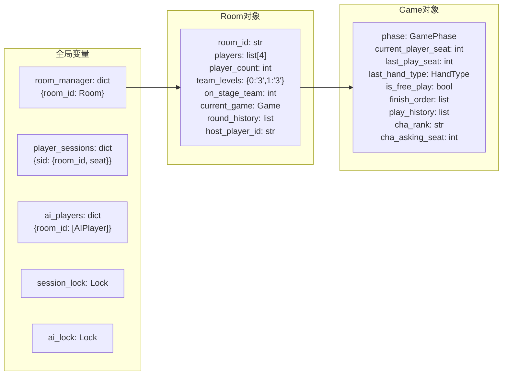

---

## 3. REST API 路由详解

### 3.1 API路由流程图

```mermaid
flowchart TD
    subgraph "GET /api/rooms"
        A1["接收请求"] --> A2["遍历 room_manager.values()"]
        A2 --> A3["对每个Room调用 get_room_state()"]
        A3 --> A4["返回 {rooms: [...], server_time: ...}"]
    end

    subgraph "POST /api/rooms"
        B1["接收请求"] --> B2["解析 room_id (可选)"]
        B2 --> B3{"room_id 已提供?"}
        B3 -->|是| B4["使用提供的 room_id"]
        B3 -->|否| B5["生成8位随机UUID"]
        B4 --> B6{"room_id 已存在?"}
        B5 --> B6
        B6 -->|是| B7["返回 400: {error: '房间已存在'}"]
        B6 -->|否| B8["room = Room(room_id)"]
        B8 --> B9["room_manager[room_id] = room"]
        B9 --> B10["返回 room.get_room_state()"]
    end

    subgraph "GET /api/checkpoints"
        C1["接收请求"] --> C2["扫描 checkpoints/ 目录"]
        C2 --> C3["过滤 .pt 和 .pth 文件"]
        C3 --> C4{"default_rl.pt 在列表中?"}
        C4 -->|否| C5["插入到列表首位"]
        C4 -->|是| C6["保持原顺序"]
        C5 --> C7["返回 {checkpoints: [文件名列表]}"]
        C6 --> C7
    end

    subgraph "GET /api/rooms/&lt;room_id&gt;"
        D1["接收请求"] --> D2{"room_id 在 room_manager 中?"}
        D2 -->|否| D3["返回 404: {error: '房间不存在'}"]
        D2 -->|是| D4["返回 room.get_room_state()"]
    end
```

### 3.2 函数清单

| 函数 | 位置 | 签名 | 职责 |
|------|------|------|------|
| `init_api(room_manager)` | routes/api.py | `def init_api(room_manager)` | 创建API Blueprint，注入room_manager引用 |
| `list_rooms()` | routes/api.py | `def list_rooms()` | GET /api/rooms - 列出所有房间及其状态 |
| `create_room()` | routes/api.py | `def create_room()` | POST /api/rooms - 创建新房间 |
| `get_room_detail(room_id)` | routes/api.py | `def get_room_detail(room_id)` | GET /api/rooms/<id> - 获取单个房间详情 |
| `list_checkpoints()` | routes/api.py | `def list_checkpoints()` | GET /api/checkpoints - 列出可用checkpoint文件 |

---

## 4. WebSocket 事件处理详解

### 4.1 连接/断开流程

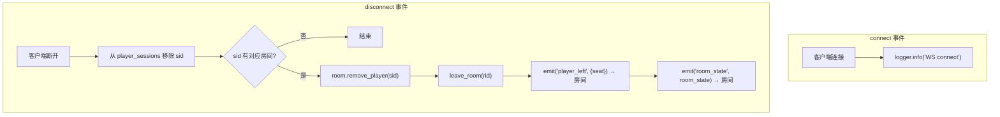

### 4.2 join_room 完整流程

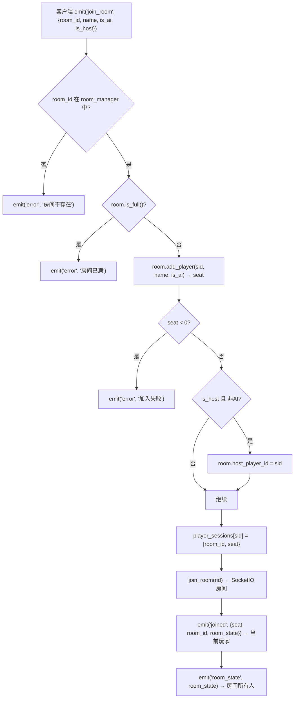

### 4.3 start_game 完整流程

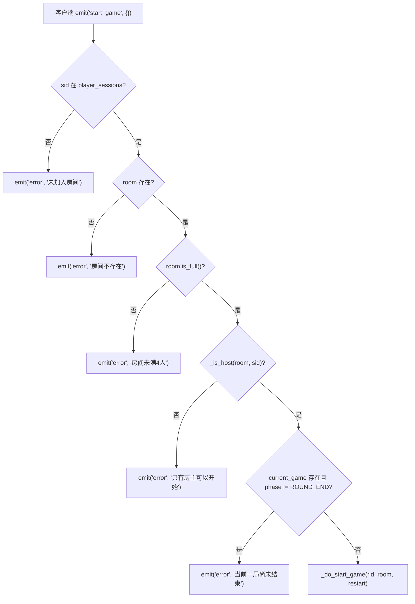

### 4.4 _do_start_game 详细流程

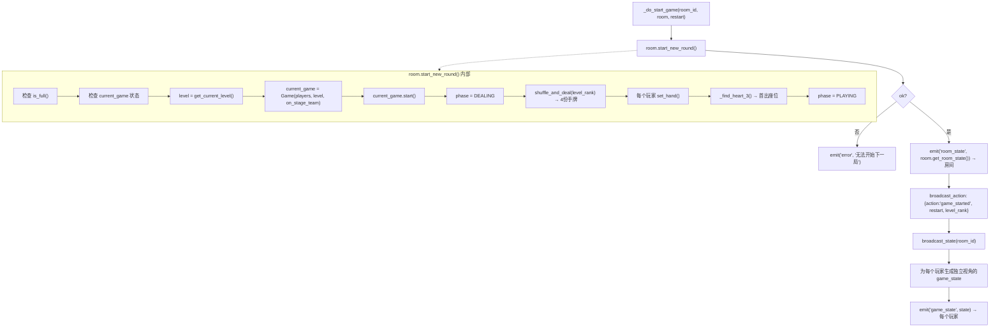

### 4.5 play_cards 完整流程

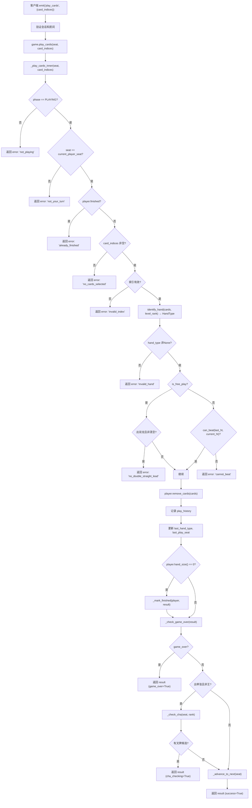

### 4.6 pass_turn 完整流程

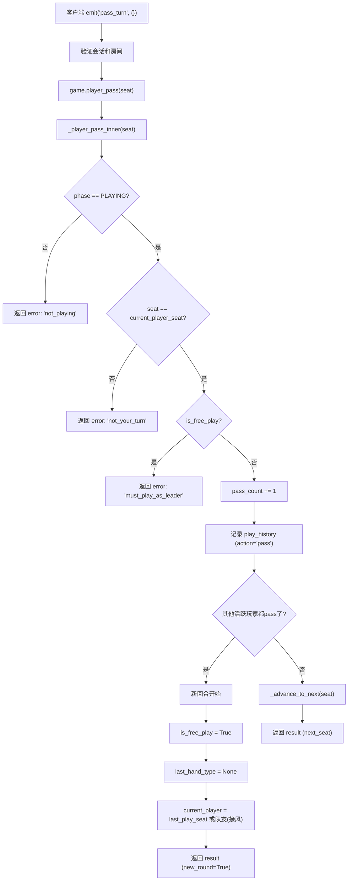

### 4.7 respond_cha 完整流程

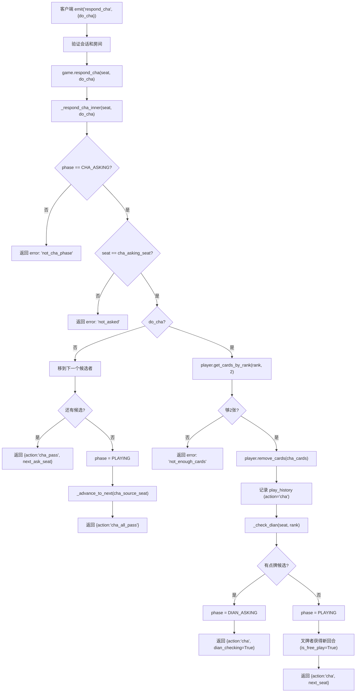

### 4.8 respond_dian 完整流程

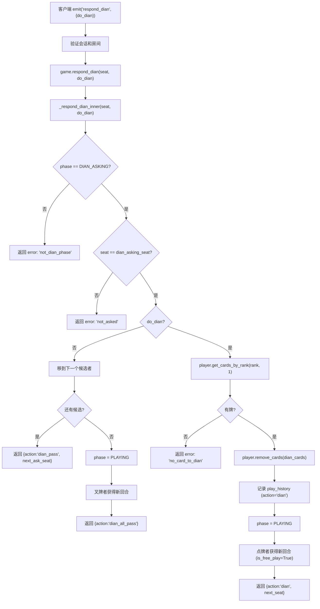

### 4.9 _handle_post_play 流程

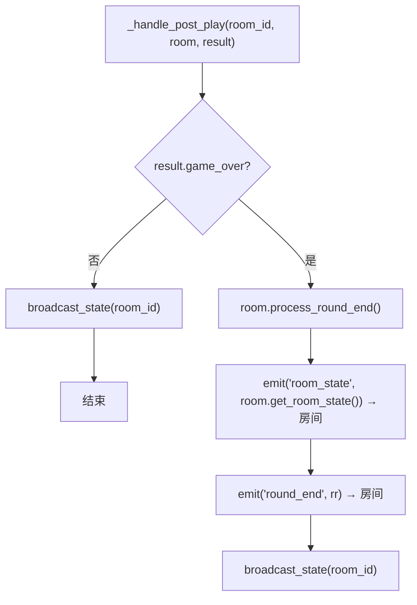

### 4.10 函数清单

| 函数 | 位置 | 签名 | 职责 |
|------|------|------|------|
| `on_connect()` | routes/ws.py | `def on_connect()` | WS连接事件：记录日志 |
| `on_disconnect()` | routes/ws.py | `def on_disconnect()` | WS断开事件：清理会话、移除玩家、广播 |
| `on_join_room(data)` | routes/ws.py | `def on_join_room(data)` | 加入房间：验证、分配座位、广播 |
| `on_start_game(data)` | routes/ws.py | `def on_start_game(data)` | 开始游戏：权限验证、调用_do_start_game |
| `on_restart_game(data)` | routes/ws.py | `def on_restart_game(data)` | 重新开始：权限验证、调用_do_start_game(restart=True) |
| `on_add_ai(data)` | routes/ws.py | `def on_add_ai(data)` | 添加AI：异步线程创建AIPlayer |
| `on_switch_seat(data)` | routes/ws.py | `def on_switch_seat(data)` | 换座：移动/交换玩家座位 |
| `on_play_cards(data)` | routes/ws.py | `def on_play_cards(data)` | 出牌：调用game.play_cards，广播结果 |
| `on_pass(data)` | routes/ws.py | `def on_pass(data)` | 不出：调用game.player_pass，广播 |
| `on_respond_cha(data)` | routes/ws.py | `def on_respond_cha(data)` | 回应叉牌：调用game.respond_cha |
| `on_respond_dian(data)` | routes/ws.py | `def on_respond_dian(data)` | 回应点牌：调用game.respond_dian |
| `broadcast_state(room_id)` | routes/ws.py | `def broadcast_state(room_id)` | 为每个玩家生成独立视角游戏状态并发送 |
| `broadcast_action(room_id, data)` | routes/ws.py | `def broadcast_action(room_id, data)` | 向房间广播游戏动作 |
| `_next_ai_name(room)` | routes/ws.py | `def _next_ai_name(room)` | 生成不重复AI名字 |
| `_add_ai_player(room_id, room, model_name)` | routes/ws.py | `def _add_ai_player(room_id, room, model_name='rule')` | 创建并连接AI玩家 |
| `_fill_ai_players(room_id, room, model_name)` | routes/ws.py | `def _fill_ai_players(room_id, room, model_name='rule')` | 用AI补满房间 |
| `_cleanup_ai_players(room_id)` | routes/ws.py | `def _cleanup_ai_players(room_id)` | 断开所有AI玩家 |
| `_is_host(room, sid)` | routes/ws.py | `def _is_host(room, sid)` | 检查是否是房主 |
| `_do_start_game(room_id, room, restart)` | routes/ws.py | `def _do_start_game(room_id, room, restart=False)` | 实际开始游戏逻辑 |
| `_handle_post_play(room_id, room, result)` | routes/ws.py | `def _handle_post_play(room_id, room, result)` | 出牌后处理：结算检查、广播 |
| `get_msg(code)` | routes/ws.py | `def get_msg(code)` | 错误码→中文消息映射 |

---

## 5. 游戏核心逻辑详解

### 5.1 游戏状态机

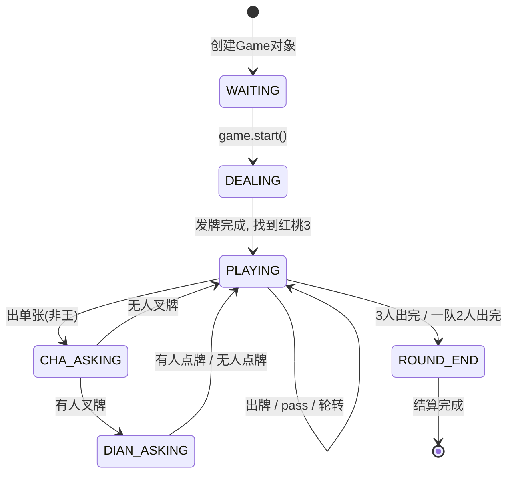

### 5.2 Game类核心函数详解

| 函数 | 签名 | 职责 | 关键逻辑 |
|------|------|------|---------|
| `__init__` | `def __init__(self, players, level_rank, on_stage_team)` | 初始化游戏状态 | 设置phase=WAITING，初始化所有状态变量 |
| `start()` | `def start(self)` | 开始游戏：发牌、确定首出 | 带锁：shuffle_and_deal → set_hand → _find_heart_3 → phase=PLAYING |
| `_find_heart_3()` | `def _find_heart_3(self)` | 找到持红桃3的玩家座位 | 遍历4个玩家手牌，匹配suit=HEART+rank='3' |
| `get_active_seats()` | `def get_active_seats(self)` | 获取所有未完成玩家的座位 | 过滤 finished=False 的玩家 |
| `_next_active_seat(cur)` | `def _next_active_seat(self, cur)` | 获取下一个活跃玩家座位 | 从cur顺时针轮询，跳过已完成的 |
| `_mark_finished(player, result)` | `def _mark_finished(self, player, result)` | 标记玩家完成 | 设置finished=True, finish_order, 更新finished_count |
| `_check_game_over(result)` | `def _check_game_over(self, result)` | 检查游戏是否结束 | 一队≥2人完成→胜；3人完成→最后完成者胜 |
| `play_cards(seat, indices)` | `def play_cards(self, seat, card_indices)` | 出牌（带锁） | 加锁后调用_play_cards_inner |
| `_play_cards_inner(seat, indices)` | `def _play_cards_inner(self, seat, card_indices)` | 出牌核心逻辑 | 验证→识别牌型→出牌→叉检查→轮转 |
| `_advance_to_next(cur_seat)` | `def _advance_to_next(self, cur_seat)` | 推进到下一个出牌者 | 普通轮转 + 接风逻辑（队友优先） |
| `_set_free_play_after_finished_or_self(seat)` | `def _set_free_play_after_finished_or_self(self, seat)` | 叉/点后设置出牌权 | 若seat已完成则转给队友，否则seat自己出牌 |
| `_check_cha(source_seat, rank)` | `def _check_cha(self, source_seat, rank)` | 检查叉牌触发条件 | 顺时针寻找持有对子的玩家→phase=CHA_ASKING |
| `respond_cha(seat, do_cha)` | `def respond_cha(self, seat, do_cha)` | 回应叉牌（带锁） | 加锁后调用_respond_cha_inner |
| `_respond_cha_inner(seat, do_cha)` | `def _respond_cha_inner(self, seat, do_cha)` | 叉牌回应核心逻辑 | 叉牌→出牌→检查点牌；不叉→下一个候选 |
| `_check_dian(cha_seat, rank)` | `def _check_dian(self, cha_seat, rank)` | 检查点牌触发条件 | 顺时针寻找持有单张的玩家→phase=DIAN_ASKING |
| `respond_dian(seat, do_dian)` | `def respond_dian(self, seat, do_dian)` | 回应点牌（带锁） | 加锁后调用_respond_dian_inner |
| `_respond_dian_inner(seat, do_dian)` | `def _respond_dian_inner(self, seat, do_dian)` | 点牌回应核心逻辑 | 点牌→出牌→新回合；不点→下一个候选 |
| `player_pass(seat)` | `def player_pass(self, seat)` | 不出（带锁） | 加锁后调用_player_pass_inner |
| `_player_pass_inner(seat)` | `def _player_pass_inner(self, seat)` | 不出核心逻辑 | 验证→pass_count++→检查是否新回合 |
| `get_state(for_seat)` | `def get_state(self, for_seat=-1)` | 获取游戏状态 | 为指定玩家生成独立视角（隐藏他人手牌） |
| `get_round_result()` | `def get_round_result(self)` | 获取结算结果 | 计算两队名次、全洞/半洞判定 |

### 5.3 接风逻辑流程图

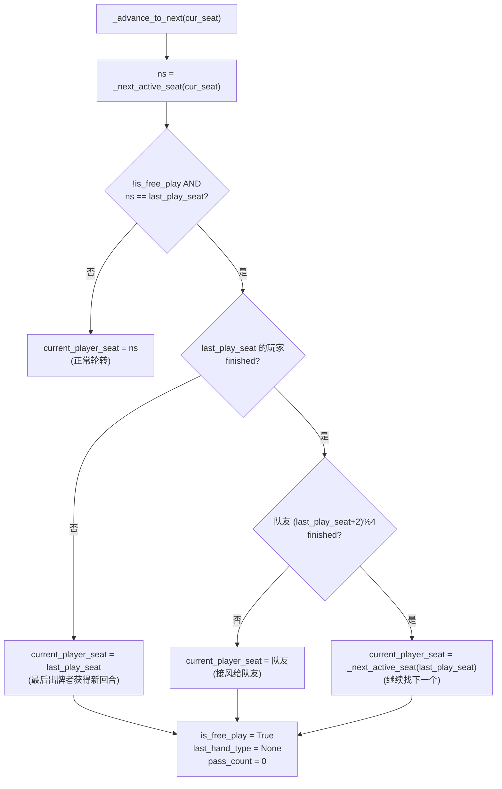

### 5.4 叉/点候选检查流程

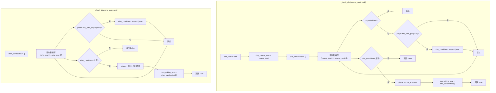

---

## 6. 牌型系统详解

### 6.1 牌型类别与等级

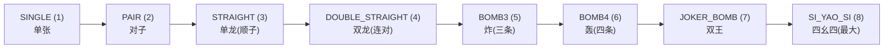

### 6.2 牌型识别流程

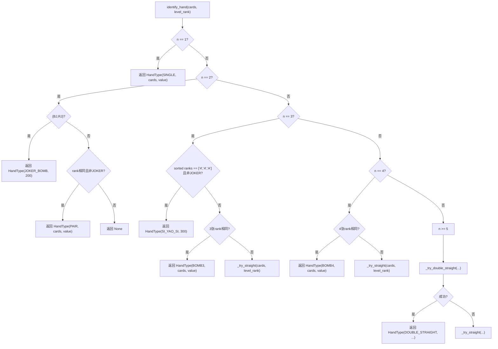

### 6.3 can_beat 比较规则

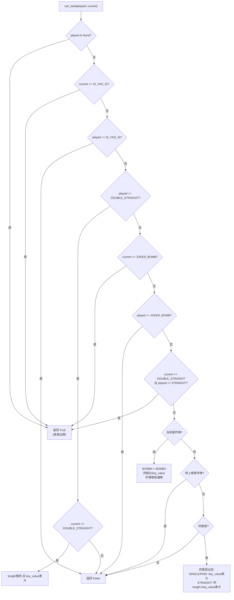

### 6.4 函数清单

| 函数 | 位置 | 签名 | 职责 |
|------|------|------|------|
| `identify_hand(cards, level_rank)` | hand_type.py | `def identify_hand(cards, level_rank)` | 识别牌型：返回HandType或None |
| `_try_straight(cards, level_rank)` | hand_type.py | `def _try_straight(cards, level_rank)` | 尝试识别单龙：检查连续、无2/王/级牌 |
| `_try_double_straight(cards, level_rank)` | hand_type.py | `def _try_double_straight(cards, level_rank)` | 尝试识别双龙：每点数恰好2张，连续 |
| `can_beat(played, current)` | hand_type.py | `def can_beat(played, current)` | 判断current能否管住played |
| `is_bomb_type(category)` | hand_type.py | `def is_bomb_type(category)` | 判断是否为炸弹类型 |
| `_get_straight_index(rank)` | hand_type.py | `def _get_straight_index(rank)` | 获取点数在顺子序列中的索引 |

---

## 7. 房间与升级系统详解

### 7.1 升级系统状态机

```mermaid
stateDiagram-v2
    [*] --> 3: 初始
    3 --> 4: 半洞/全洞
    3 --> 3: 直J(从J降级)
    4 --> 5: 半洞/全洞
    5 --> 6: 半洞/全洞
    6 --> 7: 半洞/全洞
    7 --> 8: 半洞/全洞
    8 --> 9: 半洞/全洞
    9 --> 10: 半洞/全洞
    10 --> J: 半洞/全洞
    J --> Q: 全洞(必须)
    J --> 3: 输(直J)
    Q --> K: 半洞/全洞
    K --> A: 半洞/全洞
    A --> [*]: 全洞(必须, 胜利)
    A --> J: 输(直A)
```

### 7.2 process_round_end 流程

```mermaid
flowchart TD
    PRE["room.process_round_end()"] --> C1{"current_game 存在?"}
    C1 -->|否| RET_NULL["返回 None"]
    C1 -->|是| C2{"phase == ROUND_END?"}
    C2 -->|否| RET_NULL
    C2 -->|是| RR["rr = game.get_round_result()"]
    RR --> STORE["round_history.append(rr)"]
    STORE --> INIT["winner_team = -1, upgrade = 0"]
    INIT --> TEAM_LOOP["遍历 team in [0,1]"]
    TEAM_LOOP --> TR{"team_result?"}
    TR -->|quan_dong| QD["winner_team = team<br/>upgrade = 2"]
    TR -->|ban_dong| BD["winner_team = team<br/>upgrade = 1"]
    TR -->|lose| SKIP["跳过"]
    QD --> SPECIAL{"current_level 在 MUST_QUAN_DONG?"}
    BD --> SPECIAL
    SPECIAL -->|是 且 upgrade<2| ZERO["upgrade = 0"]
    SPECIAL -->|否| ADV["_advance_level(current_level, upgrade)"]
    ZERO --> STAGE
    ADV --> UPDATE["team_levels[winner_team] = new_level"]
    UPDATE --> STAGE{"winner_team != on_stage_team?"}
    STAGE -->|是| ZHICHECK{"台上队原等级?"}
    ZHICHECK -->|J| ZHIJ["直J: 台上队降为3"]
    ZHICHECK -->|A| ZHIA["直A: 台上队降为J"]
    ZHICHECK -->|其他| NORMAL["正常切换"]
    ZHIJ --> SWITCH["on_stage_team = winner_team<br/>stage_change = True"]
    ZHIA --> SWITCH
    NORMAL --> SWITCH
    STAGE -->|否| SKIP2["stage_change = False"]
    SWITCH --> RETURN["返回结算结果"]
    SKIP2 --> RETURN
```

### 7.3 函数清单

| 函数 | 位置 | 签名 | 职责 |
|------|------|------|------|
| `__init__(room_id)` | room.py | `def __init__(self, room_id)` | 初始化房间：4个空位、初始级别3、台上队伍0 |
| `add_player(player_id, name, is_ai)` | room.py | `def add_player(self, player_id, name, is_ai=False)` | 添加玩家到空位，返回座位号 |
| `remove_player(player_id)` | room.py | `def remove_player(self, player_id)` | 移除玩家，自动转移房主 |
| `get_player_by_id(player_id)` | room.py | `def get_player_by_id(self, player_id)` | 按player_id查找玩家 |
| `get_seat_by_id(player_id)` | room.py | `def get_seat_by_id(self, player_id)` | 按player_id查找座位 |
| `move_player(player_id, target_seat)` | room.py | `def move_player(self, player_id, target_seat)` | 移动/交换玩家座位 |
| `is_full()` | room.py | `def is_full(self)` | 检查是否满4人 |
| `get_current_level()` | room.py | `def get_current_level(self)` | 获取台上队伍当前级牌 |
| `start_new_round()` | room.py | `def start_new_round(self)` | 创建新Game对象并开始 |
| `process_round_end()` | room.py | `def process_round_end(self)` | 处理结算：升级、台上台下切换、直J/直A |
| `_advance_level(current, steps)` | room.py | `def _advance_level(self, current, steps)` | 按级别顺序前进 |
| `get_room_state()` | room.py | `def get_room_state(self)` | 返回房间状态字典 |

---

## 8. AI玩家系统详解

### 8.1 AI玩家完整生命周期

```mermaid
sequenceDiagram
    participant Server as 服务器 (ws.py)
    participant AI as AIPlayer
    participant Policy as NeuralPolicy
    participant Store as ModelStore
    participant Model as CardPolicyNetwork
    participant Game as Game模型

    Server->>AI: _add_ai_player() 创建 AIPlayer(name, model_name)
    AI->>AI: init(): _setup_handlers(), policy=None
    Server->>AI: bot.connect_and_join(room_id)
    AI->>Server: sio.connect(server_url)
    Server-->>AI: on_connect() → connected=True
    AI->>Server: emit('join_room', {room_id, name, is_ai:True})
    Server-->>AI: on_joined({seat, room_id}) → seat=分配座位
    AI->>AI: 等待 seat >= 0 (最多50次×0.05s)

    Note over Server,AI: 游戏开始

    Server->>AI: on_game_action({action:'game_started', level_rank})
    AI->>AI: level_rank = data.level_rank

    Server->>AI: on_game_state(state)
    AI->>AI: _handle_game_state(state)
    AI->>AI: 更新 hand, level_rank
    AI->>AI: 检查 phase

    alt phase == 'cha_asking' 且 轮到自己
        AI->>AI: Timer(0.5s) → _decide_cha()
        AI->>AI: _should_cha(): 手牌≤2必叉<br/>叉队友且队友手牌≤2则不叉
        AI->>Server: emit('respond_cha', {do_cha: True/False})
    else phase == 'dian_asking' 且 轮到自己
        AI->>AI: Timer(0.5s) → _decide_dian()
        AI->>AI: _should_dian(): 手牌≤2必点<br/>点队友且队友手牌≤2则不点
        AI->>Server: emit('respond_dian', {do_dian: True/False})
    else phase == 'playing' 且 轮到自己
        AI->>AI: Timer(0.5s) → _decide_play()
        AI->>AI: _do_decide_play()
        AI->>AI: _choose_play_with_model(last_ht, is_free)

        alt model_name in ('rule', 'heuristic', '')
            AI->>AI: _find_free_play() 或 _find_beat_play()
        else 强化AI
            AI->>AI: 创建 fallback() 闭包（规则AI作为回退）
            AI->>Policy: NeuralPolicy(model_name).choose_play(...)
            Policy->>Store: get_shared_model(model_name)
            Store->>Store: resolve_model_path() → 权重路径
            Store->>Store: 检查缓存 _model_cache
            alt 缓存命中
                Store-->>Policy: 返回缓存的 model
            else 缓存未命中
                Store->>Model: CardPolicyNetwork() 创建新模型
                Store->>Model: load_state_dict() 加载权重
                Store->>Model: model.eval()
                Store->>Store: 存入 _model_cache
                Store-->>Policy: 返回 model
            end
            Policy->>Policy: enumerate_legal_actions()
            Policy->>Policy: encode_state() → [160]
            Policy->>Policy: encode_history() → [40,64]
            Policy->>Policy: encode_action() × N → [N,48]
            Policy->>Model: forward(state, actions, history)
            Model-->>Policy: scores [N]
            Policy->>Policy: argmax(scores) → 选择动作
            alt 推理成功
                Policy-->>AI: 返回 card_indices 或 None
            else 推理失败
                Policy-->>AI: fallback() → 规则AI结果
            end
        end

        alt 有出牌
            AI->>Server: emit('play_cards', {card_indices})
        else 无出牌
            AI->>Server: emit('pass_turn', {})
        end
    end

    Note over Server,AI: 房间销毁
    Server->>AI: _cleanup_ai_players(room_id)
    AI->>AI: disconnect()
```

### 8.2 AI出牌搜索策略

```mermaid
flowchart TD
    subgraph FREE_PLAY["_find_free_play() - 自由出牌"]
        F1["优先找最长单龙"] --> F2{"找到?"}
        F2 -->|是| F3["返回最长的单龙牌组"]
        F2 -->|否| F4["尝试双龙清空"]
        F4 --> F5{"手牌可组成双龙清空?"}
        F5 -->|是| F6["返回双龙牌组"]
        F5 -->|否| F7["出最小单张"]
        F7 --> F8["返回 [len(hand)-1]"]
    end

    subgraph BEAT_PLAY["_find_beat_play(last_ht) - 跟牌"]
        B1{"上家出单龙?"}
        B1 -->|是| B2["优先找双龙管"]
        B2 --> B3{"找到?"}
        B3 -->|是| B4["返回双龙牌组"]
        B3 -->|否| B5["找同类型跟牌"]
        B1 -->|否| B5
        B5 --> B6{"找到?"}
        B6 -->|是| B7["返回同类型牌组"]
        B6 -->|否| B8{"上家非炸弹/非双龙?"}
        B8 -->|是| B9["找炸弹管"]
        B9 --> B10{"找到?"}
        B10 -->|是| B11["返回炸弹牌组"]
        B10 -->|否| B12["返回 None (pass)"]
        B8 -->|否| B13{"上家是炸弹?"}
        B13 -->|是| B14["找更大的炸弹"]
        B14 --> B15{"找到?"}
        B15 -->|是| B16["返回炸弹牌组"]
        B15 -->|否| B12
    end
```

### 8.3 函数清单

| 函数 | 位置 | 签名 | 职责 |
|------|------|------|------|
| `__init__(name, server_url, model_name)` | ai_player.py | `def __init__(self, name, server_url='http://localhost:5000', model_name='rule')` | 初始化AI：创建socketio.Client，注册事件 |
| `_setup_handlers()` | ai_player.py | `def _setup_handlers(self)` | 注册WS事件处理器：connect/disconnect/joined/error/room_state/game_state/game_action/round_end |
| `connect_and_join(room_id)` | ai_player.py | `def connect_and_join(self, room_id)` | 连接服务器并加入房间，等待座位分配 |
| `disconnect()` | ai_player.py | `def disconnect(self)` | 断开WebSocket连接 |
| `_handle_game_state(state)` | ai_player.py | `def _handle_game_state(self, state)` | 处理游戏状态：更新手牌，延迟决策 |
| `_decide_play()` | ai_player.py | `def _decide_play(self)` | 决策出牌：异常保护 |
| `_do_decide_play()` | ai_player.py | `def _do_decide_play(self)` | 实际出牌决策：自由出牌/跟牌 |
| `_choose_play_with_model(last_ht, is_free)` | ai_player.py | `def _choose_play_with_model(self, last_ht, is_free)` | 选择AI策略：rule→规则AI；其他→NeuralPolicy→失败回退规则AI |
| `_decide_cha()` | ai_player.py | `def _decide_cha(self)` | 叉牌决策：手牌≤2张必叉，若叉队友且队友手牌≤2则不叉 |
| `_decide_dian()` | ai_player.py | `def _decide_dian(self)` | 点牌决策：手牌≤2张必点，若点队友且队友手牌≤2则不点 |
| `_should_cha()` | ai_player.py | `def _should_cha(self)` | 叉牌判断：手牌≤2张必叉；若叉的是队友且队友手牌≤2则不叉 |
| `_should_dian()` | ai_player.py | `def _should_dian(self)` | 点牌判断：手牌≤2张必点；若点的是队友且队友手牌≤2则不点 |
| `_player_hand_size(seat)` | ai_player.py | `def _player_hand_size(self, seat)` | 获取指定座位的玩家手牌数 |
| `_same_team(seat)` | ai_player.py | `def _same_team(self, seat)` | 判断指定座位是否与自己是队友 |
| `_find_free_play()` | ai_search.py | `def _find_free_play(self)` | 自由出牌搜索：单龙→双龙清空→最小单张 |
| `_find_beat_play(last_ht)` | ai_search.py | `def _find_beat_play(self, last_ht)` | 跟牌搜索：双龙管单龙→同类型→炸弹 |
| `_find_double_straight_for_straight(last_ht)` | ai_search.py | `def _find_double_straight_for_straight(self, last_ht)` | 找双龙管单龙 |
| `_find_same_type(cat, last_ht)` | ai_search.py | `def _find_same_type(self, cat, last_ht)` | 找同类型最小能管住组合 |
| `_find_bomb(last_ht)` | ai_search.py | `def _find_bomb(self, last_ht)` | 找能管住的炸弹 |
| `_group_by_rank()` | ai_search.py | `def _group_by_rank(self)` | 按点数分组手牌索引 |
| `_get_pairs()` | ai_search.py | `def _get_pairs(self)` | 获取所有对子索引 |
| `_get_n_kind(n)` | ai_search.py | `def _get_n_kind(self, n)` | 获取所有n张同点数索引 |
| `_get_joker_bomb()` | ai_search.py | `def _get_joker_bomb(self)` | 获取双王索引 |
| `_get_si_yao_si()` | ai_search.py | `def _get_si_yao_si(self)` | 获取四幺四索引 |
| `_get_straights(length)` | ai_search.py | `def _get_straights(self, length)` | 获取所有指定长度单龙索引 |
| `_get_dbl_straights(pair_count)` | ai_search.py | `def _get_dbl_straights(self, pair_count)` | 获取所有指定对数双龙索引 |
| `card_from_dict(d)` | ai_player.py | `def card_from_dict(d)` | 从字典还原Card对象 |
| `_reconstruct_ht(data)` | ai_search.py | `def _reconstruct_ht(data)` | 从字典还原HandType对象 |

### 8.4 强化学习推理模块

| 函数 | 位置 | 签名 | 职责 |
|------|------|------|------|
| `NeuralPolicy.__init__` | rl/policy.py | `def __init__(self, model_name='default_rl')` | 初始化策略：加载共用模型单例 |
| `NeuralPolicy.choose_play` | rl/policy.py | `def choose_play(self, state, hand, level_rank, seat, last_ht, is_free_play, fallback_fn)` | 选择出牌：编码→推理→argmax→返回牌索引；失败时调用fallback_fn |
| `enumerate_legal_actions` | rl/actions.py | `def enumerate_legal_actions(hand, level_rank, last_ht, is_free_play)` | 枚举所有合法动作（含pass） |
| `encode_state` | rl/features.py | `def encode_state(state, hand, level_rank, seat)` | 编码当前游戏状态为 [160] 向量 |
| `encode_action` | rl/features.py | `def encode_action(action, hand, level_rank)` | 编码单个候选动作为 [48] 向量 |
| `encode_history` | rl/features.py | `def encode_history(state, seat)` | 编码出牌历史为 [40, 64] 矩阵 |
| `get_shared_model` | rl/model_store.py | `def get_shared_model(model_name='default_rl')` | 获取共享模型实例：线程安全，同路径只加载一次 |
| `resolve_model_path` | rl/model_store.py | `def resolve_model_path(model_name=None)` | 解析模型名称到权重文件路径；空名称/rule/heuristic 返回None |
| `clear_model_cache` | rl/model_store.py | `def clear_model_cache()` | 手动清空模型缓存（训练/调试时使用） |
| `cached_model_count` | rl/model_store.py | `def cached_model_count()` | 返回当前进程内已加载模型数量 |

---

## 9. 前端完整流程详解

### 9.1 移动版前端架构

```mermaid
graph TB
    subgraph ENTRY["main.js 入口"]
        M1["检测URL参数 ?room=xxx"]
        M2["wsManager.connect()"]
        M3["new Phaser.Game(config)"]
    end

    subgraph SCENES["三个场景"]
        LOBBY["LobbyScene<br/>大厅"]
        WAIT["WaitingScene<br/>等待室"]
        GAME["GameScene<br/>游戏"]
    end

    subgraph COMPONENTS["组件"]
        CARD["Card.js<br/>牌的渲染"]
        PZ["PlayZone.js<br/>出牌区"]
        PL["Player.js<br/>玩家区"]
    end

    subgraph UTILS["工具"]
        WS["ws.js<br/>WebSocket管理器"]
        LAYOUT["layout.js<br/>自适应布局"]
        UI["ui.js<br/>UI工具"]
        LOG["logger.js<br/>日志"]
        SHARE["share.js<br/>分享"]
    end

    ENTRY --> SCENES
    GAME --> COMPONENTS
    SCENES --> UTILS
```

### 9.2 移动版场景生命周期

```mermaid
flowchart TD
    START([Phaser启动]) --> LOBBY_CREATE["LobbyScene.create()"]
    LOBBY_CREATE --> L1["drawUI(): 昵称输入、房间号输入"]
    L1 --> L2["检测分享链接自动加入"]
    L2 --> L3["点击'创建/加入牌桌'"]
    L3 --> L4["POST /api/rooms 或 wsManager.send('join_room')"]
    L4 --> L5{"收到 'joined' 事件"}
    L5 -->|否| L6["显示错误提示"]
    L5 -->|是| L7["scene.start('WaitingScene', {roomId, seat, roomState})"]

    L7 --> WAIT_CREATE["WaitingScene.create()"]
    WAIT_CREATE --> W1["drawUI(): 座位、信息栏、操作按钮"]
    W1 --> W2["loadCheckpoints(): GET /api/checkpoints"]
    W2 --> W3["setupWebSocketHandlers()"]
    W3 --> W4["用户操作: 添加AI / 切换AI模式 / 换座 / 开始"]
    W4 --> W5{"收到 game_action('game_started')"}
    W5 -->|否| W4
    W5 -->|是| W6["等待第一个 game_state"]
    W6 --> W7["scene.start('GameScene', {roomId, seat, levelRank, initialGameState})"]

    W7 --> GAME_CREATE["GameScene.create()"]
    GAME_CREATE --> G1["drawTable(): 绘制牌桌"]
    G1 --> G2["createPlayers(): 4个玩家区域"]
    G2 --> G3["createHandDock(): 手牌区"]
    G3 --> G4["bindSocket(): 绑定WS事件"]
    G4 --> G5["游戏循环"]
    G5 --> G6{"收到 'game_state'"}
    G6 -->|是| G7["updateGameState(state)"]
    G7 --> G8["渲染手牌、出牌区、按钮状态"]
    G8 --> G9["处理叉/点弹窗"]
    G9 --> G5
    G6 -->|收到 'round_end'| G10["handleRoundEnd(data)"]
    G10 --> G11["显示结算面板"]
```

### 9.3 桌面版前端流程

```mermaid
flowchart TD
    START([页面加载]) --> WS["ws.connect()"]
    WS --> REG["注册事件处理器"]
    REG --> LOBBY["大厅界面"]
    LOBBY --> INPUT["输入昵称 + 房间号"]
    INPUT --> CLICK["点击'加入/创建房间'"]
    CLICK --> C1{"有房间号?"}
    C1 -->|是| C2["ws.send('join_room', {room_id, name})"]
    C1 -->|否| C3["POST /api/rooms → 获取room_id"]
    C3 --> C4["ws.send('join_room', {room_id, name})"]
    C2 --> WAIT_JOINED
    C4 --> WAIT_JOINED["等待 'joined' 事件"]
    WAIT_JOINED --> WAITING["切换等待室界面"]
    WAITING --> W_ACT["操作: 添加AI / 加载checkpoint / 开始 / 换座"]
    W_ACT --> WAIT_START["等待 'game_started'"]
    WAIT_START --> GAME["切换游戏界面"]
    GAME --> G_LOOP["游戏循环"]
    G_LOOP --> G_STATE["收到 'game_state' → renderGameState()"]
    G_STATE --> G_ACT["用户操作: 选牌/出牌/pass/叉/点"]
    G_ACT --> G_LOOP
    G_LOOP --> G_END["收到 'round_end' → showResult()"]
```

### 9.4 前端函数清单

| 函数 | 位置 | 签名 | 职责 |
|------|------|------|------|
| `showScreen(name)` | app.js | `function showScreen(name)` | 切换大厅/等待/游戏界面 |
| `loadCheckpoints()` | app.js | `function loadCheckpoints()` | 加载checkpoint列表到下拉框 |
| `renderGameState(state)` | game.js | `function renderGameState(state)` | 渲染游戏画面：手牌、出牌区、按钮 |
| `showResult(data)` | game.js | `function showResult(data)` | 显示结算弹窗 |
| `addLog(msg, cls)` | game.js | `function addLog(msg, cls)` | 添加游戏日志 |
| `ws.connect()` | ws.js | `function connect()` | 建立WebSocket连接 |
| `ws.send(event, data)` | ws.js | `function send(event, data)` | 发送WebSocket事件 |
| `ws.on(event, handler)` | ws.js | `function on(event, handler)` | 注册事件处理器 |
| `ws.off(event, handler)` | ws.js | `function off(event, handler)` | 移除事件处理器 |
| `LobbyScene.create()` | LobbyScene.js | `create()` | 大厅场景创建：绘制UI、绑定事件 |
| `WaitingScene.create()` | WaitingScene.js | `create()` | 等待室创建：座位、操作按钮、WS绑定 |
| `WaitingScene.updateRoomState(data)` | WaitingScene.js | `updateRoomState(data)` | 更新房间状态UI |
| `WaitingScene.addAI()` | WaitingScene.js | `addAI()` | 发送添加AI请求 |
| `WaitingScene.startGame()` | WaitingScene.js | `startGame()` | 发送开始游戏请求 |
| `WaitingScene.switchSeat(seat)` | WaitingScene.js | `switchSeat(seat)` | 发送换座请求 |
| `WaitingScene.loadCheckpoints()` | WaitingScene.js | `loadCheckpoints()` | 加载checkpoint列表 |
| `WaitingScene.setupWebSocketHandlers()` | WaitingScene.js | `setupWebSocketHandlers()` | 注册WS事件处理器 |
| `GameScene.create()` | GameScene.js | `create()` | 游戏场景创建：牌桌、玩家、手牌、WS绑定 |
| `GameScene.updateGameState(st)` | GameScene.js | `updateGameState(st)` | 更新游戏状态渲染 |
| `GameScene.handleGameAction(data)` | GameScene.js | `handleGameAction(data)` | 处理游戏动作 |
| `GameScene.handleRoundEnd(data)` | GameScene.js | `handleRoundEnd(data)` | 处理结算 |
| `Card.toFront()` | Card.js | `toFront()` | 牌选中状态：上浮 |
| `Card.toBack()` | Card.js | `toBack()` | 牌取消选中：归位 |
| `Card.toggle()` | Card.js | `toggle()` | 切换牌选中状态 |
| `PlayZone.updatePlayedCards()` | PlayZone.js | `updatePlayedCards()` | 更新出牌区显示 |
| `Player.updateHandSize()` | Player.js | `updateHandSize()` | 更新手牌数量显示 |
| `wsManager.connect()` | mobile/ws.js | `connect()` | 移动版WS连接 |
| `wsManager.send(event, data)` | mobile/ws.js | `send(event, data)` | 移动版WS发送 |
| `makeLayout(scene)` | layout.js | `makeLayout(scene)` | 创建自适应布局 |
| `MobileUI.bg(scene)` | ui.js | `bg(scene)` | 绘制背景 |
| `MobileUI.text(scene, x, y, text, size, color, style)` | ui.js | `text(...)` | 创建文本 |
| `MobileUI.button(scene, x, y, w, h, text, color, cb)` | ui.js | `button(...)` | 创建按钮 |
| `MobileUI.modal(scene, title, msg, ...)` | ui.js | `modal(...)` | 创建模态弹窗 |
| `shareRoom(roomId)` | share.js | `shareRoom(roomId)` | 生成分享链接 |
| `parseShareUrl()` | share.js | `parseShareUrl()` | 解析分享URL参数 |

---

## 10. 核心时序图

### 10.1 完整一局游戏时序图

```mermaid
sequenceDiagram
    actor H as 房主
    participant WS as WebSocket服务器
    participant RM as RoomManager
    participant G as Game
    actor P1 as 玩家1
    actor P2 as 玩家2
    actor P3 as 玩家3

    H->>WS: emit('join_room', {room_id, name})
    WS->>RM: room.add_player(sid, name)
    WS-->>H: emit('joined', {seat, room_state})
    WS-->>H: emit('room_state', ...)

    P1->>WS: emit('join_room', ...)
    P2->>WS: emit('join_room', ...)
    P3->>WS: emit('join_room', ...)

    H->>WS: emit('add_ai', {model_name})
    WS->>WS: _fill_ai_players(room_id, room, model_name)

    H->>WS: emit('start_game', {})
    WS->>RM: room.start_new_round()
    RM->>G: Game(players, level, on_stage_team)
    G->>G: game.start() → 发牌/找红桃3
    WS-->>H: emit('game_started', {level_rank})
    WS-->>P1: emit('game_started', ...)
    WS-->>P2: emit('game_started', ...)
    WS-->>P3: emit('game_started', ...)
    WS->>WS: broadcast_state(room_id)
    WS-->>H: emit('game_state', state1)
    WS-->>P1: emit('game_state', state2)
    WS-->>P2: emit('game_state', state3)
    WS-->>P3: emit('game_state', state4)

    Note over H,P3: 游戏循环

    H->>WS: emit('play_cards', {card_indices})
    WS->>G: game.play_cards(seat, indices)
    G-->>WS: result {success, cha_checking, ...}
    WS->>WS: broadcast_action({action:'play', ...})
    WS->>WS: _handle_post_play(room_id, room, result)

    alt 有叉牌
        WS->>WS: broadcast_state → 包含cha状态
        P1->>WS: emit('respond_cha', {do_cha: true})
        WS->>G: game.respond_cha(seat, true)
        G-->>WS: result {action:'cha', dian_checking: true}
        WS->>WS: broadcast_state → 包含dian状态
        P2->>WS: emit('respond_dian', {do_dian: true})
        WS->>G: game.respond_dian(seat, true)
        G-->>WS: result {action:'dian', next_seat}
    end

    Note over H,P3: 继续循环...

    G-->>WS: result {game_over: true}
    WS->>RM: room.process_round_end()
    RM-->>WS: round_result
    WS-->>H: emit('round_end', round_result)
    WS-->>P1: emit('round_end', round_result)
    WS-->>P2: emit('round_end', round_result)
    WS-->>P3: emit('round_end', round_result)
```

### 10.2 AI加入与游戏启动时序图

```mermaid
sequenceDiagram
    actor H as 房主
    participant WS as 服务器
    participant AI as AIPlayer
    participant RM as Room
    participant G as Game

    H->>WS: emit('add_ai', {model_name:'rl'})
    WS->>WS: Thread(target=_add_ai_player, ...)
    WS->>AI: AIPlayer(name, model_name='rl')
    AI->>AI: _setup_handlers()
    AI->>WS: sio.connect('http://localhost:5000')
    WS-->>AI: on_connect()
    AI->>WS: emit('join_room', {room_id, name, is_ai:true})
    WS->>RM: room.add_player(sid, name, is_ai=True)
    RM-->>WS: seat
    WS-->>AI: emit('joined', {seat, room_id})
    WS-->>AI: emit('room_state', ...)
    AI->>AI: self.seat = seat

    WS-->>H: emit('room_state', room_state)  [更新UI]

    H->>WS: emit('start_game', {})
    WS->>RM: room.start_new_round()
    RM->>G: Game(players, level, on_stage_team)
    G->>G: game.start()
    WS-->>H: emit('game_started', {level_rank})
    WS-->>AI: emit('game_action', {action:'game_started', level_rank})
    WS->>WS: broadcast_state(room_id)
    WS-->>H: emit('game_state', ...)
    WS-->>AI: emit('game_state', ...)
    AI->>AI: _handle_game_state(state)
    AI->>AI: 更新 hand, level_rank
    AI->>AI: 检查 phase, 判断是否轮到自己
```

### 10.3 出牌后的叉/点交互时序图

```mermaid
sequenceDiagram
    actor P1 as 玩家1 (seat=0)
    participant WS as 服务器
    participant G as Game
    actor P2 as 玩家2 (seat=1)
    actor P3 as 玩家3 (seat=2)

    P1->>WS: emit('play_cards', {card_indices: [...]})
    WS->>G: game.play_cards(0, indices)
    G->>G: identify_hand → SINGLE, rank='J'
    G->>G: player.remove_cards()
    G->>G: _check_cha(0, 'J')
    G->>G: 遍历 seat 1,2,3 找对子
    G->>G: cha_candidates = [1, 2]
    G->>G: phase = CHA_ASKING
    G->>G: cha_asking_seat = 1
    G-->>WS: result {cha_checking: true}
    WS->>WS: broadcast_action({action:'play', ...})
    WS->>WS: broadcast_state(room_id)
    WS-->>P2: emit('game_state', {phase:'cha_asking', ...})

    P2->>WS: emit('respond_cha', {do_cha: true})
    WS->>G: game.respond_cha(1, true)
    G->>G: player.get_cards_by_rank('J', 2)
    G->>G: player.remove_cards(cha_cards)
    G->>G: _check_dian(1, 'J')
    G->>G: 遍历 seat 2,3,0 找单张
    G->>G: dian_candidates = [2]
    G->>G: phase = DIAN_ASKING
    G->>G: dian_asking_seat = 2
    G-->>WS: result {action:'cha', dian_checking: true}
    WS->>WS: broadcast_state(room_id)
    WS-->>P3: emit('game_state', {phase:'dian_asking', ...})

    P3->>WS: emit('respond_dian', {do_dian: true})
    WS->>G: game.respond_dian(2, true)
    G->>G: player.get_cards_by_rank('J', 1)
    G->>G: player.remove_cards(dian_cards)
    G->>G: phase = PLAYING
    G->>G: current_player_seat = 2
    G->>G: is_free_play = True
    G-->>WS: result {action:'dian', next_seat: 2}
    WS->>WS: broadcast_state(room_id)
    WS-->>P3: emit('game_state', {current_player_seat:2, is_free_play:true})
```

---

## 11. 数据流与状态同步

### 11.1 状态同步机制

```mermaid
flowchart TD
    subgraph SYNC["broadcast_state(room_id) 完整流程"]
        S1["遍历 room_manager[room_id].players"] --> S2{"player 有 sid?"}
        S2 -->|是| S3["game.get_state(for_seat=seat)"]
        S3 --> S4["生成独立视角状态"]
        S4 --> S5["emit('game_state', state) → player.sid"]
        S2 -->|否| S6["跳过"]
        S5 --> S1
        S6 --> S1
    end

    subgraph STATE_CONTENT["独立视角状态内容"]
        C1["hand: 只有自己的手牌"]
        C2["other_hand_sizes: 其他人手牌数量"]
        C3["current_player_seat: 当前出牌者"]
        C4["phase: 当前游戏阶段"]
        C5["last_play: 场上最后出牌(带牌型)"]
        C6["is_free_play: 是否自由出牌"]
        C7["played_cards: 所有已出牌列表"]
        C8["play_history: 出牌历史"]
        C9["finish_order: 完成顺序"]
        C10["cha/dian 状态: 如果需要"]
    end
    S4 -.-> STATE_CONTENT
```

### 11.2 数据流图

```mermaid
flowchart LR
    subgraph INPUT["输入事件"]
        I1["play_cards"]
        I2["pass_turn"]
        I3["respond_cha"]
        I4["respond_dian"]
        I5["join_room"]
        I6["start_game"]
    end

    subgraph PROCESS["处理层"]
        P1["ws.py 事件处理"]
        P2["Game 状态机"]
        P3["Room 管理"]
        P4["CardPolicyNetwork"]
    end

    subgraph OUTPUT["输出事件"]
        O1["game_state → 每个玩家"]
        O2["game_action → 广播"]
        O3["room_state → 房间"]
        O4["round_end → 房间"]
        O5["error → 当前玩家"]
        O6["joined → 当前玩家"]
    end

    I1 --> P1
    I2 --> P1
    I3 --> P1
    I4 --> P1
    I5 --> P1
    I6 --> P1
    P1 --> P2
    P1 --> P3
    P1 --> P4
    P2 --> O1
    P2 --> O2
    P2 --> O4
    P3 --> O3
    P3 --> O6
    P1 --> O5
```

---

## 12. 通信协议完整规范

### 12.1 客户端 → 服务器 (Emit)

| 事件名 | 数据格式 | 触发时机 | 服务器处理 |
|--------|---------|---------|-----------|
| `join_room` | `{room_id: str, name: str, is_ai: bool, is_host: bool}` | 进入房间时 | `on_join_room` |
| `start_game` | `{}` | 房主点开始 | `on_start_game` |
| `restart_game` | `{}` | 房主点重新开始 | `on_restart_game` |
| `add_ai` | `{model_name: str}` | 房主添加AI | `on_add_ai` |
| `switch_seat` | `{target_seat: int}` | 玩家换座 | `on_switch_seat` |
| `play_cards` | `{card_indices: [int]}` | 出牌时 | `on_play_cards` |
| `pass_turn` | `{}` | 不出时 | `on_pass` |
| `respond_cha` | `{do_cha: bool}` | 回应叉牌询问 | `on_respond_cha` |
| `respond_dian` | `{do_dian: bool}` | 回应点牌询问 | `on_respond_dian` |

### 12.2 服务器 → 客户端 (Emit)

| 事件名 | 数据格式 | 说明 |
|--------|---------|------|
| `joined` | `{seat: int, room_id: str, room_state: dict}` | 成功加入房间 |
| `room_state` | `{room_id, players, player_count, team_levels, on_stage_team, has_current_game, round_history}` | 房间状态 |
| `game_action` | `{action: str, data: dict}` | 游戏动作(play/cha/dian/pass/game_started) |
| `game_state` | `{hand, phase, current_player_seat, is_free_play, last_play, played_cards, play_history, ...}` | 独立视角游戏状态 |
| `round_end` | `{finish_order, team_results, winner_team, upgrade, stage_change, team_levels}` | 结算结果 |
| `player_left` | `{seat: int}` | 玩家离开 |
| `error` | `{message: str}` | 错误消息 |

### 12.3 game_state 数据结构

```javascript
{
  // 自身信息
  hand: [{suit: 'heart', rank: '3'}, ...],  // 自己的手牌
  seat: 0,                                   // 自己的座位
  finished: false,                           // 是否已完成

  // 游戏状态
  phase: 'playing',                          // waiting/dealing/playing/cha_asking/dian_asking/round_end
  current_player_seat: 2,                    // 当前出牌者座位
  is_free_play: false,                       // 是否自由出牌
  level_rank: '5',                           // 当前级牌

  // 场上状态
  last_play: {                               // 最后出牌 (可能为null)
    seat: 0,
    cards: [{suit:'spade', rank:'Q'}, ...],
    hand_type: {category: 'SINGLE', key_value: ...}
  },
  played_cards: [                            // 所有已出牌
    {seat: 0, cards: [...], hand_type: {...}},
    ...
  ],
  play_history: [                            // 出牌历史
    {seat: 0, action: {type:'play', cards:[...], hand_type:{...}}},
    {seat: 1, action: {type:'pass'}},
    {seat: 2, action: {type:'cha', cards:[...]}},
    {seat: 3, action: {type:'dian', cards:[...]}},
    ...
  ],

  // 其他玩家
  other_hand_sizes: [0, 12, 3, 15],         // 其他玩家手牌数量 (自己位置为0)
  other_finished: [false, false, true, false],// 其他玩家完成状态

  // 完成顺序
  finish_order: [2],                         // 已完成玩家的座位顺序

  // 叉/点状态
  cha_asking_seat: -1,                       // -1表示无叉牌询问
  cha_rank: null,                            // 叉牌点数
  dian_asking_seat: -1,                      // -1表示无点牌询问
}
```

### 12.4 round_end 数据结构

```javascript
{
  finish_order: [0, 2, 3, 1],              // 完成顺序
  team_results: {
    0: 'quan_dong',                         // 队0: 全洞
    1: 'lose'                               // 队1: 输
  },
  winner_team: 0,                            // 胜者队伍
  upgrade: 2,                                // 升级步数
  stage_change: false,                       // 是否台上台下切换
  team_levels: ['7', '3'],                   // 两队当前级别
  on_stage_team: 0,                          // 当前台上队伍
  is_quan_dong: true,                        // 是否全洞
  is_ban_dong: false,                        // 是否半洞
  is_zhi_j: false,                           // 是否直J
  is_zhi_a: false                            // 是否直A
}
```

---

## 附录A: 文件索引

| 文件 | 路径 | 职责 |
|------|------|------|
| `server.py` | `d:\workspace\4A4\server.py` | Flask-SocketIO服务器入口 |
| `routes/api.py` | `d:\workspace\4A4\routes\api.py` | REST API路由 |
| `routes/ws.py` | `d:\workspace\4A4\routes\ws.py` | WebSocket事件处理 |
| `models/game.py` | `d:\workspace\4A4\models\game.py` | 游戏核心状态机 |
| `models/game_actions.py` | `d:\workspace\4A4\models\game_actions.py` | 叉/点/pass行动逻辑 |
| `models/card.py` | `d:\workspace\4A4\models\card.py` | 牌数据模型 |
| `models/hand_type.py` | `d:\workspace\4A4\models\hand_type.py` | 牌型识别与比较 |
| `models/player.py` | `d:\workspace\4A4\models\player.py` | 玩家手牌管理 |
| `models/room.py` | `d:\workspace\4A4\models\room.py` | 房间与升级管理 |
| `models/deck.py` | `d:\workspace\4A4\models\deck.py` | 洗牌发牌 |
| `models/ai_player.py` | `d:\workspace\4A4\models\ai_player.py` | AI玩家WS客户端 |
| `models/ai_search.py` | `d:\workspace\4A4\models\ai_search.py` | 规则AI出牌搜索 |
| `rl/model.py` | `d:\workspace\4A4\rl\model.py` | CardPolicyNetwork定义 |
| `rl/features.py` | `d:\workspace\4A4\rl\features.py` | 特征编码函数 |
| `rl/actions.py` | `d:\workspace\4A4\rl\actions.py` | 合法动作枚举 |
| `rl/policy.py` | `d:\workspace\4A4\rl\policy.py` | NeuralPolicy决策器 |
| `rl/model_store.py` | `d:\workspace\4A4\rl\model_store.py` | 模型单例缓存 |
| `douzero_4a4/model.py` | `d:\workspace\4A4\douzero_4a4\model.py` | DouZero4A4Model |
| `douzero_4a4/rewards.py` | `d:\workspace\4A4\douzero_4a4\rewards.py` | 团队终局奖励 |
| `scripts/train_rl_ai.py` | `d:\workspace\4A4\scripts\train_rl_ai.py` | PPO训练脚本 |
| `scripts/train_douzero_4a4.py` | `d:\workspace\4A4\scripts\train_douzero_4a4.py` | DMC训练脚本 |
| `static/js/app.js` | `d:\workspace\4A4\static\js\app.js` | 桌面版前端入口 |
| `static/js/game.js` | `d:\workspace\4A4\static\js\game.js` | 桌面版游戏渲染 |
| `static/js/ws.js` | `d:\workspace\4A4\static\js\ws.js` | 桌面版WS管理 |
| `static/mobile/js/main.js` | `d:\workspace\4A4\static\mobile\js\main.js` | 移动版入口 |
| `static/mobile/js/scenes/GameScene.js` | `d:\workspace\4A4\static\mobile\js\scenes\GameScene.js` | 移动版游戏场景 |
| `static/mobile/js/scenes/LobbyScene.js` | `d:\workspace\4A4\static\mobile\js\scenes\LobbyScene.js` | 移动版大厅场景 |
| `static/mobile/js/scenes/WaitingScene.js` | `d:\workspace\4A4\static\mobile\js\scenes\WaitingScene.js` | 移动版等待场景 |
| `static/mobile/js/components/Card.js` | `d:\workspace\4A4\static\mobile\js\components\Card.js` | 牌渲染组件 |
| `static/mobile/js/components/PlayZone.js` | `d:\workspace\4A4\static\mobile\js\components\PlayZone.js` | 出牌区组件 |
| `static/mobile/js/components/Player.js` | `d:\workspace\4A4\static\mobile\js\components\Player.js` | 玩家区组件 |
| `static/mobile/js/utils/layout.js` | `d:\workspace\4A4\static\mobile\js\utils\layout.js` | 自适应布局 |
| `static/mobile/js/utils/ui.js` | `d:\workspace\4A4\static\mobile\js\utils\ui.js` | UI工具函数 |
| `static/mobile/js/utils/ws.js` | `d:\workspace\4A4\static\mobile\js\utils\ws.js` | 移动版WS管理 |
| `static/mobile/js/utils/logger.js` | `d:\workspace\4A4\static\mobile\js\utils\logger.js` | 日志工具 |
| `static/mobile/js/utils/share.js` | `d:\workspace\4A4\static\mobile\js\utils\share.js` | 分享工具 |