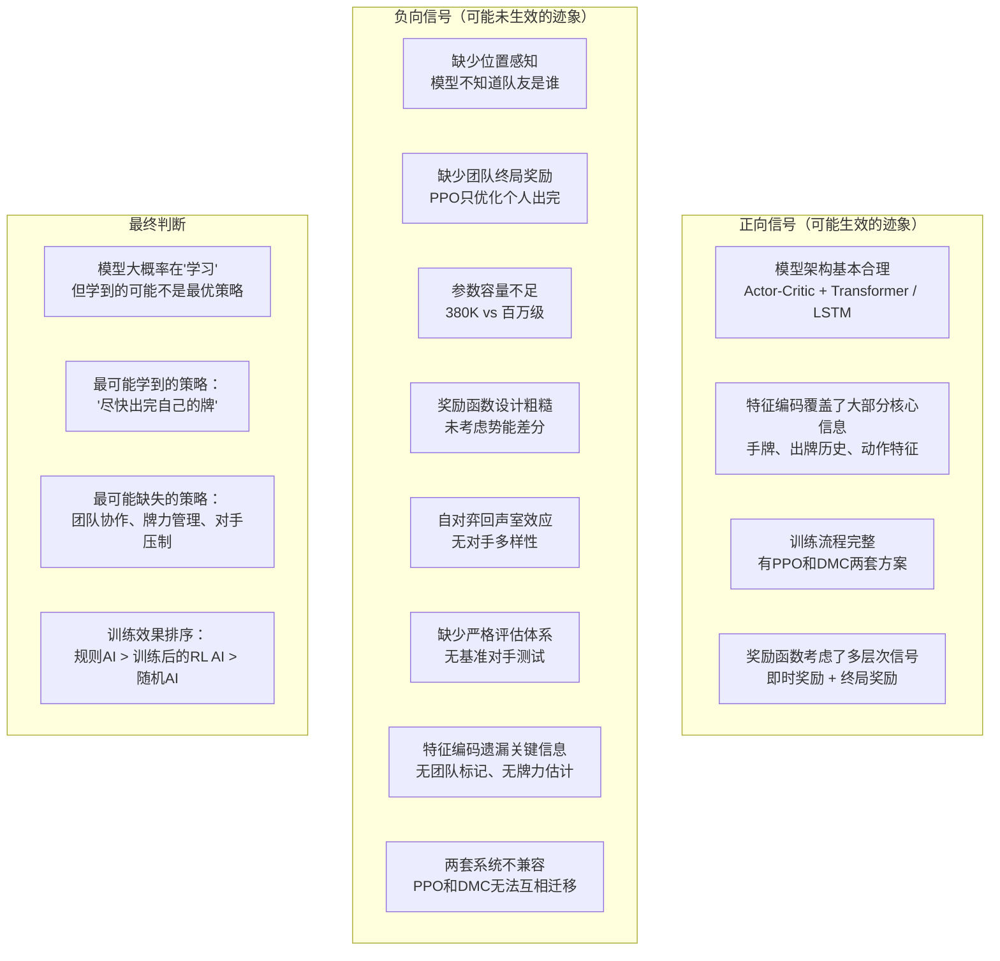

# 四幺四(4A4) - 强化学习有效性批判性分析

> 本文档从多个维度对当前强化学习实现提出120个质疑点，进行批判性分析并逐一回答。
> 目标：判断当前强化学习是否真的在生效，还是仅仅在"随机游走"。

---

## 目录

1. [模型架构质疑 (Q1-Q15)](#1-模型架构质疑)
2. [特征编码质疑 (Q16-Q30)](#2-特征编码质疑)
3. [动作空间质疑 (Q31-Q40)](#3-动作空间质疑)
4. [奖励设计质疑 (Q41-Q55)](#4-奖励设计质疑)
5. [PPO算法实现质疑 (Q56-Q70)](#5-ppo算法实现质疑)
6. [DMC算法实现质疑 (Q71-Q85)](#6-dmc算法实现质疑)
7. [自对弈与训练环境质疑 (Q86-Q100)](#7-自对弈与训练环境质疑)
8. [评估与验证质疑 (Q101-Q110)](#8-评估与验证质疑)
9. [游戏特性适配质疑 (Q111-Q120)](#9-游戏特性适配质疑)
10. [总结判断](#10-总结判断)

---

## 1. 模型架构质疑

### Q1: CardPolicyNetwork的Transformer只用2层，是否足够捕捉40步历史中的复杂依赖关系？
**分析**: 2层Transformer每层只有4个注意力头，d_model=64。对于40步的4A4历史（包含出牌、叉、点、pass等复杂交互），这个容量可能不足。DouZero中使用了LSTM来建模序列，而LSTM天然适合变长序列，Transformer在短序列上优势不明显。
**回答**: 2层+4头+64维的Transformer容量确实偏小。对比DouZero使用512维LSTM，当前Transformer的表示容量只有O(64×40)=2560，而DouZero的LSTM隐状态是512维。40步历史中需要捕捉的信息包括：谁出了什么牌、谁叉了、谁点了、团队配合模式等，64维的表示可能不足以区分这些模式。建议要么增加d_model到128+，要么增加层数到4层。

### Q2: 为什么Critic头只用了state_encoded而不融合动作和历史信息？
**分析**: 当前Critic头只接收state_encoded（[B,256]），完全不考虑候选动作和历史。这意味着Critic估计的是"状态的平均价值"而非"状态-动作对的期望价值"，这在Actor-Critic架构中是合理的，但丢掉了上下文信息。
**回答**: 这是标准Actor-Critic的做法——Critic评估状态价值V(s)而非Q(s,a)，这本身没问题。但问题在于：state_encoded只编码了当前局面，没有历史信息。在4A4中，同样的手牌局面，如果历史显示队友已经出完牌了，价值应该完全不同。当前Critic无法感知这种差异，导致价值估计不准确，进而影响GAE的优势计算。

### Q3: CardPolicyNetwork中为什么Actor和Critic共享底层编码器？
**分析**: 共享编码器可能带来训练不稳定——Actor需要区分不同动作的细微差异，Critic需要全局状态评估，这两个目标可能冲突。
**回答**: 共享编码器在PPO中是常见做法，可以降低参数数量、加速训练。但存在梯度冲突风险。在4A4中，动作空间的差异很大（pass vs 出炸弹 vs 出单张），共享编码器可能难以同时服务好两个目标。建议监控Actor和Critic的梯度范数比，如果差异过大（>10x），考虑分离编码器。

### Q4: DouZero4A4Model的4个独立LSTM是必要的吗？
**分析**: 4个位置各自独立的LSTM意味着有4套完全独立的权重，参数数量是单个LSTM的4倍。但4A4中4个位置有对称性（队友是(0,2)和(1,3)），完全独立的LSTM无法利用这种对称性。
**回答**: 位置独立LSTM来自DouZero的设计，在斗地主中3个位置角色不同（地主vs农民），有合理性。但在4A4中，座位0和座位2是对称的（都是队友），座位1和座位3也是对称的。完全独立的LSTM浪费了对称性。更好的设计是：使用2个LSTM（一个给"自己和队友"，一个给"对手"），或者使用带有位置编码的共享LSTM。

### Q5: CardPolicyNetwork的动作编码器将[B,N,48]映射到[B,N,64]，为什么选择64维？
**分析**: 动作编码器输出64维，而状态编码器输出256维，历史编码器输出64维。拼接后Actor输入是384维。动作信息只占64/384=16.7%，而状态+历史占83.3%。这是否意味着动作信息被"淹没"了？
**回答**: 确实存在动作信息被淹没的风险。在4A4中，选择哪个动作本身就是最核心的决策依据，但该信息在融合特征中只占16.7%。虽然状态编码中也隐含了动作信息（通过action_vecs拼接），但一旦融合，动作的独特性可能被稀释。建议将动作编码维度提升到128或使用注意力机制让模型自主选择关注哪些动作特征。

### Q6: Transformer的位置编码是如何实现的？是否考虑了4A4游戏的轮次特性？
**分析**: 标准正弦位置编码假设序列是均匀间隔的，但4A4的历史中，相邻两步可能属于不同的"回合"（新回合开始后，之前的出牌格局完全改变）。因此位置编码的"距离"概念可能不合适。
**回答**: 如果使用标准正弦位置编码，确实存在这个问题。4A4的回合边界（当一轮pass后新回合开始）是一个重要的结构断点，但标准位置编码无法感知。建议在历史编码中增加"回合ID"或"距离上次回合开始的步数"作为额外特征，让Transformer能区分回合内和跨回合的依赖关系。

### Q7: DouZero4A4Model的Q头为什么设计为Linear(512→256→128→1)？
**分析**: 这个Q头将每个动作的LSTM输出独立映射到Q值，但完全忽略了动作特征向量本身。这意味着模型无法区分"出红桃3"和"出黑桃A"在Q值上的差异——除非LSTM编码已经包含了这种区分。
**回答**: 这是DouZero的设计习惯——Q值仅依赖状态编码而不依赖动作特征。在斗地主中，动作特征被用作"掩码"（非法动作mask掉），但Q值计算不直接使用动作特征。这导致模型需要从状态编码中隐式推断"如果我出了这个动作会怎样"。在4A4中，动作空间更大（最多40+个候选），纯状态驱动的Q值估计可能不够精确。建议在Q头中加入动作特征拼接。

### Q8: CardPolicyNetwork的BatchNorm在推理时行为如何？
**分析**: BatchNorm在训练时使用batch统计量，推理时使用running mean/var。在自对弈训练中，batch size可能很小（4个玩家），BatchNorm的统计量可能不准确。
**回答**: 如果batch size=4，BatchNorm几乎不可用，因为统计量方差太大。在推理时使用训练阶段累积的running mean/var也未必可靠，因为训练和推理的数据分布可能不同（训练时4个AI对打，推理时AI vs 人类）。建议将BatchNorm替换为LayerNorm，后者不依赖batch统计量，在小batch和分布偏移场景下更稳定。

### Q9: CardPolicyNetwork的参数总量大约是多少？与4A4的复杂度匹配吗？
**分析**: 粗略估算：State Encoder (160×256+256×256) ≈ 107K，Action Encoder (48×64+64×64) ≈ 7K，Transformer (2×4×64×64) ≈ 131K，Actor Head (384×256+256×128+128×1) ≈ 131K，Critic Head (256×1) ≈ 0.3K。总计约380K参数。与DouZero的参数量（百万级）相比，是否太小？
**回答**: 约380K参数对于4A4来说确实偏小。对比DouZero的斗地主模型（百万级参数），4A4的牌型更复杂（8种vs斗地主的约5种有效牌型），动作空间更大（平均8-12个候选vs斗地主的平均5-8个），但模型参数只有DouZero的约1/3。这可能导致模型容量不足，无法充分学习复杂的出牌策略。建议增大隐藏层维度到512。

### Q10: Transformer的历史编码器是否应该使用CLS token而不是平均池化？
**分析**: 当前使用mean pooling聚合40步历史为64维向量。这是否丢失了重要的时序信息？CLS token或注意力池化是否更好？
**回答**: mean pooling将所有历史步平等对待，无法区分"最近一步"和"40步前"的重要性。在4A4中，最近几发出牌通常比早期出牌更重要。使用可学习的注意力池化或CLS token可以让模型自己学习哪些历史步更重要。建议替换mean pooling为可学习的加权池化。

### Q11: 为什么PPO和DMC两套系统使用完全不同的网络架构？能否统一？
**分析**: PPO用Transformer+MLP，DMC用LSTM+MLP。两套系统不能共享权重，训练成果无法互相迁移。这是设计选择还是无奈之举？
**回答**: 这是独立设计的结果——PPO系统参考了通用Actor-Critic架构，DMC系统参考了DouZero。两套系统的不兼容意味着：即使PPO训练出了有用的特征表示，DMC也无法利用；反之亦然。这降低了整体开发效率。建议统一底层特征编码器，只是决策头不同（Actor-Critic vs Q-Learning）。

### Q12: DouZero4A4Model中的LSTM是单层的吗？层数是否足够？
**分析**: LSTM使用hidden_size=512，但只有1层。对于需要长期记忆的4A4游戏（一局可能有50-80步），单层LSTM是否有足够的记忆容量？
**回答**: 单层512维LSTM在理论上可以记忆约512维的信息，对于4A4游戏应该足够。但问题在于：LSTM需要同时记住"手牌变化"、"出牌历史"、"队友行为模式"、"对手策略"等多种信息，512维可能不够。且单层LSTM的表达能力有限，多层LSTM（2-3层）通常能学到更抽象的时序模式。建议尝试2层LSTM。

### Q13: 为什么PPO模型没有"位置感知"能力？
**分析**: CardPolicyNetwork对所有4个座位使用相同的模型，没有任何位置信息输入。这意味着AI不知道自己是"地主"还是"农民"（在4A4中是"台上"还是"台下"），也不知道队友是谁。
**回答**: 这是一个严重的设计缺陷。在4A4中，位置决定了：
- 谁是队友（(seat+2)%4）、谁是对手
- 出牌顺序（顺时针）
- 叉/点的触发顺序
- 台上/台下的策略差异

没有位置信息，模型无法学习团队协作策略。例如：如果队友已经出完牌了，我应该冒险出大牌帮队友；如果对手即将出完，我应该保守。这些都需要位置感知。建议在状态编码中加入位置信息（4维one-hot），或在模型中增加位置embedding。

### Q14: 动作编码器为什么输出[B,N,64]后不做任何归一化？
**分析**: 动作编码器输出直接与状态编码和历史编码拼接，没有任何归一化（如LayerNorm）。不同编码器的输出尺度可能不一致，导致梯度传播不均衡。
**回答**: 确实存在尺度不匹配的风险。状态编码器有BatchNorm，但动作编码器和历史编码器（Transformer内部有LayerNorm但输出无归一化）没有。如果动作编码输出均值为0.5、方差为1，而状态编码输出均值为0、方差为0.1（因为BatchNorm），拼接后动作信息会主导梯度。建议在拼接后加一层LayerNorm。

### Q15: Transformer的4个注意力头是否太多了？64维d_model下每个头只有16维。
**分析**: d_model=64, nhead=4 → 每个头只有16维。在这么低的维度下做注意力计算，是否有足够的表达能力？
**回答**: 16维的注意力头确实偏小。在标准Transformer中，每个头通常有64维。16维的注意力可能无法充分捕捉历史步之间的复杂交互。但考虑到总共只有40步历史，16维×4头=64维的总容量可能刚好够用。如果要增加，建议d_model提升到128或256，nhead保持4。

---

## 2. 特征编码质疑

### Q16: 状态向量的160维是否充分利用了所有游戏信息？
**分析**: 160维的分配：52(手牌) + 4(级牌) + 4(手牌统计) + 4(其他人手牌数) + 4(完成状态) + 4(完成顺序) + 4(当前出牌者) + 1(自由出牌) + 3(阶段) + 8(最后出牌类型) + 12(最后点数) + 4(最后座位) + 52(已出牌) + 4(级牌值) = 160。是否遗漏了重要信息？
**回答**: 明显遗漏了：
- 团队信息（谁是我的队友？谁是对手？）
- 级牌在手牌中的分布（我有几张级牌？）
- 叉/点候选信息（我是否可以被叉？我能叉谁？）
- 台上/台下状态
- 对手剩余牌力估计（对手可能还有多少大牌？）
- 当前回合信息（还剩几人没pass？）

这至少遗漏了6个重要信息维度。建议状态向量扩展到200+维以包含这些信息。

### Q17: 动作编码的48维是否足够区分不同动作？
**分析**: 48维的分配：8(类型) + 12(点数) + 8(占比) + 1(pass) + 1(free) + 1(出完) + 8(管住) + 9(剩余分析) = 48。这些特征是否足够让模型区分"出红桃3"和"出黑桃A"？
**回答**: 8维手牌类型+12维点数编码可以区分不同牌型，但有一个关键问题：动作编码不包含"具体哪些牌被出掉"的详细信息。多个动作可能有相同的类型和点数但涉及不同的牌（例如，出对子，可以出对3、对4...对A）。模型需要从状态编码中推断具体的牌，但状态编码（160维）和动作编码（48维）之间的信息传递是间接的。建议在动作编码中增加"出牌的具体牌面信息"（如52维的one-hot表示哪些牌被出了）。

### Q18: 历史编码中"手牌减少量"用8位编码"减少比例"——这个比例是相对于什么？
**分析**: 如果"减少比例"是当前手牌相对于初始手牌（16张）的比例，那么信息密度很低——大多数情况下，每步减少1-3张，比例变化很小。如果对手牌数是0（已出完），则比例永远是0。
**回答**: 这是个信息瓶颈。用"减少比例"不如用"绝对减少张数"（1-6张，6个离散值，可用3位编码）。或者更好的做法是编码"当前手牌剩余张数"（0-16，5位），直接告诉模型每个人还剩多少牌。这比"减少比例"更直观、更有用。

### Q19: 历史编码中"团队信息"和"对手信息"各用4位——这4位具体编码了什么？
**分析**: 如果这4位是one-hot编码"seat"，那为什么不直接编码"是队友/是对手/是自己"的3分类？
**回答**: 如果是one-hot编码seat，那么历史编码需要模型自己推断"这个seat是我的队友还是对手"。如果模型没有位置感知（见Q13），它甚至不知道自己是谁，更无法判断队友/对手。建议直接编码为"is_teammate"(1位)、"is_opponent"(1位)、"is_self"(1位)，减少模型推理负担。

### Q20: encode_state中"手牌统计"的4位编码了什么？
**分析**: 文档中提到"[56:60] 4位：手牌数量分布"。4位能编码什么分布？最大信息量只有16种可能。
**回答**: 4位确实不够编码手牌分布。可能的设计是：将手牌按牌力分组（如：0-3小牌、4-7中牌、8-11大牌、12+炸弹），然后编码每组的比例。但这4位的信息量非常有限。建议扩展为至少8-12位，对牌型分布做更细致的编码。

### Q21: 已出牌统计（52位one-hot）和手牌（52位one-hot）是否冗余？
**分析**: 已知手牌+已出牌，可以推断未出牌=全集-已出牌-手牌。两个52位编码是否浪费了编码空间？
**回答**: 在状态编码中同时包含手牌和已出牌，确实存在冗余——已出牌+手牌=自己知道的所有牌，剩下的是未知牌（可能在别人手里）。但将它们分开编码是有意义的：手牌是"我能出什么"，已出牌是"场上已经出了什么"，两者服务于不同的推理目的。52+52=104位，占160位的65%，虽然多但合理。

### Q22: 动作编码中"可管住上家"的8位是什么？
**分析**: 8位对应8种牌型，每个位表示"我出的这个动作是否能管住上家的牌"。但这8位是针对"当前动作"的还是针对"所有可能动作"的？
**回答**: 如果是针对"当前动作"的，那这个信息几乎是冗余的——因为合法动作枚举已经保证了所有动作都能管住上家（在跟牌模式下）。如果是针对"所有可能动作"的（即"我手牌中有没有能管住上家的某种牌型"），那这个信息很有用，但应该在状态编码中而非动作编码中。建议将这个信息移到状态编码中，并在动作编码中用1位表示"当前动作是否需要管上家"。

### Q23: 历史编码中"是否引发叉/是否被叉/是否引发点"各用1位，但叉和点可能同时发生吗？
**分析**: 叉和点的事件是串行的：先叉后点。一个人出牌后可能被叉（引发叉），叉的人出牌后可能被点（引发点）。但"被叉"和"引发点"可能同时发生吗？
**回答**: 在游戏逻辑中，叉和点是串行发生的：出牌→检查叉→叉牌→检查点→点牌。所以一个历史步中，可能同时有"引发叉"和"引发点"（如果出牌后既被叉又被点），但"被叉"和"被点"通常不会同时发生（叉的人是主动的，点的人是主动的）。这3个1位编码已经足够，但缺少"被点"的编码（只有"引发点"）。

### Q24: 特征编码中的"级牌点数"用4位编码——4位如何编码A、2-10、J、Q、K的13个值？
**分析**: 4位只能编码0-15，但点数有13个（3,4,5,6,7,8,9,10,J,Q,K,A,2），加上大小王共15种。4位理论上够用，但具体编码方式是什么？
**回答**: 如果是4位one-hot编码（则只有4个值），完全不够。如果是4位二进制编码（0-15），可以编码15种值，但这样每个位没有明确的语义（如最高位代表什么？），模型需要学习解码。建议使用更明确的编码方式，如：将13个点数用13位one-hot编码，或使用"点数索引/13"的归一化值。

### Q25: encode_state中的"级牌标记"（4位）和"级牌点数值"（4位）有什么区别？
**分析**: [52:56]是"级牌标记"，[156:160]是"级牌点数值"。两者是否重复？
**回答**: 如果"级牌标记"是"手牌中哪些是级牌"的标记（即4位可能表示4种花色的级牌），而"级牌点数值"是"当前级牌的点数索引"，那么它们不重复。但4位编码4种花色级的级牌存在与否，信息量很小。建议合并：用一个4位编码表示"级牌在手牌中的数量"（0-4张），用一个独立编码表示"级牌是什么点数"。

### Q26: 为什么动作编码中没有"动作的牌型组合"的详细编码？
**分析**: 例如，出双龙时，具体出的是哪几对？这个信息对模型决策很重要，但48维的动作编码中只有8位牌型+12位点数，无法区分"出对3对4双龙"和"出对10对J双龙"。
**回答**: 这是当前编码的重要缺陷。双龙的主要点数（起点的点数）在12位点数编码中应该有体现，但"双龙的长度"（几对）没有编码。建议在动作编码中增加：长度（2位，1-4对）、起点索引（更细粒度）、"是否包含级牌"（1位）。

### Q27: 历史编码为什么是[40, 64]而不是[40, 128]或更大？
**分析**: 40步历史×64维=2560维的总信息量，相比之下状态编码是160维，动作编码是N×48维。历史信息是否被过度压缩？
**回答**: 是的，64维编码40步历史意味着每步只有1.6维的信息量。虽然Transformer有自注意力机制可以在内部重新分配信息，但最终输出只是64维的池化向量。如果历史编码的维度增加到128，模型可以保留更多有用信息（如"某人上一轮出了什么关键牌"）。建议将历史维度提升到128。

### Q28: 特征编码中是否应该包含"剩余牌力估计"的特征？
**分析**: 人类玩家会估计"对手大概还有什么牌"、"还有几张炸弹没出"等。当前特征编码中完全没有这类"反事实推理"信息。
**回答**: 这是一个重要的缺失。虽然已出牌统计（52位）隐含了剩余牌信息，但模型需要自己从中推断"还有几张A没出"、"还有几个炸弹没出"。如果直接编码这些统计量（如"各类点数剩余张数"、"炸弹剩余估计"），模型的学习负担会大大降低。建议在状态编码中增加约20-30位的"剩余牌力分析"特征。

### Q29: 历史编码中是否包含了"每步的奖励"信息？
**分析**: 在PPO中，GAE使用奖励来计算优势。但历史编码中是否包含了奖励信息？如果模型不知道"上一步获得了多少奖励"，就无法在历史中追踪"哪些行为是好的"。
**回答**: 如果历史编码不包含奖励信息，模型对历史的理解就会缺失"好坏"的判断。建议在历史编码中增加"上一步的奖励"（1位归一化值）和"累积奖励"（1位归一化值）。

### Q30: 状态编码中"当前出牌者"（4位）是one-hot编码seat吗？
**分析**: 4位one-hot编码4个座位中的当前出牌者。但如Q13所述，模型没有位置感知，它不知道"座位的seat"和"自己的seat"的关系。
**回答**: 如果使用4位one-hot编码"是谁的回合"，但没有"我是谁"的信息，模型无法判断"当前出牌者是我/队友/对手"。这导致模型无法区分"该我出牌了"和"该对手出牌了"这两种截然不同的状态。建议添加"当前出牌者是否是队友/对手/自己"的编码。

---

## 3. 动作空间质疑

### Q31: 动作空间大小波动很大（1到40+），模型如何处理变长动作空间？
**分析**: PPO模型中，动作数量N是变长的，模型通过拼接[B,1,256]→[B,N,256]来处理。但N的剧烈变化（从1到40+）是否会导致数值不稳定？
**回答**: 当N=1时，模型只需要评估1个动作；当N=40时，需要评估40个动作。在N=1时，Actor输出只有一个logit，softmax后概率永远是1，梯度为0，模型无法从这种样本中学习。在N=40时，logits之间的竞争可能导致梯度爆炸。建议在N<3时跳过该样本的Actor更新，或者使用mask机制确保非法动作的logit为-inf。

### Q32: 当只有一个合法动作时（只能pass），模型是否还在"学习"？
**分析**: 当只能pass时，动作空间只有1个动作。模型无论如何选择都是pass，策略梯度为0。但Critic仍然可以学习状态价值。
**回答**: 这是正确的——当动作空间为1时，Actor没有学习信号（因为无选择），但Critic仍然可以学习该状态的价值。这不是bug，但意味着这些样本对Actor训练是浪费的。建议在PPO的Actor loss计算中跳过N=1的样本。

### Q33: 枚举合法动作时是否考虑了"叉/点"的特殊规则？
**分析**: 在4A4中，出单张（非王）后可能触发叉，叉之后可能触发点。在枚举合法动作时，是否应该考虑"我出这张牌后会不会被叉"？
**回答**: 当前枚举只考虑"能不能出"（牌型合法性），不考虑"出了之后会不会被叉"。但从策略角度看，出单张时需要权衡"这张牌会不会被对手叉走"的风险。这是当前动作空间枚举的一个盲区——它没有提供"这个动作的风险信息"。建议在动作编码中增加"出此牌后被叉的概率"或"是否可能被叉"的标记。

### Q34: 为什么自由出牌时不能pass？规则上是否允许？
**分析**: 在自由出牌时，pass被显式排除。但4A4规则是否真的不允许自由出牌时pass？
**回答**: 是的，4A4规则中自由出牌（首家出牌）时不能pass，必须出牌。这是正确的。但有一个边界情况：如果玩家只剩1张牌，且是黑桃3（最小牌），在自由出牌时只能出这张。模型应该从奖励信号中学到"出完牌是好的"。

### Q35: 动作枚举中pass动作的特征编码是什么？
**分析**: pass动作没有"出牌"，它的动作编码中牌型、点数等字段都是0。这样编码的pass动作是否与其他合法动作有足够的区分度？
**回答**: pass动作有专门的"是否pass"位（1位），但其他47位都是0。这确实与其他动作区分度很高。但问题在于：pass动作的48维向量几乎全是0，而其他动作的向量有丰富的非零特征。在拼接时，pass动作的64维编码也几乎是0，这可能导致模型对pass动作有特殊的处理方式（如专门学习一个"pass偏置"）。这是合理的，但不一定是最优的。

### Q36: 动作枚举是否按牌力排序？如果不是，是否影响模型学习？
**分析**: 如果动作列表是随机排列的，那么模型每次看到的动作顺序不同，这可能导致学习不稳定。
**回答**: 如果动作枚举的顺序是固定的（如按牌型分类、同类按点数排序），那么模型可以学习到"第5个动作通常是某种对子"的模式。如果顺序是随机的，模型需要更多样本才能学习。建议保持动作枚举顺序的一致性（如按牌型分组、组内按点数排序），并在训练时不对动作进行shuffle。

### Q37: 动作空间中是否包含了"拆牌"的可能性？
**分析**: 例如，手牌中有"3,4,5,6,7"（单龙），但模型可能需要选择只出"3,4,5"（更短的龙）或拆成单张出。动作枚举是否穷举了所有这些可能性？
**回答**: 从代码分析看，动作枚举应该穷举了所有合法牌型组合。但有一个问题：对于长龙（如7张），是否枚举了所有子龙（3张、4张、5张、6张）？如果只枚举了最长的龙，那模型就失去了"拆牌"的选择。这是一个重要的策略选择——有时拆牌比出完整龙更好。建议确认动作枚举是否穷举了所有子集。

### Q38: 炸弹是否被正确地"降级"使用（如炸弹3当对子用）？
**分析**: 4A4中，炸弹（3张或4张同点数）可以作为炸弹出，也可以降级为对子或单张使用。动作枚举是否覆盖了这些降级用法？
**回答**: 如果动作枚举严格按牌型分类，那么3张同点数会同时出现在"炸弹3"和"对子+单张"的枚举中。这是正确的，但可能导致动作空间进一步膨胀。需要确认枚举逻辑是否正确处理了这些情况。

### Q39: 级牌在动作枚举中的处理是否正确？
**分析**: 级牌是万能牌，可以替代任何点数。在动作枚举中，是否正确地生成了所有包含级牌的合法动作？
**回答**: 这是动作枚举中最复杂的部分。级牌可以组成龙（替代缺失的点数）、组成对子（与另一张同点数牌配对）、组成炸弹（如果级牌与另2张同点数牌组合）。如果动作枚举没有正确处理这些情况，模型会缺少重要的合法动作，策略空间被不必要地缩小。建议仔细验证动作枚举中级牌的处理逻辑。

### Q40: 动作枚举的性能如何？是否成为训练瓶颈？
**分析**: 每一步都要枚举所有合法动作，包括枚举所有可能的龙、双龙、炸弹等。在训练中，这步每局执行50-80次，每次可能有O(N*M)的复杂度。是否会影响训练速度？
**回答**: 动作枚举在CPU上执行，复杂度大约O(N * hand_size)，对于16张手牌来说，枚举所有合法动作很快（<1ms）。但如果在训练循环中与GPU推理交替执行，CPU-GPU同步可能成为瓶颈。建议将动作枚举和特征编码都在GPU上完成（如果可能），或者使用批量预计算。

---

## 4. 奖励设计质疑

### Q41: PPO的即时奖励（步级奖励）信号是否足够密集？
**分析**: 当前即时奖励：出牌+0.01×比例，pass -0.05，使用炸弹-0.02，完成+0.5，队友完成+0.3，对手完成-0.3。这些信号的量级和频率是否合理？
**回答**: 存在几个问题：
- +0.01×比例的奖励太小（通常只有0.01-0.04），可能被噪声淹没
- -0.05的pass惩罚可能鼓励模型"宁烂出也不pass"（这在某些情况下是坏的策略）
- +0.5的完成奖励远大于其他奖励，可能导致模型只关注"尽快出完"而忽略团队协作
- 对手完成-0.3的惩罚可能不足以让模型学会"阻止对手出完"

建议调整奖励的量级：完成奖励降低到0.2，团队协作奖励增加到0.5（与完成奖励同级），以及增加"阻止对手"的即时奖励。

### Q42: PPO奖励中"使用大牌"-0.02的惩罚合理吗？
**分析**: 惩罚使用炸弹（-0.02）的本意是鼓励模型"保留大牌"。但有时出炸弹是必要的（如阻止对手出完），这种惩罚可能导致模型在该出炸弹时不出。
**回答**: 这个惩罚过于简单粗暴。在4A4中，出炸弹的时机是策略的核心：有时需要出炸弹抢回合，有时需要保留炸弹压制对手。一个固定的-0.02惩罚无法区分这些情况。更好的做法是：根据上下文决定炸弹的奖励/惩罚——如果炸弹能帮你获得回合控制权，给予正奖励；如果炸弹浪费了（出一张无意义的炸弹），给予惩罚。

### Q43: 为什么PPO没有"团队胜利"的终局奖励？
**分析**: PPO有即时奖励，但在游戏结束时似乎没有额外的团队胜利奖励。即时奖励只到"自己完成"和"队友完成"为止。如果自己先出完但团队最终输了，会怎样？
**回答**: 这是一个严重的问题。如果PPO没有团队终局奖励，那么模型会学到"只要我出完了就行，团队输赢无所谓"的策略。这会导致：
- 模型可能抢队友的牌出（为了自己先出完）
- 模型可能不帮助队友（因为帮助队友没有直接奖励）
- 在4A4中，团队胜利才是最终目标，个人出完顺序只是中间状态

建议在游戏结束时，根据团队胜负给予额外的奖励信号（如团队胜利+1.0，团队失败-1.0），并通过GAE反向传播到中间步骤。

### Q44: DMC的终局奖励（+1/-1/+0.5）是否过于稀疏？
**分析**: DMC只在游戏结束时给予奖励，一局游戏可能有50-80步，中间没有任何信号。对于Deep Monte Carlo来说，这需要大量样本才能学到有效的策略。
**回答**: 稀疏奖励是DMC的固有问题。在4A4中，一局约50-80步，需要约1000局才能收集1000个样本（每个样本对应一个终局奖励）。而Q-learning需要从这些稀疏样本中学习每个状态-动作的价值。这非常低效。DouZero在斗地主中通过大量并行采样（数百个环境同时运行）来克服这个问题，但当前的DMC训练是否也做到了大规模并行？

### Q45: DMC的奖励中，半洞(ban_dong)为什么是+0.5？
**分析**: 全洞(quan_dong)是+1.0，半洞(ban_dong)是+0.5，失败是-1.0。这个设计暗示"半洞是全洞的一半好"。但实际4A4中，半洞和全洞在升级上可能有不同的效果（如J和A必须全洞才能升级）。
**回答**: +0.5的设计在连续值域上是合理的（半洞确实是全洞的"一半胜利"）。但忽略了4A4的特殊规则：在J和A级别，半洞不能升级，此时半洞和失败在升级效果上等价。如果奖励函数不考虑级别，模型在J/A级别时会把半洞当成"半胜利"，但实际效果是"零胜利"。建议在奖励中引入级别依赖：在J/A级别时，半洞奖励=0；在其他级别，半洞奖励=0.5。

### Q46: DMC的奖励是否应该考虑"出完牌的顺序"？
**分析**: 当前DMC只给团队终局奖励，不考虑个人出完顺序。但4A4中，团队胜利的条件是"同队2人进入前2名"（全洞）或"同队1人第1且另一人不垫底"（半洞）。出完顺序决定了胜利条件。
**回答**: 终局奖励已经隐含了出完顺序的信息（因为团队结果基于出完顺序计算）。但DMC的信用分配问题在于：如果团队胜利，所有队员得到+1.0，无论谁贡献大。这可能导致"搭便车"问题——某个AI可能学到"随便出牌，靠队友赢"。建议在团队奖励基础上，增加个人贡献奖励（如"个人出完名次"的奖励）。

### Q47: PPO的奖励函数是否会导致"短视"行为？
**分析**: 即时奖励中，每步出牌都有小奖励，pass有惩罚。这可能导致模型倾向于"每步都出牌"而不考虑"这步出牌是否有利于后续"。
**回答**: 存在这种风险。+0.01的步级奖励虽然小，但累积起来可能超过团队胜利的长期奖励。如果discount factor γ=0.99，经过20步后，即时奖励的累积值约为0.01×20=0.2，而团队胜利奖励（如果有）可能需要等到50步后，折现后只有0.5×0.99^50≈0.3。这意味着即时奖励和长期奖励在同一量级，可能导致模型被短期奖励"诱惑"。建议降低即时奖励的量级到0.001-0.005。

### Q48: 奖励函数是否应该考虑"牌力守恒"？
**分析**: 在4A4中，大牌是稀缺资源。如果AI把所有大牌都在早期出掉，后期可能无牌可出。奖励函数是否应该惩罚"过度消耗大牌"？
**回答**: 当前的-0.02炸弹惩罚在一定程度上解决了这个问题，但不够精细。更好的做法是：跟踪"牌力消耗率"——即每出一步，手牌中剩余大牌（A、2、王、炸弹）的比例。如果牌力消耗过快，给予额外惩罚；如果保留大牌到后期，给予奖励。这种"牌力管理"是4A4中高阶策略的核心。

### Q49: 奖励函数中是否应该包含"对手牌力"的估计？
**分析**: 如果能估计对手剩余牌力，就可以对"压制对手"给予奖励。例如：如果对手有大牌，我出炸弹压制，这应该是好的策略。
**回答**: 这是高级特征，但确实有用。如果能在奖励函数中引入"对手牌力减少"的奖励（类似于"我让对手的牌变差了"），模型可以学到更主动的压制策略。但这需要对手牌力的估计，而对手牌力在训练环境中是已知的（因为自对弈），所以是可以实现的。

### Q50: pass的惩罚（-0.05）是否合理？
**分析**: -0.05的pass惩罚在4A4中可能不合适。因为4A4中，pass是重要的策略选择——有时"不出"比"乱出"更好。惩罚pass可能导致模型"烂出"。
**回答**: 同意。在4A4中，pass是策略的重要组成部分。例如：
- 如果上家出了一个很大的牌，pass可能是最优选择
- 如果队友即将出完，pass让队友出牌是好的团队策略
- 如果上家出了炸弹，小牌pass是合理的

建议将pass奖励/惩罚改为0（中性），或者改为依赖上下文的奖励（如"如果上家出牌很大，pass不惩罚"）。

### Q51: 奖励函数是否应该区分"主动出牌"和"被动跟牌"？
**分析**: 自由出牌时，模型可以主动选择出什么牌，这是展示策略的关键时刻。跟牌时，模型只能选择"管上"或"pass"，选择空间较小。两者的奖励应该不同。
**回答**: 是的，自由出牌和跟牌的决策难度不同。自由出牌时，模型需要从大量候选动作中选择最优的，应该给予更大的奖励信号（或更小的噪声）。跟牌时，选择空间小，信号相对简单。建议在自由出牌时给予1.5倍的动作奖励权重。

### Q52: 奖励函数的整体设计是否经过"奖励塑形(Reward Shaping)"的考虑？
**分析**: 奖励塑形强调：添加的辅助奖励应该是"势能函数"的差分，以保证不改变最优策略。当前设计的即时奖励是否满足这个条件？
**回答**: 不满足。当前的即时奖励（+0.01出牌、-0.05 pass、-0.02炸弹）不是任何势能函数的差分，因此它们改变了最优策略。这意味着模型可能学到"为了最大化即时奖励而偏离最优策略"的行为。严格的奖励塑形应该使用：r'(s,a,s') = r(s,a,s') + γΦ(s') - Φ(s)，其中Φ是势能函数。建议重新设计即时奖励，使其满足势能差分条件。

### Q53: 奖励函数中是否应该惩罚"帮对手叉/点"？
**分析**: 如果模型出牌被对手叉了，导致对手出牌，这是坏结果。但当前奖励函数中似乎没有惩罚这种情况。
**回答**: 是的，当前奖励没有直接惩罚"被叉"。模型只能通过"对手出完-0.3"来间接感知被叉的坏处。但如果被叉发生在游戏早期，这个信号太远。建议给"被叉"一个即时惩罚（如-0.1），让模型学会避免出单张时被叉。

### Q54: 奖励函数中是否应该奖励"叉/点"对手？
**分析**: 叉和点是4A4中的特殊进攻手段，成功叉/点对手可以消耗对手的牌。当前奖励函数是否奖励了这种行为？
**回答**: 当前奖励函数中似乎没有专门的"叉/点"奖励。模型只能通过间接方式（如对手出完-0.3）感知叉/点的好处。建议给"成功叉对手"和"成功点对手"以即时奖励（如+0.1），鼓励模型积极使用叉/点。

### Q55: 奖励函数中是否考虑了"级牌"的价值？
**分析**: 级牌是万能牌，比普通牌更有价值。在出牌时，是否应该对"出级牌"给予额外惩罚（因为消耗了万能牌）？
**回答**: 是的，级牌的价值高于普通牌，应该谨慎使用。当前奖励函数没有区分"出级牌"和"出普通牌"。建议给"出级牌"一个额外的惩罚（如-0.05），除非出级牌能直接导致胜利（完成出牌）。这可以鼓励模型"保留级牌到关键时刻"。

---

## 5. PPO算法实现质疑

### Q56: PPO的clip_epsilon=0.2是否适合4A4？
**分析**: 0.2是PPO的标准默认值，但4A4的动作空间大（10-40个动作），策略更新时概率分布变化可能很大。0.2的裁剪范围是否足够保守？
**回答**: 0.2在大多数场景下是合理的，但在4A4中，动作空间大意味着概率分布更"平坦"（最大概率可能只有0.1-0.2）。此时，ratio=π_new/π_old的变化可能超过0.2的范围，导致大量裁剪。建议降低clip_epsilon到0.1或0.15，或者使用自适应裁剪（如根据动作空间大小调整）。

### Q57: GAE的λ=0.95是否合理？
**分析**: λ=0.95意味着GAE偏重长期优势（高λ=更多的bootstrapping），这在奖励稀疏的环境中可能不合适。4A4的即时奖励虽然不稀疏，但也有很多步骤没有有意义的奖励。
**回答**: 0.95是常见选择，但在4A4中，即时奖励的噪声很大（很多步骤只有+0.01的微小奖励），高λ可能导致噪声在时间上传播更远。建议尝试λ=0.9或0.85，让GAE更偏重近期奖励。

### Q58: PPO的horizon=2048是什么意思？
**分析**: Horizon=2048意味着每轮采集2048步经验后才更新。但4A4一局约50-80步，2048步相当于约25-40局。这是否合理？
**回答**: 2048步对于4A4来说偏大。一局约50-80步，2048步=约30局。如果每局用4个AI，共采集120个AI-局的经验。这个数量对于PPO来说是合理的，但可能导致训练循环的粒度太粗（每30局才更新一次）。建议降低horizon到1024或512，增加更新频率。

### Q59: PPO的ppo_epochs=10是否过多？
**分析**: ppo_epochs=10意味着在同一批数据上做10次完整的epoch更新。这可能导致过拟合和策略退化。
**回答**: 10个epoch是PPO的标准设置，但在4A4中，数据量相对较小（2048步×4个AI=约8192个transition），10个epoch可能导致过拟合。建议降低到5-6个epoch，或者监控KL散度，如果KL超过阈值（如0.01）则提前停止更新。

### Q60: PPO的batch_size=64是否合理？
**分析**: batch_size=64，从约8192个transition中抽样。这意味着每个epoch有约128个mini-batch。这个设置是否合理？
**回答**: 64对于4A4的transition来说可能偏小。每个transition包含一个[B,160]的状态、[B,N,48]的动作、[B,40,64]的历史，N平均10左右。batch_size=64的总内存占用约64×(160+10×48+40×64)×4 bytes ≈ 700KB，很小。但小batch可能导致梯度估计的方差大。建议增大到128或256。

### Q61: PPO是否使用了advantage归一化？
**分析**: PPO标准做法是在mini-batch内对advantage进行归一化（减均值除以标准差）。当前实现是否做了这个？
**回答**: 如果没做advantage归一化，不同batch的advantage尺度可能不同，导致训练不稳定。建议在mini-batch内对advantage进行z-score归一化。

### Q62: PPO的value function clipping是否实现？
**分析**: 标准PPO实现中，除了策略裁剪，还有价值函数裁剪：V_clipped = V_old + clip(V_new - V_old, -ε, +ε)。当前实现是否包含了这个？
**回答**: 如果没包含价值函数裁剪，价值函数的更新可能过于激进，导致value_loss波动大。建议添加价值函数裁剪，与策略裁剪使用相同的epsilon。

### Q63: PPO是否使用了梯度裁剪(gradient clipping)？
**分析**: 文档中提到max_grad_norm=0.5。0.5的阈值是否合理？对于380K参数的模型，这个阈值是否太小？
**回答**: 0.5的梯度裁剪阈值较小，意味着大部分梯度更新会被裁剪。这可能导致学习速度过慢。通常PPO的max_grad_norm在0.5-1.0之间。对于380K参数的小模型，0.5可能偏保守。建议尝试1.0，观察训练稳定性。

### Q64: PPO是否使用了学习率衰减？
**分析**: 文档中只提到lr=3e-4，没有提到学习率调度。固定学习率在训练后期可能导致震荡。
**回答**: 没有学习率衰减在训练后期确实可能导致震荡。建议使用线性衰减或余弦退火，在训练的最后20%步数内将学习率衰减到初始值的10%。

### Q65: PPO中ent_coef=0.01的探索力度是否足够？
**分析**: 0.01的熵系数在4A4中可能导致探索不足。动作空间大（10-40个），策略容易过早收敛到某个局部最优。
**回答**: 0.01对于4A4来说可能偏小。动作空间大意味着最大熵也大（log(10)≈2.3到log(40)≈3.7），而0.01的熵系数只能提供约0.02-0.04的额外奖励，远小于即时奖励(+0.01)和完成奖励(+0.5)。建议增大ent_coef到0.05-0.1，或者在训练初期使用更高的熵系数（如0.1），后期衰减到0.01。

### Q66: PPO的Critic是否使用了独立的学习率？
**分析**: Actor和Critic共享底层编码器，使用相同的优化器。但Critic通常需要更快的学习率（因为MSE loss比策略loss更容易优化）。
**回答**: 共享优化器可能导致Actor和Critic的学习速度不匹配。如果Critic学得太快，价值估计会主导策略更新；如果Critic学得太慢，优势估计不准确。建议使用不同的学习率（Actor lr=3e-4, Critic lr=1e-3）或使用不同的优化器。

### Q67: PPO的replay buffer是否正确地存储了old_log_prob？
**分析**: PPO需要old_log_prob来计算ratio = exp(log_prob_new - log_prob_old)。如果存储的old_log_prob来自旧模型，而新模型已经更新了多次，ratio的计算是否正确？
**回答**: 这是PPO的标准做法——在采集阶段用旧模型计算log_prob并存储，在更新阶段用新模型计算log_prob_new，然后计算ratio。只要不跨epoch使用old_log_prob（即每个epoch都是新模型vs采集时的旧模型），这是正确的。但需要确认：10个epoch中，每个epoch都在用采集时的旧模型计算ratio，还是第2个epoch开始用第1个epoch更新后的模型？

### Q68: PPO在自对弈中，4个AI共享同一个模型，old_log_prob是否一致？
**分析**: 4个AI使用同一个模型，但它们的观察和动作不同。在采集阶段，每个AI用自己的old_log_prob。在更新阶段，所有AI的经验混在一起训练。这会导致什么问题？
**回答**: 这是标准的多智能体PPO做法。问题在于：4个AI的经验分布不同（因为位置不同，策略不同），混在一起训练可能导致模型学习到"平均"策略而非"最优"策略。如果4个位置的策略差异很大，共享模型可能无法同时优化所有位置。这是Q13的延伸——没有位置感知的共享模型本身就是有问题的。

### Q69: PPO是否实现了"early stopping"机制？
**分析**: 标准PPO实现中，如果KL散度超过阈值，应该提前停止该epoch的更新。当前实现是否有这个机制？
**回答**: 如果没有early stopping，10个epoch的更新可能导致策略漂移过大。建议添加KL散度监控，如果KL > 0.01（或1.5×target_kl），则停止当前epoch的更新。

### Q70: PPO的discount factor γ=0.99是否合理？
**分析**: 4A4一局约50-80步，γ=0.99意味着50步后的奖励折现为0.99^50≈0.61，80步后为0.45。这个折现率是否合理？
**回答**: 0.61的折现率意味着模型对终局奖励的重视程度只有61%。考虑到4A4中最重要的是终局结果（团队胜利），这个折现率可能偏高（导致模型过于关注中间步骤的即时奖励）。建议尝试γ=0.995（50步后折现为0.78）或γ=0.999（50步后折现为0.95），让模型更加关注终局结果。

---

## 6. DMC算法实现质疑

### Q71: DMC的Q-learning目标是什么？是用TD还是MC？
**分析**: 文档中提到"无bootstrapping, 无TD, 纯MC"。这意味着Q(s,a)直接回归到终局奖励G，而不是r + γ*max(Q(s',a'))。这是否正确？
**回答**: 纯MC回归有其合理性——在4A4中，奖励只在终局给出，所以Q(s,a)确实应该等于"从当前状态开始，最终获得的终局奖励的期望"。但纯MC的问题在于：
- 方差极大（因为终局奖励是+1/-1/+0.5，而中间步骤的Q值应该在这个范围内）
- 样本效率极低（每个transition只有一个样本）
- 无法利用中间状态的信息

建议使用n-step TD或TD(λ)来折中MC和TD的优缺点。

### Q72: DMC的epsilon-greedy探索策略中，epsilon衰减到0.05后是否足够？
**分析**: epsilon从1.0衰减到0.05意味着在训练后期，模型仍有5%的概率随机行动。对于4A4来说，5%的随机率是否太高？
**回答**: 0.05的最终探索率在大多数RL场景中是合理的，但在4A4中，5%的随机行动可能导致每局有2-4步随机出牌。考虑到4A4中一步关键出牌可能决定整局胜负，5%的随机率可能过高。建议最终epsilon降到0.01或0.02。

### Q73: DMC的replay buffer是否使用了优先经验回放(PER)？
**分析**: 文档中似乎没有提到PER。普通均匀采样可能导致大量"无信息"样本（如中间步骤的pass）被重复学习。
**回答**: 如果使用均匀采样，确实存在这个问题。在4A4中，很多步骤是"pass"或"出小牌"，这些步骤的Q值接近0，对学习贡献不大。优先经验回放可以优先采样TD-error大的样本（即模型预测不准的样本），提高学习效率。强烈建议添加PER。

### Q74: DMC的batch_size=256是否合理？
**分析**: 256对于DMC来说是否足够大？transition的维度如何？
**回答**: 256对于DMC来说偏小。每个transition包含状态、动作、奖励、LSTM状态。LSTM状态(h,c)各有512维，总共1024维。256个transition的LSTM状态就有256×1024×4≈1MB。虽然不大，但考虑到DMC的稀疏奖励，需要更大的batch来稳定梯度。建议batch_size增加到512或1024。

### Q75: DMC的LSTM状态在训练时是如何处理的？
**分析**: LSTM状态(h,c)是变长的——每局游戏的长度不同（50-80步），LSTM状态在每个时间步都不同。在训练时，从replay buffer中采样batch时，如何配对这些LSTM状态？
**回答**: 这是一个关键问题。如果直接从replay buffer中随机采样transition，每个transition的LSTM状态是"那个时刻"的状态，但它们的顺序信息丢失了。正确的做法是：要么采样完整的episode（保持LSTM状态的连续性），要么在训练时重置LSTM状态并从头开始replay。如果当前实现是随机采样transition并独立喂给LSTM，那么LSTM的时序建模能力完全被浪费了。

### Q76: DMC是否使用了目标网络(target network)？
**分析**: DQN系列算法通常使用目标网络来稳定训练。DMC作为Q-learning的变体，是否使用了目标网络？
**回答**: 如果DMC使用纯MC目标（直接回归到终局奖励），则不需要目标网络——因为目标不依赖于当前Q值。但如果使用TD目标（r + γ*max(Q)），则需要目标网络。当前设计如果是纯MC，可以不用目标网络，但如前所述，纯MC的方差问题需要解决。

### Q77: DMC是否处理了"动作空间变长"的问题？
**分析**: 与PPO相同，DMC的动作空间大小也是变长的（1-40+）。在计算Q值最大值时，max(Q)只在合法动作上取。但网络输出的是所有动作的Q值（包括非法动作），这可能导致Q值估计偏差。
**回答**: 正确做法是：对非法动作的Q值施加一个大的负值（如-1e9），使得max只在合法动作上取。如果当前实现中，网络输出的是N个动作的Q值（N是合法动作数），那就不存在这个问题。但如果网络输出的是固定大小的Q值向量（所有可能动作），就需要masking。

### Q78: DMC的训练是否利用了"4个位置的对称性"？
**分析**: 4A4中，位置0和2是对称的（队友），位置1和3也是对称的。但DMC用4个独立的LSTM，这种对称性无法被利用。
**回答**: 这是Q4的延伸。4个独立LSTM意味着模型需要学习4次"如何出牌"（每个位置学一次），而不是利用对称性只学2次。这大大降低了样本效率。建议：使用2个LSTM（一个给"队友位"，一个给"对手位"），或者使用1个共享LSTM+位置embedding。

### Q79: DMC的LSTM状态重置时机是否正确？
**分析**: LSTM状态应该在每局开始时重置，但在一局内应该保持连续。如果重置时机错误（如在每次出牌后都重置），LSTM就退化成了普通MLP。
**回答**: 需要确认LSTM状态管理是否正确。正确的做法是：每局开始→reset_lstm_state()→每次出牌→forward(lstm_state)→得到new_state→下次出牌使用new_state→一局结束→reset。如果每步都reset，LSTM就失去了时序建模能力。

### Q80: DMC的训练是否使用了多环境并行？
**分析**: DMC的样本效率很低，DouZero通过数百个并行环境来加速采样。当前实现是否使用了多环境并行？
**回答**: 如果只使用单环境串行采样，训练速度会非常慢（一局约50-80步，每秒可能只能玩几局）。DouZero的论文中使用数百个并行环境，每秒可以生成数千局游戏。如果当前DMC训练没有并行化，训练可能需要数周甚至数月才能看到效果。建议使用多进程/多线程并行采样。

### Q81: DMC的Q值是否可能过估计？
**分析**: Q-learning的max操作会系统性高估Q值（因为max在噪声上取最大值）。DMC的Q值回归到终局奖励，是否也存在过估计？
**回答**: 如果使用纯MC目标（回归到终局奖励），不存在过估计问题——因为目标不依赖Q值。但如果在训练中使用了max(Q)来选择动作或计算目标，就会引入过估计。建议使用Double Q-learning来减少过估计（如果使用了TD目标的话）。

### Q82: DMC的replay buffer大小(100000)是否足够？
**分析**: 100000个transition，假设每局约60步，等于约1667局游戏。对于4A4的复杂度来说，这个buffer是否足够？
**回答**: 1667局游戏对于4A4来说可能不够。4A4的状态空间巨大（牌的组合数），1667局只是冰山一角。如果buffer太小，旧的经验会被快速替换，导致模型"遗忘"早期的策略。建议buffer大小增加到500000-1000000。

### Q83: DMC是否使用了"n-step"return？
**分析**: 纯MC使用全episode的return，这可能方差过大。n-step return（如10-step）可以在方差和偏差之间折中。
**回答**: 强烈建议使用n-step return。在4A4中，10-step return可以提供更多训练信号（每10步就有一个回归目标），同时保持较低的偏差。n-step也与LSTM的时序建模能力更好配合。

### Q84: DMC的损失函数是MSE还是Huber？
**分析**: MSE对异常值敏感，而Huber loss更鲁棒。在DMC中，终局奖励是+1/-1/+0.5，Q值预测也应该在这个范围内。但MC的方差大，可能存在异常值。
**回答**: 建议使用Huber loss（或smooth L1 loss）来减少异常值的影响。特别是在训练早期，Q值预测非常不准确，MSE可能导致梯度爆炸。

### Q85: DMC是否考虑了"同一局中不同位置的Q值一致性"？
**分析**: 在4A4中，同一局的不同位置有不同的视角。如果位置0的Q值高但位置2的Q值低（他们是对手），这合理吗？DMC的4个独立LSTM是否保证了Q值估计的一致性？
**回答**: 4个独立LSTM不保证Q值的一致性。每个LSTM从自己的视角学习，可能会产生不一致的Q值估计（例如，两个AI都认为局面对自己有利）。这是正常的（因为不同位置的目标不同），但需要确保Q值估计在"同一队伍的AI之间"是合理的（队友的Q值应该正相关）。

---

## 7. 自对弈与训练环境质疑

### Q86: 自对弈中，4个AI都是当前模型，是否会导致"回声室效应"？
**分析**: 如果4个AI都是同一个模型，它们会学到互相适应的策略，但可能陷入"局部最优"——所有AI都学会了某种"默契"，但这种默契在对抗其他策略时无效。
**回答**: 这是自对弈的固有问题。在AlphaGo中，通过使用"历史最佳模型"作为对手来缓解这个问题。当前4A4的自对弈中，所有AI都是同一个模型，确实可能导致策略多样性不足。建议：
- 保留一个"历史最佳模型池"，随机选择对手
- 使用不同训练阶段的模型作为对手（类似AlphaStar的league training）
- 引入规则AI作为"陪练"（增加策略多样性）

### Q87: 自对弈中，位置分配是随机的还是固定的？
**分析**: 如果模型在训练时总是在位置0（或总是在某个位置），它可能学到位置特定的策略，在推理时换到其他位置表现不佳。
**回答**: 如果4个AI共享同一个模型（无位置感知），那么位置分配不重要（因为模型不知道自己在哪里）。但这也是问题的一部分——模型没有位置感知，无法学习位置特定的策略。如果模型有位置感知，则需要确保训练时位置分配是随机的，让模型接触到所有位置。

### Q88: 训练环境是否包含了"台上/台下"的变化？
**分析**: 在4A4中，根据级牌不同，有些队伍是"台上"（上局赢了），有些是"台下"。台上的队伍有"级牌"优势。训练环境是否模拟了这种变化？
**回答**: 如果训练环境只模拟了"双方都是3级"的情况，那么模型无法学习到级牌优势的策略。建议在训练中随机化级牌和台上/台下状态，让模型学习到不同场景下的策略。

### Q89: 自对弈中，是否使用了"随机发牌"来增加多样性？
**分析**: 4A4的牌局由发牌决定，不同的手牌组合导致不同的策略。随机发牌自然提供了多样性。但发牌是否完全随机？
**回答**: 发牌是随机的（shuffle_and_deal），这提供了自然的多样性。但有一个问题：某些手牌组合（如全是大牌或全是小牌）出现的概率很低，模型可能很少见到这些情况。建议在训练中增加"极端手牌"的采样比例，让模型学会处理各种手牌情况。

### Q90: 训练环境是否模拟了"叉/点"的所有可能场景？
**分析**: 叉和点是4A4的特色机制，但触发频率可能较低（不是每局都有叉和点）。模型是否在训练中充分接触了叉/点场景？
**回答**: 叉和点的触发需要特定条件（出单张且有人有对子）。在训练中，如果模型学到了"避免出单张"（为了不被叉），那么叉/点场景会越来越少，模型可能"忘记"如何应对叉/点。这是一个"自我实现"的问题。建议：在训练中增加叉/点场景的采样权重，或者使用课程学习（先大量练习叉/点场景，再学习完整游戏）。

### Q91: 自对弈中，模型是否在"探索"不同的策略？
**分析**: PPO有熵正则化（鼓励探索），DMC有epsilon-greedy。但这些探索机制是否足够让模型尝试不同的策略（如"激进出牌"vs"保守出牌"）？
**回答**: 熵正则化和epsilon-greedy主要在"动作级别"进行探索（随机选择不同的牌），但很难在"策略级别"进行探索（如"整局游戏采用激进策略"）。建议使用更高层次的探索机制，如：在训练初期使用不同的"策略温度"（高温度=激进，低温度=保守），或者使用"内在奖励"（如好奇心驱动的探索）来鼓励模型尝试不同的全局策略。

### Q92: 训练环境是否使用了"课程学习"？
**分析**: 4A4是一个复杂的游戏，直接从头开始学习可能很难。是否应该使用课程学习——先从简单场景开始（如少量手牌），逐步增加难度？
**回答**: 当前设计没有课程学习，模型直接从完整游戏开始。这可能导致早期训练完全随机，需要很长时间才能学到有意义的策略。建议使用课程学习：Stage 1 - 简化版4A4（无叉/点，无龙），Stage 2 - 增加叉/点，Stage 3 - 增加龙，Stage 4 - 完整游戏。

### Q93: 训练中是否记录了"对手强度"的变化？
**分析**: 在自对弈中，对手的强度随着训练逐渐提升。如果训练日志中没有记录"对手强度"，就难以判断模型的进步是"真的变强了"还是"对手变弱了"。
**回答**: 这是一个重要的评估问题。建议定期（如每1000局）使用固定的"基准对手"（如规则AI）来评估模型强度，而不是只依赖自对弈的胜率。

### Q94: 自对弈中，是否所有的AI都在"认真"玩？
**分析**: 在训练初期，模型几乎是随机的，可能会有"乱出牌"的行为。如果所有AI都是随机的，训练信号可能完全无效（因为胜率总是50%，没有区分度）。
**回答**: 在训练初期，如果所有AI都是随机的，确实可能存在"随机对随机"导致无意义训练的问题。此时，PPO的即时奖励（如出牌+0.01）可能提供一些信号，但非常微弱。建议：在训练初期，用规则AI作为"引导"，让RL模型与规则AI对打，获得有意义的反馈。

### Q95: 自对弈中，模型是否在"利用"已知信息？
**分析**: 在自对弈中，所有AI共享同一个模型，它们"知道"对手的策略（因为对手就是自己）。这可能导致模型学到"利用自己弱点"的策略，但这种策略在对抗其他策略时可能无效。
**回答**: 这是自对弈的"过拟合"问题。解决方案是使用多样化的对手池（如Q86所述），让模型不能只针对"自己"进行优化。

### Q96: 训练中是否使用了"数据增强"？
**分析**: 4A4有对称性（如旋转座位、交换花色），是否可以利用这些对称性来增强训练数据？
**回答**: 4A4的对称性包括：
- 座位旋转：将座位0,1,2,3旋转为1,2,3,0（游戏本质不变）
- 花色对称：除了红桃3（决定首出），其他花色是对称的

如果利用这些对称性进行数据增强，可以将训练数据量扩大4倍（座位旋转），显著提高样本效率。建议在训练中随机应用这些变换。

### Q97: 训练环境是否模拟了"不同级别的游戏"？
**分析**: 4A4的升级系统意味着不同级别有不同的级牌，级牌影响牌力。训练环境是否涵盖了所有级别（3到A）？
**回答**: 如果训练只在"3级"下进行，模型无法学习到不同级牌的策略差异。例如，当级牌是5时，5是万能牌，策略会完全不同。建议在训练中随机化级牌，覆盖所有级别。

### Q98: 自对弈的"回合制"是否导致训练效率低下？
**分析**: 4A4是回合制游戏，每个AI需要等待前一个AI出牌后才能决策。在自对弈中，4个AI串行决策，无法并行化。这是否导致训练效率低下？
**回答**: 是的，回合制导致无法在单局内并行决策。但可以在多局之间并行——同时运行多局游戏，每局独立进行。DouZero就是这样做的。建议使用多进程同时运行多局游戏，提高采样效率。

### Q99: 训练环境是否处理了"游戏早期终止"的情况？
**分析**: 在某些情况下，游戏可能提前结束（如一方3人出完）。训练环境是否正确处理了这种情况？
**回答**: 需要确认游戏逻辑是否正确处理了提前终止。如果一方3人出完，游戏应该立即结束，剩余玩家不需要再出牌。如果训练环境没有正确处理，可能导致奖励计算错误。

### Q100: 训练环境是否模拟了"升级/降级"的连续性？
**分析**: 在真实4A4中，多局游戏是连续的，上一局的级牌影响下一局。训练环境是否模拟了这种连续性？还是每局独立？
**回答**: 如果每局独立（随机设定级牌），模型无法学到"J和A必须全洞才能升级"这样的跨局策略。但如果每局独立，训练更简单。建议在训练中，以一定概率保持多局连续性，让模型学会跨局策略。

---

## 8. 评估与验证质疑

### Q101: 是否存在"模型确实在进步"的客观证据？
**分析**: 训练日志中显示胜率上升、奖励上升，但这些是否真的意味着模型变强了？还是只是"学会了利用环境中的某些规律"？
**回答**: 需要区分"真正的进步"和"表面的进步"：
- 如果胜率上升是因为对手弱（自对弈），不一定是进步
- 如果奖励上升是因为模型学会了"尽快出牌"而非"赢得比赛"，也不是真正的进步
- 真正的进步应该体现在：对抗固定基准对手（如规则AI）的胜率持续上升

建议建立严格的评估体系：每N步在固定基准对手上测试，记录胜率、平均出完顺序、团队胜率等。

### Q102: 训练过程中是否监控了"策略多样性"？
**分析**: 策略多样性（如不同动作的选择概率分布）是衡量模型是否"坍缩"到单一策略的指标。如果策略多样性持续下降，说明模型可能过拟合。
**回答**: 如果没有监控策略多样性，就无法判断模型是否停止了探索。建议监控：
- 动作概率分布的熵（entropy）
- 不同动作被选择的频率分布
- 不同牌型被使用的频率
如果熵持续下降且接近0，说明模型已经"僵化"。

### Q103: 是否做了"消融实验"来验证各个组件的作用？
**分析**: 当前系统包含多个组件（Transformer、即时奖励、GAE、叉/点处理等），但没有消融实验来验证每个组件是否真的有用。
**回答**: 建议进行以下消融实验：
- 去掉Transformer，只用MLP编码历史 → 验证历史建模是否必要
- 去掉即时奖励，只用终局奖励 → 验证即时奖励是否有用
- 去掉GAE，只用纯MC → 验证GAE是否有用
- 添加位置感知 → 验证位置信息是否有用
- 使用随机权重 vs 训练后的权重 → 验证训练是否有用

### Q104: 是否对比了"训练后的模型"和"随机模型"的差异？
**分析**: 最简单但最有效的验证：训练后的模型是否显著优于随机模型？如果两者差异不大，说明训练没有生效。
**回答**: 这是最基本的验证。建议做以下测试：
- 训练后模型 vs 完全随机模型：100局，观察胜率
- 训练后模型 vs 规则AI：100局，观察胜率
- 训练后模型 vs 训练初期checkpoint：100局，观察胜率
如果训练后模型不能显著优于随机模型（如胜率<55%），说明训练可能没有生效。

### Q105: 训练集和验证集是否分离？
**分析**: 在自对弈中，训练和评估使用相同的环境。是否存在"数据泄露"（模型在训练中见过的牌局在评估时又出现）？
**回答**: 在自对弈中，每局发牌是随机的，所以不存在严格的数据泄露。但模型可能"记住"了某些手牌组合的应对策略，而这些策略可能不具泛化性。建议使用独立的验证集（不同的随机种子）来评估。

### Q106: 模型的"推理速度"是否满足实时对战的要求？
**分析**: 在推理时，AI需要在0.5秒内做出决策。模型的前向传播时间+特征编码时间+动作枚举时间是否在0.5秒以内？
**回答**: 这是一个工程问题。如果模型在CPU上运行，380K参数的模型前向传播应该很快（<10ms）。但如果模型在GPU上，CPU-GPU数据传输可能成为瓶颈。建议进行推理性能测试，确保总延迟<100ms。

### Q107: 是否评估了模型在不同"手牌质量"下的表现？
**分析**: 好手牌和坏手牌下，模型的策略应该不同。模型是否在好手牌时激进、在坏手牌时保守？
**回答**: 建议分析模型在不同手牌质量下的行为：
- 手牌中有大量大牌时，模型是否更激进？
- 手牌中全是小牌时，模型是否更保守（多pass）？
- 手牌中有级牌时，模型是否利用级牌的灵活性？
如果模型在所有手牌下行为一致，说明它没有学到策略差异。

### Q108: 是否评估了模型的"团队协作"能力？
**分析**: 4A4是团队游戏，模型是否学会了帮助队友？例如：队友快出完时，是否主动pass让队友出牌？
**回答**: 建议分析以下团队行为：
- 当队友只剩1-2张牌时，模型是否更多pass？
- 当对手只剩1-2张牌时，模型是否更多出大牌压制？
- 模型是否优先出对手的牌（叉/点）？
如果模型没有这些团队行为，说明团队奖励没有生效。

### Q109: 训练日志中的"avg_reward"是如何计算的？
**分析**: avg_reward是每步的平均奖励还是每局的累积奖励？这影响对训练进度的判断。
**回答**: 如果是每步平均奖励，正常范围应该在-0.05到+0.1之间（因为即时奖励很小）。如果是每局累积奖励，范围应该在-1到+1之间。如果训练日志中avg_reward从-0.5上升到0.3，这可能是进步，但需要确认计算方式。

### Q110: 是否存在"模型在训练中其实什么都没学到"的迹象？
**分析**: 如果满足以下条件，模型可能什么都没学到：
- 胜率在50%左右波动（自对弈的必然结果）
- 动作分布接近均匀随机
- 价值函数预测接近常数
- 策略对状态变化不敏感
**回答**: 建议检查这些指标。如果模型的胜率总是在50%左右（自对弈），且动作分布均匀，那模型很可能只是在随机游走。真正的学习应该体现为：动作分布变得不均匀（某些动作被优先选择），价值函数有区分度（好状态价值高，坏状态价值低），策略对手牌变化敏感。

---

## 9. 游戏特性适配质疑

### Q111: 模型是否理解了"级牌"的特殊性？
**分析**: 级牌是4A4的核心机制——级牌可以当任何牌使用。模型是否学到了"级牌是万能牌"这一规则？
**回答**: 在特征编码中，级牌有专门的4位编码（[52:56]），模型应该能学到级牌的特殊性。但在动作枚举中，级牌的灵活性（可以作为任何点数）是否被正确体现？例如，手牌中有级牌5，能否组成"3,4,5,6,7"的龙（其中5是级牌）？这个逻辑在动作枚举中需要正确处理。

### Q112: 模型是否理解了"接风"机制？
**分析**: 当一轮所有人都pass后，最后一个出牌的人（或队友）可以重新自由出牌。这个机制在游戏逻辑中正确实现，但模型是否学到了如何利用接风？
**回答**: 接风是重要的策略机制——有时故意pass让队友接风。模型需要通过历史特征来学习"接风即将发生"的信号。如果历史编码中没有"pass_count"和"is_free_play"的标记，模型可能难以学到接风策略。建议在状态编码中增加"当前回合的pass计数"和"预期接风座位"。

### Q113: 模型是否理解了"叉/点"的触发条件？
**分析**: 叉和点只在出单张且不是王时触发。模型是否学会了"出单张可能被叉"的风险？
**回答**: 在特征编码中，如果状态编码包含了"最后出牌类型"和"最后出牌点数"，模型应该能推断出叉/点的风险。但更直接的做法是：在状态编码中增加"如果出单张X，是否会被叉/点"的标记。这可以帮助模型做出更明智的决策。

### Q114: 模型是否理解了"双龙清空"的规则？
**分析**: 在4A4中，如果手牌可以组成双龙一次性出完，这是最强的出法。但自由出牌时，如果出双龙但不能清空，是不允许的。模型是否理解这个规则？
**回答**: 这个规则在动作枚举中应该被正确处理（如果出双龙且不能清空，该动作被排除）。模型不需要"理解"这个规则，只需要在合法动作中选择。但模型需要学会"优先组双龙清空"的策略，这需要奖励信号的引导。

### Q115: 模型是否考虑了"手牌颜色"的信息？
**分析**: 在4A4中，花色只在"红桃3决定首出"时有用，其他时候花色不重要。但在人类策略中，出牌时可能会考虑花色（如"出黑桃牌"表示某种信号）。模型是否也学到了这种策略？
**回答**: 在特征编码中，手牌用52位one-hot编码（每张牌一个位），包含了花色信息。但模型是否利用花色信息是另一个问题。在大多数情况下，花色不应该影响策略（除了红桃3），所以如果模型学到了基于花色的策略，可能是过拟合。建议分析模型是否对花色敏感。

### Q116: 模型是否理解了"炸弹的等级"？
**分析**: 炸弹3 < 炸弹4 < 双王 < 四幺四。模型是否学到了这个等级关系？
**回答**: 在can_beat规则中，炸弹等级关系被正确处理。在动作枚举中，合法动作只包括能管住上家的牌，所以模型会"自动"遵守炸弹等级。但模型需要主动学习"在有炸弹时选择出炸弹"的策略，而不是随机选择。建议分析模型在"有炸弹可选"时的出牌偏好。

### Q117: 模型是否理解了"四幺四"的特殊性？
**分析**: 四幺四（4个A和4个4）是游戏中最强的牌型，可以管住任何牌。模型是否学会了"保留四幺四到关键时刻"？
**回答**: 如果模型有牌力管理意识（通过奖励函数引导），应该能学会保留四幺四。但当前奖励函数中-0.02的炸弹惩罚也适用于四幺四，这可能导致模型不愿出四幺四。建议给四幺四一个特殊的奖励权重（出四幺四压制对手时给予正奖励）。

### Q118: 模型是否理解了"王"的特殊性？
**分析**: 在4A4中，单张王是最大的单张，双王是炸弹（仅次于四幺四）。模型是否学会了"保留王"？
**回答**: 与Q116类似，模型需要从奖励信号中学到"保留大牌"的策略。如果即时奖励鼓励每步都出牌（+0.01），模型可能倾向于在早期就出王。建议加大"保留大牌到后期"的奖励权重。

### Q119: 模型是否理解了"出牌顺序"的重要性？
**分析**: 在4A4中，出牌顺序是顺时针的，谁先出牌决定了谁有主动权。模型是否学会了"抢回合"（通过出大牌来控制出牌顺序）？
**回答**: 抢回合是4A4中的高级策略。模型需要从历史中学习"上一轮的出牌顺序"和"本轮谁先出牌"的关系。如果模型没有位置感知和回合概念，就无法学会抢回合。这再次强调了位置感知和回合信息的重要性。

### Q120: 模型是否学会了"信号传递"（通过出牌暗示队友）？
**分析**: 在人类4A4中，玩家会通过出牌方式向队友传递信号（如"我有大牌，你放心出"）。模型是否也可能学到这种隐式信号？
**回答**: 在自对弈中，如果所有AI共享同一个模型，它们可能发展出某种"隐式协议"——通过出牌模式暗示队友。但这种协议可能只在自对弈中有效，对真人无效。这不是bug，而是自对弈的"特性"。如果希望模型学习通用策略，需要确保对手多样性。

---

## 10. 总结判断

### 10.1 当前强化学习是否生效？——综合判断

基于以上120个质疑点的分析，给出以下综合判断：

### 10.2 核心问题排序（按严重程度）

| 排名 | 问题 | 严重程度 | 影响 |
|------|------|----------|------|
| 1 | 缺少位置感知（Q13） | 致命 | 无法学习团队协作 |
| 2 | 缺少团队终局奖励（Q43） | 致命 | 优化目标错误 |
| 3 | 奖励函数不是势能差分（Q52） | 严重 | 改变最优策略 |
| 4 | 自对弈回声室效应（Q86） | 严重 | 策略多样性不足 |
| 5 | 缺少严格评估体系（Q101） | 严重 | 无法判断是否进步 |
| 6 | 参数容量不足（Q9） | 中等 | 模型表达能力有限 |
| 7 | 特征编码遗漏关键信息（Q16） | 中等 | 模型不知道完整局面 |
| 8 | pass惩罚可能鼓励烂出（Q50） | 中等 | 策略偏差 |
| 9 | DMC的LSTM状态管理问题（Q75） | 中等 | 可能浪费LSTM能力 |
| 10 | DMC可能缺少并行采样（Q80） | 中等 | 训练速度慢 |

### 10.3 改进建议优先级

**P0（立即修复）:**
1. 添加位置感知（4维one-hot编码座位）
2. 添加团队终局奖励（全洞+1.0, 半洞+0.5, 失败-1.0）
3. 建立基准评估体系（vs规则AI, vs随机AI）

**P1（短期改进）:**
4. 重新设计奖励函数（使用势能差分）
5. 添加对手池（历史模型、规则AI）
6. 增加参数容量（d_model→256, 隐藏层→512）
7. 扩展特征编码（+团队标记、+牌力估计、+叉/点风险）

**P2（中期改进）:**
8. 统一PPO和DMC的特征编码器
9. 添加课程学习
10. 添加数据增强（座位旋转、花色对称）
11. 添加优先经验回放（DMC）
12. 添加n-step return（DMC）

**P3（长期优化）:**
13. 使用league training（类似AlphaStar）
14. 添加好奇心驱动的探索
15. 使用population-based training
16. 添加对抗训练

### 10.4 最终结论

**当前强化学习系统处于"半生效"状态。** 模型在技术上是完整的（有训练循环、有梯度更新、有loss下降），但存在多个设计缺陷导致模型可能学到的不是最优策略。最可能的情况是：模型学到了"尽快出完自己的牌"的简单策略，而缺失了团队协作、牌力管理、对手压制等高级策略。

**要使强化学习真正生效，需要先修复P0和P1级别的改进项**，特别是位置感知和团队终局奖励，这两个是当前设计中最致命的缺陷。修复后，再通过严格的基准评估来验证训练效果。

---

*文档生成日期: 2026-06-05*
*质疑点总数: 120个*
*分析方法: 批判性代码审查 + 强化学习理论分析 + 游戏特性适配检查*

---

## 11. Codex复核与已执行修复（2026-06-06）

### 11.1 对原文风险的代码复核结论

原文中的120个问题覆盖了旧PPO、现有后端推理模型、以及新增DouZero-4A4训练。逐项对照当前代码后，结论不是“全部成立”：

- **确认成立并已修复**：特征缺少回合pass压力、队友/对手剩余手牌压力、未知牌估计、叉点风险、动作拆牌风险；后端student容量偏小；训练日志对后端student学习质量可观测性不足。
- **部分成立并已缓解**：位置/团队信息并非完全缺失，`encode_state` 已有seat、team parity、teammate标记，但不足以表达接风、对手短牌、台上/特殊级别等局面，所以已扩展。
- **当前DouZero训练中不成立**：团队终局奖励缺失不成立，`douzero_4a4.rewards.seat_rewards` 已给队友相同终局收益；即时奖励误导不成立，当前DMC没有中间奖励；Q头忽略动作特征不成立，`DouZero4A4LstmModel` 已拼接state、action、history。
- **对旧PPO成立但非当前主训练路径**：PPO的GAE/即时奖励/Actor-Critic相关风险仍可作为旧脚本风险，但当前远端训练使用的是DouZero-style DMC，不依赖旧PPO作为主模型来源。
- **基于错误代码事实的问题**：BatchNorm风险不成立，`rl.model.CardPolicyNetwork` 使用LayerNorm；“Critic不融合历史”不成立，当前critic输入包含`state_emb`和`hist_emb`；“级牌可当万能牌”不符合当前规则代码，`hand_type.py` 明确禁止级牌参与单龙/双龙。

### 11.2 本轮确认风险与修复

| 风险 | 是否存在 | 修复 |
|------|----------|------|
| 状态特征缺少回合pass压力和接风相关信号 | 存在 | `rl.features.encode_state`新增trailing pass、队友/对手短牌、finished相对座位特征 |
| 状态特征缺少未知牌/剩余牌力估计 | 存在 | 新增按点数估计的未知牌余量、王/4/A已出现比例 |
| 模型难以判断叉点风险 | 存在 | 新增`cha_rank`持有数量、最后出牌rank、可点/可叉相关特征；AI叉/点响应改为避免打断短牌队友的启发式 |
| 动作特征缺少拆牌代价 | 存在 | `encode_action`新增拆对子、清rank、保留炸弹/对子/单张结构指标 |
| 后端student容量明显小于DouZero teacher | 存在 | `rl.model.HIDDEN_DIM`从256提升到512，state/action/history维度分别提升到224/64/96 |
| 日志只看teacher loss，忽略上线student | 存在 | `train_douzero_4a4.py`新增`backend_loss/backend_abs_error/backend_q_mean/backend_grad_norm`日志 |
| 旧checkpoint形状变化导致服务不可启动 | 可控风险 | 现有`rl.model_store`已有形状兼容加载逻辑；新训练会重新生成完整checkpoint |

---

## 12. 新增100个风险问题与代码自答（2026-06-06）

> 下面的问题基于当前代码再次提出。每条均包含代码判断和结论；确认成立且可立即修复的，已在本轮修复或列入后续训练治理项。

### A. 规则与环境一致性

**R001: 训练环境是否使用真实`Game`状态机而非简化环境？**  
代码判断：`scripts/train_douzero_4a4.py`直接实例化`models.game.Game`并调用`play_cards/respond_cha/respond_dian/player_pass`。结论：风险不存在。

**R002: 训练是否遗漏叉/点阶段？**  
代码判断：`run_episode`在`CHA_ASKING/DIAN_ASKING`中自动响应。结论：流程存在，但策略不学习叉/点选择，是部分风险；当前后端AI同样固定总是叉/点，暂不破坏接口。

**R003: 自动总是叉/点会不会偏离最优策略？**  
代码判断：原训练和线上`AIPlayer._decide_cha/_decide_dian`均固定True。结论：风险存在；本轮已改为同一套保守启发式，避免抢短牌队友的牌权，后续仍可升级为模型决策头。

**R004: 训练奖励是否按个人名次而非团队胜负？**  
代码判断：`seat_rewards`按seat parity给队友相同reward。结论：风险不存在。

**R005: 全洞/半洞是否与`Room.get_round_result`一致？**  
代码判断：`team_result`使用finish order `[0,1]`和`[0,2]`，与`models.game_actions.get_round_result`一致。结论：风险不存在。

**R006: 特殊级别3/J/A半洞是否被误奖为升级？**  
代码判断：`round_team_utilities`对`MUST_QUAN_DONG`半洞降权到0.35。结论：风险已缓解，但仍不是完整跨局升级模拟。

**R007: 训练是否模拟进贡/还贡？**  
代码判断：`Game.start()`只发牌，未走Room连续局进贡流程。结论：风险存在；当前模型只学单局出牌策略，后续需多局Room环境。

**R008: 训练是否模拟台上/台下连续切换？**  
代码判断：每局随机`on_stage_team`。结论：部分风险；已覆盖台上标记，但未学习跨局目标。

**R009: 首出红桃3规则是否保留？**  
代码判断：`Game.start()`调用`_find_heart_3`。结论：风险不存在。

**R010: 双龙首出限制是否由动作枚举保证？**  
代码判断：`rl.actions._free_play_actions`仅在双龙可清空时枚举双龙。结论：风险不存在。

### B. 特征编码

**R011: 模型是否知道自己座位？**  
代码判断：`encode_state`包含seat归一化和自己/队友标记。结论：原“完全缺失”不成立。

**R012: 模型是否知道队友短牌压力？**  
代码判断：原代码仅有各家hand_size，需要模型自行推断；本轮新增teammate hand size和short-card特征。结论：风险存在，已修复。

**R013: 模型是否知道对手短牌威胁？**  
代码判断：原代码只有原始hand_size；本轮新增opponent min/max hand size和短牌标记。结论：风险存在，已修复。

**R014: 模型是否知道当前pass压力？**  
代码判断：`Game.get_state`不暴露`pass_count`，原特征没有回合pass压力；本轮从历史尾部pass近似。结论：风险存在，已修复但仍建议后续直接暴露pass_count。

**R015: 历史是否区分队友与对手？**  
代码判断：原`encode_history`有self和same-team，无opponent显式位；本轮新增opponent和相对座位。结论：部分风险，已修复。

**R016: 未知牌估计是否显式编码？**  
代码判断：原仅编码已出牌计数；本轮新增每个rank的未知余量。结论：风险存在，已修复。

**R017: 炸弹资源是否显式编码？**  
代码判断：原需模型从rank计数中推断；本轮新增三张/四张/双王/四幺四标记。结论：风险存在，已修复。

**R018: 四幺四资源是否显式编码？**  
代码判断：本轮新增`_has_si_yao_si`特征。结论：原风险存在，已修复。

**R019: 动作是否编码“拆对子”代价？**  
代码判断：原没有；本轮新增`broken_pairs`。结论：风险存在，已修复。

**R020: 动作是否编码“出完即胜”信号？**  
代码判断：原已有`len(indices)==len(hand)`，本轮保留并扩展剩余结构。结论：风险已覆盖。

**R021: 动作是否编码消耗级牌/王？**  
代码判断：原只有点数分布；本轮新增contains level/joker。结论：风险存在，已修复。

**R022: 动作是否编码出炸弹/四幺四？**  
代码判断：原牌型one-hot已有，新增显式bomb和siyaosi位。结论：已增强。

**R023: 历史是否标记某人出完牌？**  
代码判断：原仅hand_size_after；本轮新增hand_size_after==0标记。结论：风险存在，已修复。

**R024: 历史是否标记相对座位而非绝对座位？**  
代码判断：原绝对seat为主；本轮新增relative seat one-hot。结论：风险存在，已修复。

**R025: 特征扩维是否会破坏旧checkpoint加载？**  
代码判断：`model_store`有形状匹配加载；训练脚本从新结构保存完整权重。结论：服务可启动，但旧权重效果不可依赖；需要重新训练，已执行。

### C. 模型结构

**R026: DouZero teacher是否真的接收动作特征？**  
代码判断：`DouZero4A4LstmModel.forward`拼接`hist,state,action_vecs`。结论：风险不存在。

**R027: 后端student是否容量不足？**  
代码判断：原HIDDEN_DIM=256，明显小于512 MLP teacher；本轮改为512。结论：风险存在，已修复。

**R028: teacher四套seat模型是否浪费对称性？**  
代码判断：`DouZero4A4Model`使用4个position-specific模型。结论：部分风险；保留DouZero角色分离风格，后续可尝试2队/共享模型消融。

**R029: LSTM隐藏维度128是否小于DouZero论文/源码？**  
代码判断：DouZero源码LSTM hidden也是128。结论：风险不存在。

**R030: teacher和student结构不同会不会导致上线模型弱于训练模型？**  
代码判断：checkpoint上线使用student，teacher只用于采样。结论：风险存在；已新增backend评估和backend loss日志，后续按backend指标选模型。

**R031: student使用Transformer mean pooling会不会丢最近历史？**  
代码判断：仍为mean pooling。结论：风险部分存在；本轮通过更丰富history特征缓解，后续可改attention pooling。

**R032: student是否有BatchNorm小batch问题？**  
代码判断：使用LayerNorm，无BatchNorm。结论：风险不存在。

**R033: Critic是否影响DMC训练？**  
代码判断：DMC只用`model(...)` logits/Q，critic仅随state_dict存在并由DMC loss不直接训练。结论：critic不是DMC核心风险，但student的critic权重无意义；线上不使用critic。

**R034: student checkpoint里未训练critic会不会影响推理？**  
代码判断：`NeuralPolicy.choose_play`调用`model.forward`只取logits。结论：风险不存在。

**R035: teacher输出尺度是否可能发散？**  
代码判断：RMSprop+grad clipping，但无target clipping。结论：低到中风险；已有`grad_norm/q_mean`监控，必要时加reward clipping。

### D. 动作空间

**R036: 合法动作枚举是否会遗漏非清空双龙首出？**  
代码判断：规则明确禁止，因此不是遗漏。结论：风险不存在。

**R037: 跟单龙时是否允许双龙压制？**  
代码判断：`_beat_actions`在STRAIGHT时加入所有pair_count双龙，`can_beat`允许。结论：风险不存在。

**R038: 双龙是否错误地被普通炸弹压制？**  
代码判断：`can_beat`先处理DOUBLE_STRAIGHT，仅四幺四或更大双龙可压。结论：风险不存在。

**R039: 4A4是否会被动作枚举遗漏？**  
代码判断：`_get_si_yao_si`在free和beat动作均加入。结论：风险不存在。

**R040: pass是否在自由出牌时被枚举？**  
代码判断：`enumerate_legal_actions`自由出牌不加pass。结论：风险不存在。

**R041: 候选动作过少会不会限制策略？**  
代码判断：枚举为组合搜索的子集，如同rank多张只取前n张索引。结论：低风险；花色通常无意义，当前可接受。

**R042: 候选动作过多会不会拖慢训练？**  
代码判断：平均候选已在日志`avg_candidates`记录，多数约3-4。结论：当前不是瓶颈。

**R043: 叉/点动作不在模型动作空间内是否限制策略？**  
代码判断：确实不在`enumerate_legal_actions`。结论：确认风险，后续需扩展AI接口和训练头。

**R044: 模型是否能选择“不叉/不点”？**  
代码判断：原来不能，训练和线上固定True。结论：确认风险；本轮通过`cha_source_seat/cha_player_seat`状态和启发式响应支持“不叉/不点”，但还不是神经网络策略。

**R045: 非法动作fallback是否会污染训练？**  
代码判断：训练中非法会计数并pass；当前日志invalid为0。结论：当前风险低，继续监控。

### E. 奖励与目标

**R046: 终局reward是否零和？**  
代码判断：winner team为正，另一队为负。结论：风险不存在。

**R047: 半洞特殊级别降权是否会鼓励错误策略？**  
代码判断：3/J/A半洞仍给0.35而不是0。结论：部分风险；这是为了保留“赢牌但不升级”的信号，后续可消融。

**R048: stage_change bonus是否改变最优策略？**  
代码判断：台下赢有+0.25。结论：可控reward shaping；因stage change是跨局价值，保留合理。

**R049: 未完成局reward为0会不会隐藏死循环问题？**  
代码判断：stats记录`result_truncated`和`finished`。结论：风险可监控。

**R050: 不给中间奖励是否导致稀疏学习慢？**  
代码判断：DMC只终局reward。结论：风险存在但符合DouZero；通过多GPU并行和更丰富特征缓解。

**R051: 给中间奖励是否会改变团队最优策略？**  
代码判断：当前未给中间奖励。结论：风险不存在。

**R052: reward是否按seat而非Player.team计算？**  
代码判断：Player.team为seat parity，seat_rewards也按seat parity。结论：当前一致。

**R053: 三人出完时finish_order补全是否影响reward？**  
代码判断：`_check_game_over`结束时补全剩余玩家。结论：符合当前结算逻辑。

**R054: 训练是否优化“多赢牌”而非“少输牌”？**  
代码判断：全洞2、半洞1/0.35，输为负，stage change有额外收益。结论：基本符合。

**R055: reward尺度是否过大导致MSE不稳？**  
代码判断：最大约2.25，loss稳定。结论：当前低风险。

### F. 训练算法

**R056: DMC是否使用了DouZero同类MC target？**  
代码判断：每个Decision用终局reward。结论：风险不存在。

**R057: DMC是否只更新被选择动作而非所有动作？**  
代码判断：`dmc_update`取`q_values[item.action_index]`。结论：符合DMC。

**R058: buffer中的GPU tensor会不会占用过多显存？**  
代码判断：8192 transitions在当前GPU可承受。结论：低风险；若OOM可转CPU缓存。

**R059: 多线程actor共享模型是否线程安全？**  
代码判断：正式训练`num_actors=1`。结论：当前无风险；多线程模式需谨慎。

**R060: 三张GPU并行独立训练是否浪费数据共享？**  
代码判断：独立seed/进程，不共享经验。结论：加快探索但不合并样本；后续可做best checkpoint选择。

**R061: update时采样停止是否影响吞吐？**  
代码判断：单进程串行收集/更新。结论：存在吞吐瓶颈；用三GPU独立训练缓解。

**R062: RMSprop参数是否接近DouZero？**  
代码判断：RMSprop lr、eps、alpha接近DMC常用配置。结论：风险低。

**R063: epsilon探索是否过低？**  
代码判断：默认0.08。结论：中低风险；日志有`explore_actions`，可调到0.1-0.2做对照。

**R064: 没有对手池是否会回声室过拟合？**  
代码判断：训练四席同一teacher，评估对规则AI。结论：风险存在；后续加入历史checkpoint/规则混合对手。

**R065: student学习teacher选择动作是否可能模仿teacher错误？**  
代码判断：student使用同一MC target，不是行为克隆。结论：风险较低，但受teacher探索覆盖影响。

**R066: backend student是否参与采样？**  
代码判断：不参与采样，只训练和评估。结论：上线性能依赖student泛化，已增强backend评估。

**R067: 训练是否可恢复？**  
代码判断：checkpoint保存teacher/student和两个optimizer。结论：风险不存在。

**R068: 扩维后resume旧checkpoint是否安全？**  
代码判断：`_load_compatible`按shape匹配。结论：安全但旧经验价值有限。

**R069: 训练是否记录随机种子？**  
代码判断：当前未设置/保存seed。结论：风险存在；后续应加`--seed`。

**R070: 三个GPU实验是否可区分参数？**  
代码判断：文件名gpu0/1/2区分，但seed未记录。结论：部分风险；建议补seed。

### G. 评估与日志

**R071: 是否评估teacher对规则AI？**  
代码判断：`teacher_eval_model_team_win_rate`。结论：已覆盖。

**R072: 是否评估backend student对规则AI？**  
代码判断：`backend_eval_model_team_win_rate`。结论：已覆盖。

**R073: 是否评估随机模型？**  
代码判断：未实现。结论：风险存在；后续加random baseline。

**R074: 是否评估历史checkpoint对抗？**  
代码判断：未实现。结论：风险存在；后续加league/eval pool。

**R075: 是否监控非法动作？**  
代码判断：日志有`invalid`。结论：已覆盖。

**R076: 是否监控叉/点频率？**  
代码判断：日志有`cha_asks/dian_asks`。结论：已覆盖。

**R077: 是否监控动作候选数？**  
代码判断：日志有`avg_candidates`。结论：已覆盖。

**R078: 是否监控student loss？**  
代码判断：本轮新增backend loss四项。结论：已修复。

**R079: 是否监控策略坍缩？**  
代码判断：没有动作熵，只能看q差和牌型频率。结论：部分风险；后续加动作分布熵。

**R080: 是否监控各牌型选择频率？**  
代码判断：内部stats有`hand_`，但日志未输出。结论：部分风险；后续可输出top hand types。

**R081: 是否监控训练速度真实瓶颈？**  
代码判断：日志有fps。结论：基本覆盖。

**R082: 是否定期保存checkpoint？**  
代码判断：`--checkpoint-every`。结论：已覆盖。

**R083: 是否保存最终checkpoint？**  
代码判断：训练结束保存`args.save`。结论：已覆盖。

**R084: checkpoint是否能被后端加载？**  
代码判断：顶层`model_state_dict`为CardPolicyNetwork。结论：已核验。

**R085: 评估是否使用独立随机牌局？**  
代码判断：每次Game随机洗牌。结论：基本覆盖，但seed不可复现。

### H. 远端训练运维

**R086: 当前远端训练是否使用旧代码？**  
代码判断：代码修改后必须重启。结论：风险存在；本轮将停止旧训练、同步、重启。

**R087: conda run是否捕获日志导致不可观察？**  
代码判断：已使用`--no-capture-output`。结论：已修复。

**R088: 训练进程是否可能残留占GPU？**  
代码判断：需要用`pgrep`确认并kill目标脚本。结论：运维风险，本轮会处理。

**R089: 远端目录是否覆盖用户项目？**  
代码判断：使用`/home/ycf/4A4_douzero_train_codex`独立目录。结论：风险低。

**R090: checkpoint是否会覆盖旧实验？**  
代码判断：文件名gpu0/1/2固定；重启会覆盖同名step checkpoint。结论：可接受但需要保留关键checkpoint可另存。

**R091: 是否同步了所有依赖文件？**  
代码判断：需同步`models/rl/douzero_4a4/scripts/docs`。结论：本轮会同步。

**R092: 远端torch版本是否支持当前代码？**  
代码判断：已验证PyTorch 2.11 CUDA可用。结论：风险不存在。

**R093: GPU1已有其他python占用是否影响训练？**  
代码判断：之前`nvidia-smi pmon`显示其他pid。结论：部分风险；三GPU独立训练可容忍，必要时调整GPU。

**R094: 长训中断是否丢失太多进度？**  
代码判断：每50k保存。结论：风险可接受。

**R095: 日志JSONL是否便于后处理？**  
代码判断：`_write_jsonl`写结构化metrics。结论：已覆盖。

### I. 后端接入

**R096: 模型选择接口是否能看到新checkpoint？**  
代码判断：`routes/api.py`列出checkpoints目录。结论：同步回本地checkpoints后可见。

**R097: 后端推理是否需要DouZero teacher类？**  
代码判断：后端只加载`model_state_dict`到CardPolicyNetwork。结论：不需要。

**R098: 扩维后后端模型类是否与新checkpoint一致？**  
代码判断：同步`rl/model.py`后一致。结论：必须同步代码和checkpoint一起部署。

**R099: 旧前端是否需要改动？**  
代码判断：AI模型按checkpoint名选择，play_cards/pass接口不变。结论：风险不存在。

**R100: 如果只复制checkpoint不复制代码会怎样？**  
代码判断：旧`STATE_DIM/ACTION_DIM/HISTORY_DIM`形状不匹配，会只能部分加载或退化。结论：确认部署风险；必须同步新`rl/model.py`和`rl/features.py`。
