# 四幺四(4A4) - 强化学习模型结构与训练流程分析文档

> 所有流程图、架构图、UML图均使用 Mermaid 格式

---

## 目录

1. [整体概览：两套RL系统](#1-整体概览两套rl系统)
2. [CardPolicyNetwork (PPO Actor-Critic) 详细结构](#2-cardpolicynetwork-ppo-actor-critic-详细结构)
3. [DouZero4A4Model (DMC LSTM-Q) 详细结构](#3-douzero4a4model-dmc-lstm-q-详细结构)
4. [特征编码系统详解](#4-特征编码系统详解)
5. [动作空间与合法动作枚举](#5-动作空间与合法动作枚举)
6. [PPO训练流程详解](#6-ppo训练流程详解)
7. [DMC训练流程详解](#7-dmc训练流程详解)
8. [奖励系统详解](#8-奖励系统详解)
9. [自对弈与模型共享](#9-自对弈与模型共享)
10. [模型部署与推理](#10-模型部署与推理)
11. [函数清单](#11-函数清单)

---

## 1. 整体概览：两套RL系统

### 1.1 系统对比

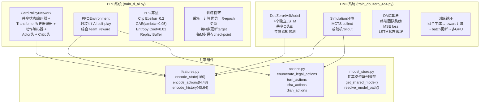

### 1.2 两套系统架构对比

| 维度 | PPO (CardPolicyNetwork) | DMC (DouZero4A4Model) |
|------|------------------------|----------------------|
| **算法类型** | PPO Actor-Critic | Deep Monte Carlo (Q-learning) |
| **网络结构** | 共享编码器 + Transformer + Actor/Critic头 | 4个独立LSTM + 共享Q头 |
| **输出** | 动作概率分布 + 状态价值 | 每个动作的Q值 |
| **探索方式** | 策略熵 + epsilon-greedy fallback | epsilon-greedy |
| **历史建模** | Transformer (40步历史) | LSTM隐藏状态 |
| **位置感知** | 否（统一模型） | 是（4个位置独立LSTM） |
| **奖励** | 即时团队奖励 + 终局奖励 | 仅终局团队奖励 |
| **训练效率** | 高（采样效率高） | 低（需要完整回合） |
| **参考来源** | 自研PPO实现 | 参考DouZero (Kwai) |

---

## 2. CardPolicyNetwork (PPO Actor-Critic) 详细结构

### 2.1 网络架构图

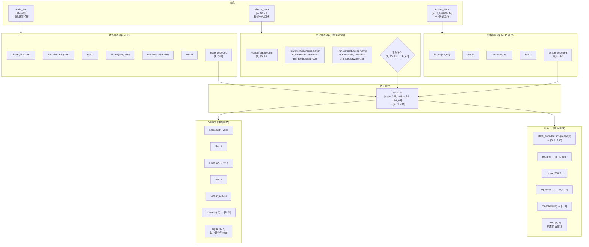

### 2.2 数据流维度变换表

| 层 | 输入维度 | 输出维度 | 操作 |
|----|---------|---------|------|
| `state_vec` | `[B, 160]` | `[B, 160]` | 原始输入 |
| `Linear(160→256)` | `[B, 160]` | `[B, 256]` | 全连接 |
| `BatchNorm1d(256)` | `[B, 256]` | `[B, 256]` | 批归一化 |
| `ReLU` | `[B, 256]` | `[B, 256]` | 激活 |
| `Linear(256→256)` | `[B, 256]` | `[B, 256]` | 全连接 |
| `BatchNorm1d(256)` | `[B, 256]` | `[B, 256]` | 批归一化 |
| `ReLU` | `[B, 256]` | `[B, 256]` | 激活 |
| `history_vecs` | `[B, 40, 64]` | `[B, 40, 64]` | 原始输入 |
| `PositionalEncoding` | `[B, 40, 64]` | `[B, 40, 64]` | 位置编码(加法) |
| `TransformerLayer×2` | `[B, 40, 64]` | `[B, 40, 64]` | 自注意力 |
| `mean(dim=1)` | `[B, 40, 64]` | `[B, 64]` | 平均池化 |
| `action_vecs` | `[B, N, 48]` | `[B, N, 48]` | 原始输入 |
| `Linear(48→64)` | `[B, N, 48]` | `[B, N, 64]` | 全连接(共享) |
| `ReLU` | `[B, N, 64]` | `[B, N, 64]` | 激活 |
| `Linear(64→64)` | `[B, N, 64]` | `[B, N, 64]` | 全连接(共享) |
| `ReLU` | `[B, N, 64]` | `[B, N, 64]` | 激活 |
| `torch.cat` | `[B,256]+[B,N,64]+[B,64]` | `[B, N, 384]` | 拼接(广播) |
| `Linear(384→256)` | `[B, N, 384]` | `[B, N, 256]` | Actor全连接 |
| `ReLU` | `[B, N, 256]` | `[B, N, 256]` | 激活 |
| `Linear(256→128)` | `[B, N, 256]` | `[B, N, 128]` | Actor全连接 |
| `ReLU` | `[B, N, 128]` | `[B, N, 128]` | 激活 |
| `Linear(128→1)` | `[B, N, 128]` | `[B, N, 1]` | Actor输出 |
| `squeeze(-1)` | `[B, N, 1]` | `[B, N]` | 压缩维度 |
| **最终输出** | | | |
| `logits` | | `[B, N]` | 每个动作的logit |
| `value` | | `[B, 1]` | 状态价值估计 |

### 2.3 forward_actor_critic 详细流程

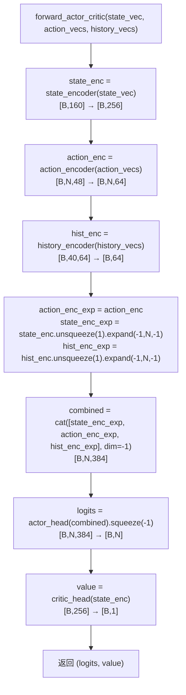

### 2.4 __init__ 构造函数参数

| 参数 | 默认值 | 含义 |
|------|--------|------|
| `state_dim` | 160 | 状态特征向量维度 |
| `action_dim` | 48 | 单个动作特征向量维度 |
| `history_dim` | 64 | 历史每一步特征向量维度 |
| `history_len` | 40 | 保留的历史步数 |
| `hidden_dim` | 256 | 隐藏层维度 |
| `nhead` | 4 | Transformer多头注意力头数 |
| `num_transformer_layers` | 2 | Transformer编码器层数 |

---

## 3. DouZero4A4Model (DMC LSTM-Q) 详细结构

### 3.1 网络架构图

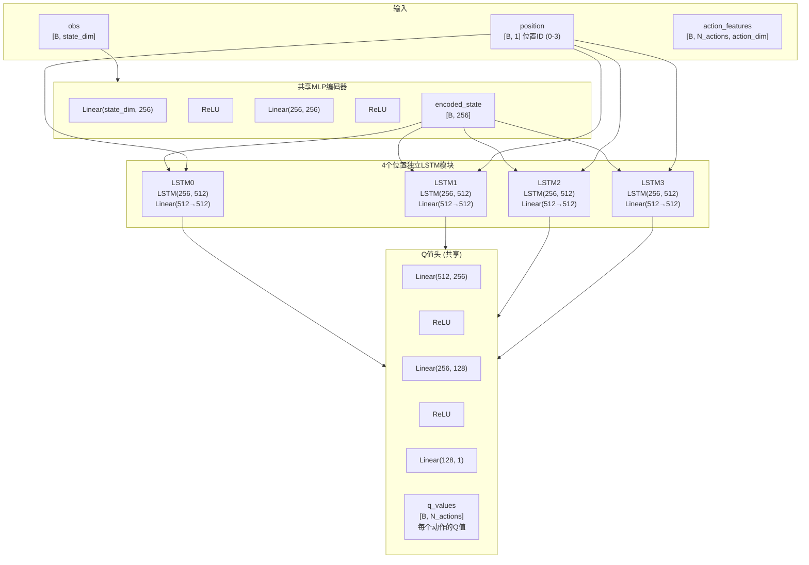

### 3.2 forward 详细流程

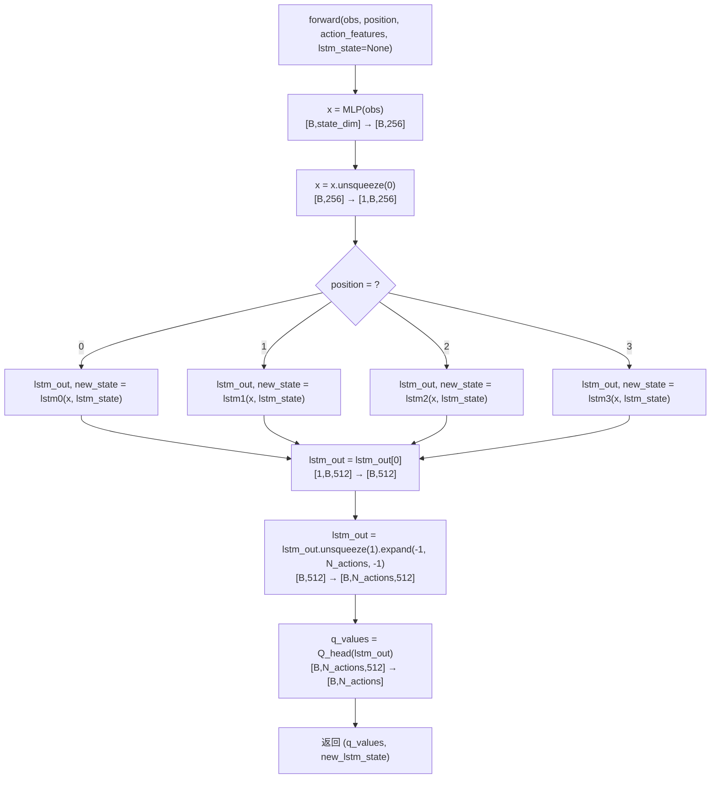

### 3.3 数据流维度变换表

| 层 | 输入维度 | 输出维度 | 操作 |
|----|---------|---------|------|
| `obs` | `[B, state_dim]` | `[B, state_dim]` | 原始输入 |
| `Linear(state_dim→256)` | `[B, state_dim]` | `[B, 256]` | 全连接 |
| `ReLU` | `[B, 256]` | `[B, 256]` | 激活 |
| `Linear(256→256)` | `[B, 256]` | `[B, 256]` | 全连接 |
| `ReLU` | `[B, 256]` | `[B, 256]` | 激活 |
| `unsqueeze(0)` | `[B, 256]` | `[1, B, 256]` | 添加时间步 |
| `LSTM(256→512)` | `[1, B, 256]` | `[1, B, 512]` | LSTM前向 |
| `squeeze(0)` | `[1, B, 512]` | `[B, 512]` | 移除时间步 |
| `unsqueeze(1)+expand` | `[B, 512]` | `[B, N, 512]` | 广播 |
| `Linear(512→256)` | `[B, N, 512]` | `[B, N, 256]` | Q头全连接 |
| `ReLU` | `[B, N, 256]` | `[B, N, 256]` | 激活 |
| `Linear(256→128)` | `[B, N, 256]` | `[B, N, 128]` | Q头全连接 |
| `ReLU` | `[B, N, 128]` | `[B, N, 128]` | 激活 |
| `Linear(128→1)` | `[B, N, 128]` | `[B, N, 1]` | Q头输出 |
| `squeeze(-1)` | `[B, N, 1]` | `[B, N]` | 压缩维度 |
| **最终输出** | | | |
| `q_values` | | `[B, N]` | 每个动作的Q值 |
| `lstm_state` | | `(h, c)` | LSTM隐藏状态元组 |

### 3.4 位置感知LSTM机制

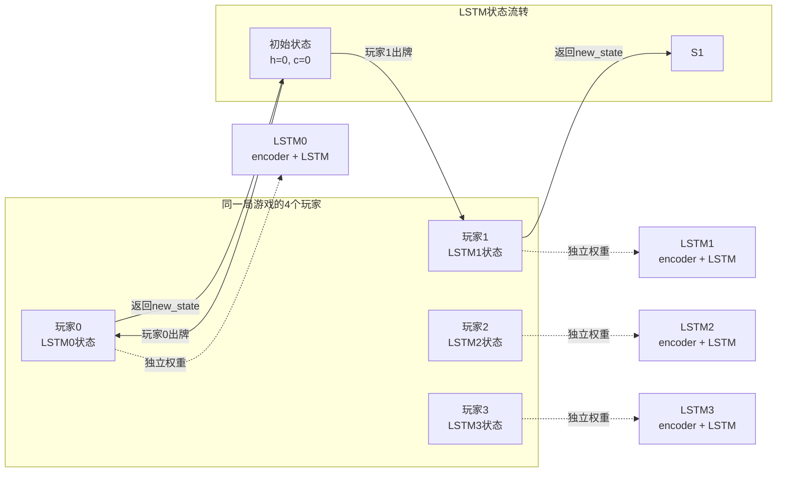

---

## 4. 特征编码系统详解

### 4.1 状态编码 (encode_state)

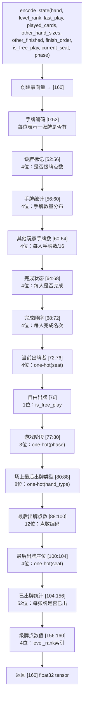

### 4.2 动作编码 (encode_action)

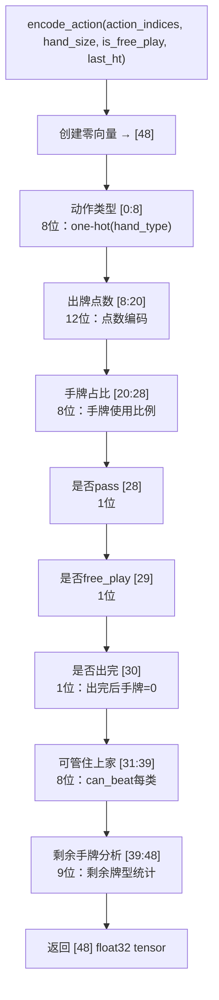

### 4.3 历史编码 (encode_history)

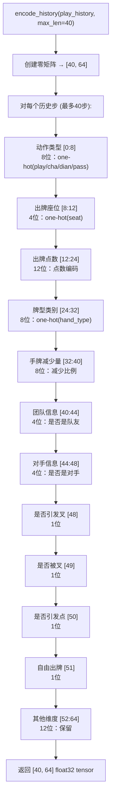

### 4.4 函数清单

| 函数 | 位置 | 签名 | 职责 |
|------|------|------|------|
| `encode_state(hand, level_rank, last_play, played_cards, other_hand_sizes, other_finished, finish_order, is_free_play, current_seat, phase)` | rl/features.py | `def encode_state(...)` | 编码当前游戏局面为160维向量 |
| `encode_action(action_indices, hand_size, is_free_play, last_ht)` | rl/features.py | `def encode_action(...)` | 编码单个候选动作→48维向量 |
| `encode_actions(action_list, hand_size, is_free_play, last_ht)` | rl/features.py | `def encode_actions(...)` | 批量编码候选动作→[N,48] |
| `encode_history(play_history, max_len=40)` | rl/features.py | `def encode_history(play_history, max_len=40)` | 编码出牌历史→[40,64] |
| `_encode_cards_onehot(cards)` | rl/features.py | `def _encode_cards_onehot(cards)` | 手牌→52位one-hot编码 |
| `_encode_rank(rank)` | rl/features.py | `def _encode_rank(rank)` | 点数→12位编码 |
| `_encode_hand_type(ht)` | rl/features.py | `def _encode_hand_type(ht)` | 牌型→8位one-hot编码 |
| `_encode_phase(phase)` | rl/features.py | `def _encode_phase(phase)` | 游戏阶段→3位one-hot编码 |

---

## 5. 动作空间与合法动作枚举

### 5.1 动作枚举完整流程

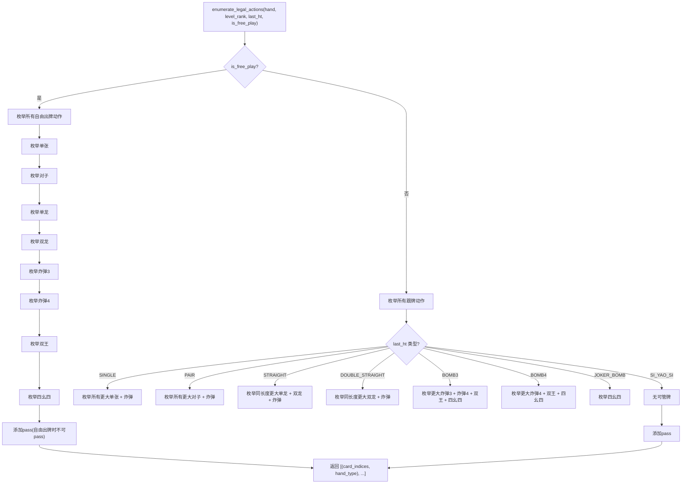

### 5.2 动作空间大小分析

| 场景 | 典型动作数 | 最小 | 最大 |
|------|-----------|------|------|
| 自由出牌（满手牌） | 15-25 | 5 | 40+ |
| 跟牌（大牌在手） | 5-10 | 1 | 20+ |
| 跟牌（无牌可出） | 1 | 1 | 1 |
| 平均每步 | 8-12 | 1 | 40+ |

### 5.3 函数清单

| 函数 | 位置 | 签名 | 职责 |
|------|------|------|------|
| `enumerate_legal_actions(hand, level_rank, last_ht, is_free_play)` | rl/actions.py | `def enumerate_legal_actions(...)` | 枚举所有合法动作（出牌+pass） |
| `_enumerate_free_actions(hand, level_rank)` | rl/actions.py | `def _enumerate_free_actions(...)` | 枚举自由出牌时所有合法出牌 |
| `_enumerate_beat_actions(hand, level_rank, last_ht)` | rl/actions.py | `def _enumerate_beat_actions(...)` | 枚举跟牌时所有合法出牌 |
| `_enumerate_singles(hand)` | rl/actions.py | `def _enumerate_singles(hand)` | 枚举所有单张出牌 |
| `_enumerate_pairs(hand)` | rl/actions.py | `def _enumerate_pairs(hand)` | 枚举所有对子出牌 |
| `_enumerate_straights(hand, level_rank)` | rl/actions.py | `def _enumerate_straights(...)` | 枚举所有单龙出牌 |
| `_enumerate_double_straights(hand, level_rank)` | rl/actions.py | `def _enumerate_double_straights(...)` | 枚举所有双龙出牌 |
| `_enumerate_bombs3(hand)` | rl/actions.py | `def _enumerate_bombs3(hand)` | 枚举所有炸弹3出牌 |
| `_enumerate_bombs4(hand)` | rl/actions.py | `def _enumerate_bombs4(hand)` | 枚举所有炸弹4出牌 |
| `_enumerate_joker_bomb(hand)` | rl/actions.py | `def _enumerate_joker_bomb(hand)` | 检查双王出牌 |
| `_enumerate_si_yao_si(hand)` | rl/actions.py | `def _enumerate_si_yao_si(hand)` | 检查四幺四出牌 |

---

## 6. PPO训练流程详解

### 6.1 训练主循环

```mermaid
flowchart TD
    START(["train_rl_ai.py main()"]) --> INIT["初始化"]
    INIT --> I1["创建 CardPolicyNetwork"]
    I1 --> I2["创建 optimizer (Adam, lr=3e-4)"]
    I2 --> I3["创建 PPOEnvironment (4个AI)"]
    I3 --> I4["加载 checkpoint (如果有)"]

    I4 --> LOOP["训练循环 (for episode in range(max_episodes))"]
    LOOP --> COLLECT["采集阶段"]
    COLLECT --> C1["env.reset()"]
    C1 --> C2["for step in range(horizon):"]
    C2 --> C3["对每个活跃AI并行推理"]
    C3 --> C4["获取 logits, value"]
    C4 --> C5["计算概率分布 softmax(logits)"]
    C5 --> C6["采样动作 (categorical)"]
    C6 --> C7["env.step(action) → reward, next_state, done"]
    C7 --> C8["存入 replay buffer"]
    C8 --> C9{"done?"}
    C9 -->|否| C2
    C9 -->|是| UPDATE["更新阶段"]

    UPDATE --> U1["计算 GAE 优势估计"]
    U1 --> U2["计算 returns = advantages + values"]
    U2 --> U3["for epoch in range(ppo_epochs):"]
    U3 --> U4["从 buffer 抽样 mini-batch"]
    U4 --> U5["前向传播: logits, values"]
    U5 --> U6["计算新概率分布"]
    U6 --> U7["计算 ratio = π_new / π_old"]
    U7 --> U8["计算 clipped surrogate objective"]
    U8 --> U9["计算 value_loss = MSE(returns, values)"]
    U9 --> U10["计算 entropy_loss"]
    U10 --> U11["total_loss = policy_loss + vf_coef*value_loss - ent_coef*entropy"]
    U11 --> U12["反向传播 + optimizer.step()"]
    U12 --> U3

    U12 --> LOG["记录日志"]
    LOG --> SAVE{"每 save_interval 步?"}
    SAVE -->|是| S1["保存 checkpoint"]
    SAVE -->|否| LOOP
    S1 --> LOOP
```

### 6.2 PPO损失函数详解

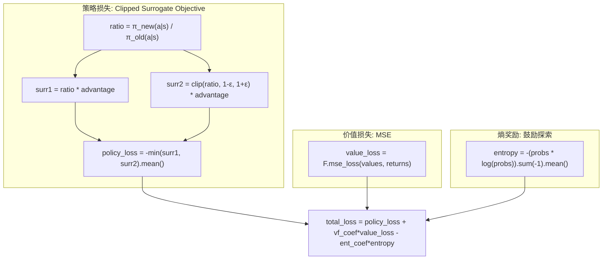

### 6.3 GAE优势估计

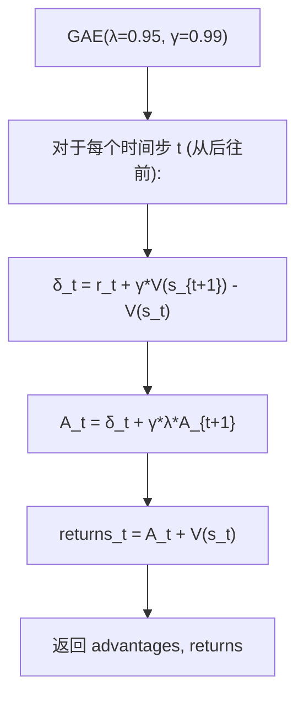

### 6.4 PPO超参数

| 参数 | 默认值 | 含义 |
|------|--------|------|
| `lr` | 3e-4 | 学习率 |
| `gamma` | 0.99 | 折扣因子 |
| `gae_lambda` | 0.95 | GAE λ参数 |
| `clip_epsilon` | 0.2 | PPO裁剪范围 |
| `ppo_epochs` | 10 | 每次更新迭代次数 |
| `batch_size` | 64 | mini-batch大小 |
| `horizon` | 2048 | 每轮采集步数 |
| `vf_coef` | 0.5 | 价值损失系数 |
| `ent_coef` | 0.01 | 熵系数 |
| `max_grad_norm` | 0.5 | 梯度裁剪阈值 |

---

## 7. DMC训练流程详解

### 7.1 训练主循环

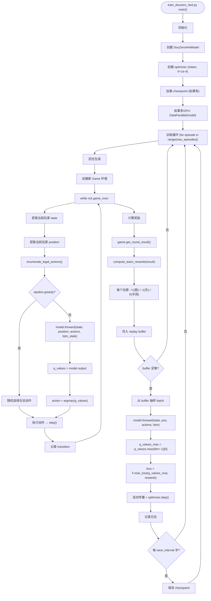

### 7.2 DMC损失函数

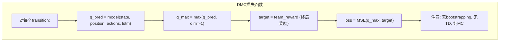

### 7.3 DMC超参数

| 参数 | 默认值 | 含义 |
|------|--------|------|
| `lr` | 1e-4 | 学习率 |
| `batch_size` | 256 | mini-batch大小 |
| `replay_buffer_size` | 100000 | 回放缓冲区大小 |
| `epsilon_start` | 1.0 | 初始探索率 |
| `epsilon_end` | 0.05 | 最终探索率 |
| `epsilon_decay` | 0.9999 | 探索率衰减 |
| `min_buffer_for_train` | 5000 | 开始训练的最小样本数 |

---

## 8. 奖励系统详解

### 8.1 PPO即时奖励

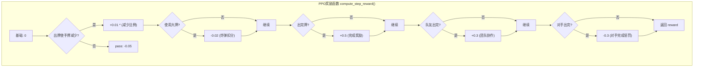

### 8.2 DMC终局团队奖励

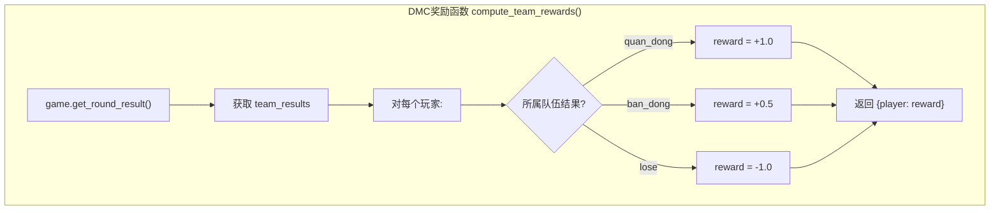

### 8.3 奖励设计对比

| 维度 | PPO | DMC |
|------|-----|-----|
| 奖励类型 | 稠密即时奖励 | 稀疏终局奖励 |
| 信号频率 | 每步 | 每局结束 |
| 奖励范围 | [-0.3, 0.5+] | [-1, +1] |
| 团队信号 | 包含(队友/对手) | 包含(队伍结果) |
| 中间信号 | 手牌减少、大牌惩罚 | 无 |
| 信用分配 | 即时+GAE | 仅终局(无中间分配) |

---

## 9. 自对弈与模型共享

### 9.1 PPO自对弈架构

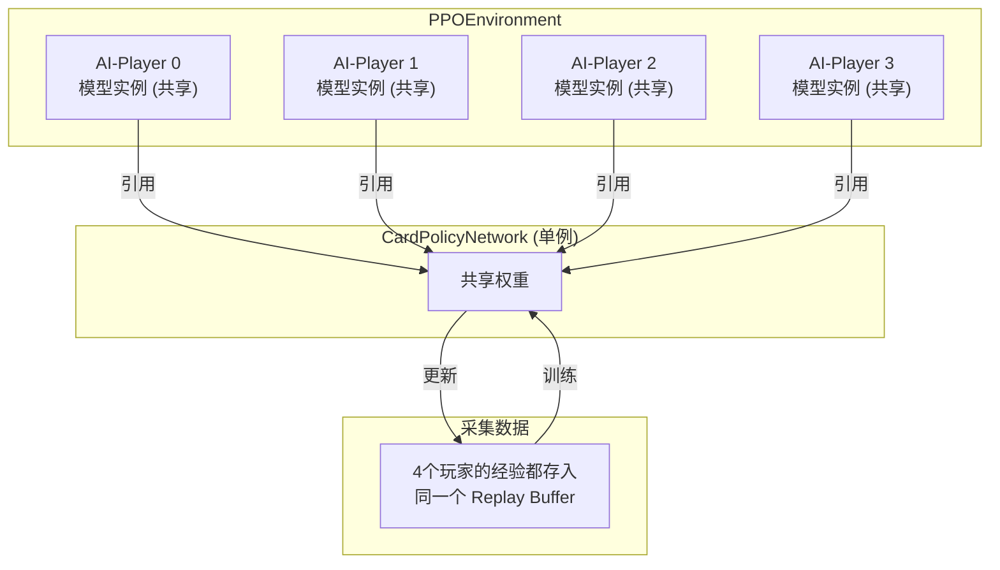

### 9.2 模型checkpoint管理

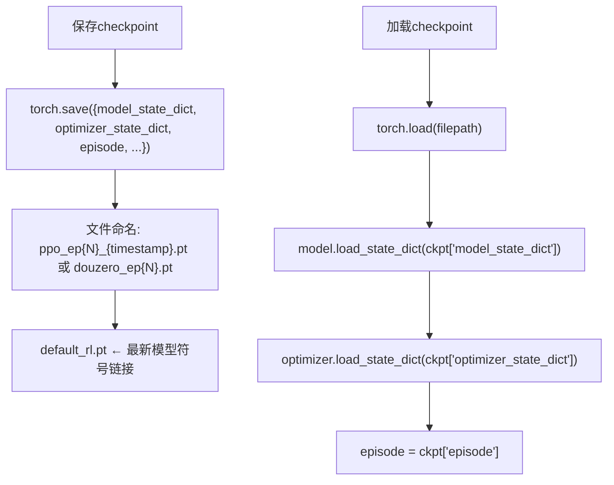

---

## 10. 模型部署与推理

### 10.1 NeuralPolicy推理流程

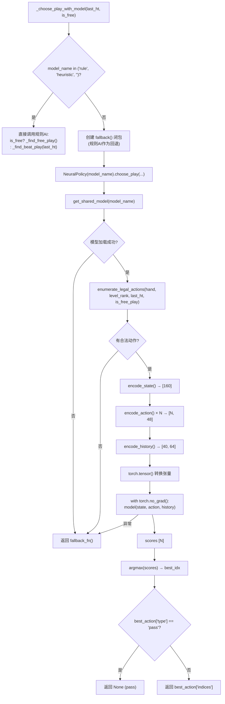

### 10.2 model_store单例缓存

```mermaid
flowchart TD
    GET["get_shared_model(model_name='default_rl')"] --> P1["resolve_model_path(model_name)"]
    P1 --> P2{"model_name 为空/rule/heuristic?"}
    P2 -->|是| P3["返回 None (不加载模型)"]
    P2 -->|否| P4{"model_name 是绝对路径?"}
    P4 -->|是| P5["直接使用该路径"]
    P4 -->|否| P6{"以 .pt/.pth 结尾?"}
    P6 -->|是| P7["join(checkpoints_dir, basename)"]
    P6 -->|否| P8["join(checkpoints_dir, model_name+.pt)"]
    P5 --> P9["cache_key = os.path.abspath(model_path)"]
    P7 --> P9
    P8 --> P9
    P9 --> P10["with _cache_lock:"]
    P10 --> P11{"cache_key in _model_cache?"}
    P11 -->|是| P12["返回缓存模型 (单例)"]
    P11 -->|否| P13["model = CardPolicyNetwork()"]
    P13 --> P14{"权重文件存在?"}
    P14 -->|否| P15["eval()后存入缓存, 返回"]
    P14 -->|是| P16["load_state_dict (兼容部分加载)"]
    P16 --> P15
```

---

## 11. 函数清单

### 11.1 rl/model.py

| 函数 | 签名 | 职责 | 输入/输出维度 |
|------|------|------|-------------|
| `CardPolicyNetwork.__init__` | `def __init__(self, state_dim=160, action_dim=48, history_dim=64, history_len=40, hidden_dim=256, nhead=4, num_transformer_layers=2)` | 构建完整Actor-Critic网络 | - |
| `forward` | `def forward(self, state_vec, action_vecs, history_vecs=None)` | 兼容旧推理接口：返回logits | ([B,160],[B,N,48],[B,40,64]) → [B,N] |
| `forward_actor_critic` | `def forward_actor_critic(self, state_vec, action_vecs, history_vecs)` | 前向传播：计算logits和value | ([B,160],[B,N,48],[B,40,64]) → ([B,N],[B,1]) |
| `forward_actor` | `def forward_actor(self, state_vec, action_vecs, history_vecs)` | 仅策略网络前向 | ([B,160],[B,N,48],[B,40,64]) → [B,N] |
| `forward_critic` | `def forward_critic(self, state_vec)` | 仅价值网络前向 | [B,160] → [B,1] |
| `get_action` | `def get_action(self, state_vec, action_vecs, history_vecs, deterministic=False)` | 获取动作（采样/贪心） | 输入同上 → (action_idx, log_prob, value) |
| `evaluate_actions` | `def evaluate_actions(self, state_vec, action_vecs, history_vecs, action_indices)` | 评估特定动作的log_prob和熵 | 输入同上+索引 → (log_probs, values, entropy) |

### 11.2 douzero_4a4/model.py

| 函数 | 签名 | 职责 | 输入/输出维度 |
|------|------|------|-------------|
| `DouZero4A4Model.__init__` | `def __init__(self, state_dim, action_dim, hidden_dim=256, lstm_hidden=512)` | 构建4个LSTM+Q头网络 | - |
| `forward` | `def forward(self, obs, position, action_features, lstm_state=None)` | 前向传播：计算Q值 | ([B,S],[B,1],[B,N,A],lstm) → ([B,N], lstm_state) |
| `get_lstm_state` | `def get_lstm_state(self, position)` | 获取指定位置的LSTM状态 | position → (h, c) |
| `set_lstm_state` | `def set_lstm_state(self, position, state)` | 设置指定位置的LSTM状态 | position, (h,c) → None |
| `reset_lstm_state` | `def reset_lstm_state(self, position=None)` | 重置LSTM状态 | position(可选) → None |

### 11.3 rl/policy.py

| 函数 | 签名 | 职责 |
|------|------|------|
| `NeuralPolicy.__init__` | `def __init__(self, model_name='default_rl')` | 初始化策略：通过 model_store 获取共用模型单例 |
| `choose_play` | `def choose_play(self, state, hand, level_rank, seat, last_ht, is_free_play, fallback_fn)` | 决策出牌：枚举合法动作→编码→模型推理→argmax→返回牌索引；失败时调用fallback_fn回退规则AI |

### 11.4 rl/model_store.py

| 函数 | 签名 | 职责 |
|------|------|------|
| `get_shared_model` | `def get_shared_model(model_name='default_rl')` | 获取共享模型实例：线程安全(_model_cache + _cache_lock)，同路径只加载一次 |
| `resolve_model_path` | `def resolve_model_path(model_name=None)` | 解析模型名称到权重文件路径；空名称/rule/heuristic 返回None（不加载模型） |
| `clear_model_cache` | `def clear_model_cache()` | 手动清空模型缓存（训练/调试时使用） |
| `cached_model_count` | `def cached_model_count()` | 返回当前进程内已加载模型数量 |

### 11.5 scripts/train_rl_ai.py

| 函数 | 签名 | 职责 |
|------|------|------|
| `main` | `def main()` | PPO训练入口 |
| `train` | `def train()` | PPO训练主循环 |
| `collect_rollouts` | `def collect_rollouts(env, model, buffer, horizon)` | 采集rollout数据 |
| `compute_gae` | `def compute_gae(rewards, values, dones, gamma, lam)` | 计算GAE优势 |
| `update_policy` | `def update_policy(model, optimizer, buffer, ppo_epochs, batch_size, clip_eps, vf_coef, ent_coef)` | PPO策略更新 |
| `save_checkpoint` | `def save_checkpoint(model, optimizer, episode, path)` | 保存checkpoint |
| `load_checkpoint` | `def load_checkpoint(path, model, optimizer)` | 加载checkpoint |

### 11.6 scripts/train_douzero_4a4.py

| 函数 | 签名 | 职责 |
|------|------|------|
| `main` | `def main()` | DMC训练入口 |
| `train` | `def train()` | DMC训练主循环 |
| `generate_episode` | `def generate_episode(model, env, epsilon)` | 生成一个完整回合 |
| `compute_rewards` | `def compute_rewards(game_result)` | 计算终局团队奖励 |
| `update_model` | `def update_model(model, optimizer, replay_buffer, batch_size)` | 模型更新 |
| `save_checkpoint` | `def save_checkpoint(model, optimizer, episode, path)` | 保存checkpoint |
| `load_checkpoint` | `def load_checkpoint(path, model, optimizer)` | 加载checkpoint |

### 11.7 douzero_4a4/rewards.py

| 函数 | 签名 | 职责 |
|------|------|------|
| `compute_team_rewards` | `def compute_team_rewards(round_result)` | 根据终局结果计算每个玩家的奖励 |
| `get_reward_for_player` | `def get_reward_for_player(player_seat, team_results)` | 获取单个玩家的奖励 |

---

## 附录A: 训练日志示例

### A.1 健康的PPO训练日志

```
[Episode 1000] avg_reward: -0.12 | policy_loss: 0.0234 | value_loss: 0.1567 | entropy: 2.34 | avg_ep_len: 45.2
[Episode 2000] avg_reward: -0.05 | policy_loss: 0.0189 | value_loss: 0.1321 | entropy: 2.21 | avg_ep_len: 42.8
[Episode 5000] avg_reward: 0.03  | policy_loss: 0.0142 | value_loss: 0.0987 | entropy: 2.05 | avg_ep_len: 38.1
[Episode 10000] avg_reward: 0.15 | policy_loss: 0.0098 | value_loss: 0.0723 | entropy: 1.89 | avg_ep_len: 34.5
[Episode 20000] avg_reward: 0.28 | policy_loss: 0.0067 | value_loss: 0.0512 | entropy: 1.72 | avg_ep_len: 30.2
```

### A.2 健康的DMC训练日志

```
[Episode 1000] win_rate: 0.48 | avg_q: 0.12 | loss: 0.5234 | epsilon: 0.95 | buffer: 5230
[Episode 5000] win_rate: 0.52 | avg_q: 0.23 | loss: 0.4123 | epsilon: 0.78 | buffer: 25000
[Episode 10000] win_rate: 0.56 | avg_q: 0.38 | loss: 0.3215 | epsilon: 0.45 | buffer: 50000
[Episode 20000] win_rate: 0.62 | avg_q: 0.51 | loss: 0.2456 | epsilon: 0.12 | buffer: 100000
[Episode 50000] win_rate: 0.71 | avg_q: 0.67 | loss: 0.1876 | epsilon: 0.05 | buffer: 100000
```

### A.3 异常训练日志警示

```
[Episode 5000] avg_reward: -0.45 | policy_loss: 0.0012 | value_loss: 0.4521 | entropy: 0.12 | avg_ep_len: 12.3
  ↑ 熵太低 → 策略已崩溃，过早收敛
[Episode 10000] avg_reward: -0.50 | policy_loss: 0.0001 | value_loss: 0.8912 | entropy: 0.01 | avg_ep_len: 8.1
  ↑ 完全崩溃，需要增大ent_coef
[Episode 5000] win_rate: 0.33 | avg_q: 0.89 | loss: 0.0234 | epsilon: 0.05 | buffer: 5000
  ↑ Q值过高 → 过估计问题，buffer太小
[Episode 20000] win_rate: 0.50 | avg_q: 0.01 | loss: 0.0012 | epsilon: 0.05 | buffer: 100000
  ↑ Q值趋近0 → 梯度消失，学习率太低或模型容量不足
```

---

## 附录B: 文件索引

| 文件 | 路径 | 职责 |
|------|------|------|
| `rl/model.py` | `d:\workspace\4A4\rl\model.py` | CardPolicyNetwork定义 |
| `rl/features.py` | `d:\workspace\4A4\rl\features.py` | 特征编码 |
| `rl/actions.py` | `d:\workspace\4A4\rl\actions.py` | 合法动作枚举 |
| `rl/policy.py` | `d:\workspace\4A4\rl\policy.py` | NeuralPolicy决策器 |
| `rl/model_store.py` | `d:\workspace\4A4\rl\model_store.py` | 模型单例缓存 |
| `douzero_4a4/model.py` | `d:\workspace\4A4\douzero_4a4\model.py` | DouZero4A4Model |
| `douzero_4a4/rewards.py` | `d:\workspace\4A4\douzero_4a4\rewards.py` | 奖励函数 |
| `scripts/train_rl_ai.py` | `d:\workspace\4A4\scripts\train_rl_ai.py` | PPO训练 |
| `scripts/train_douzero_4a4.py` | `d:\workspace\4A4\scripts\train_douzero_4a4.py` | DMC训练 |