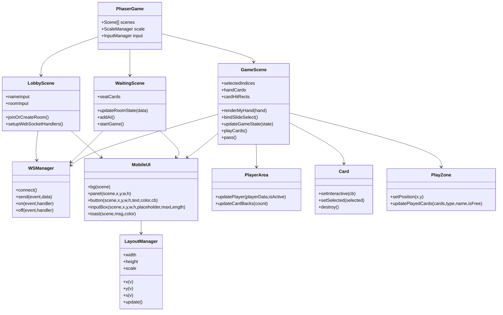
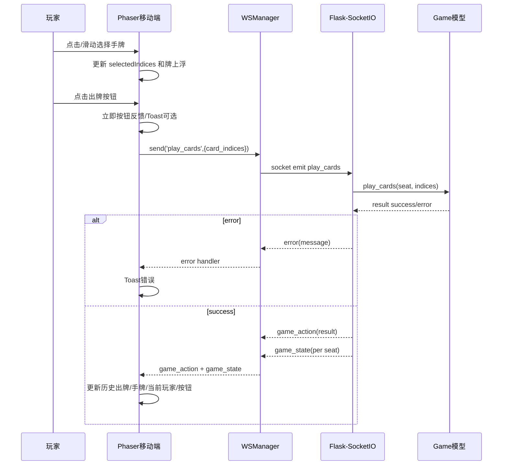
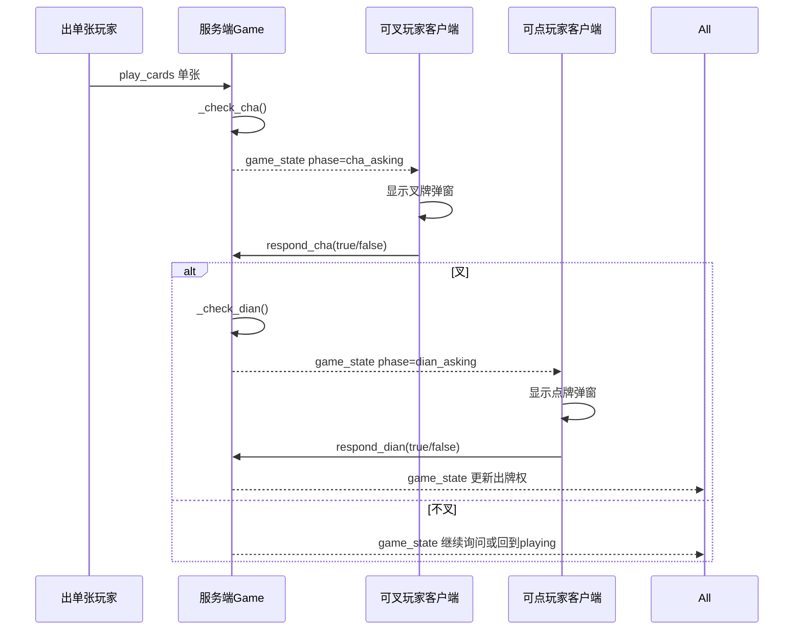

# 四幺四移动端纸牌游戏前端设计文档

## 1. 目标

移动端版本不是桌面版缩放，而是面向手机横屏的纸牌游戏客户端。核心目标：

1. 强制横屏体验，牌桌、手牌、操作按钮、历史出牌互不遮挡。
2. 使用 Phaser 3 作为游戏引擎，所有游戏显示、触控、按钮、弹窗、手牌选择、日志、状态反馈都由引擎托管。
3. 仅系统输入法例外：昵称和房间号需要触发手机系统 IME，因此使用一个隐藏原生 input 作为文本输入桥。焦点、显示、提交、状态仍由 Phaser 输入框管理。
4. 前端不复制服务端规则判定，只做合法操作入口和状态呈现。出牌合法性、叉/点、胜负结算由服务端权威处理。
5. 移动端牌要足够大，手牌区高度至少为横屏逻辑高度的 1/4。
6. 支持点击选牌、滑动批量选牌、从已选牌开始滑动批量取消。
7. 按钮点击必须即时反馈，不能等网络响应才给用户反馈。
8. 使用矢量绘制和百分比/逻辑坐标布局，减少模糊和不同屏幕适配问题。

## 2. 游戏引擎选择

选择 Phaser 3。

原因：

- 已经在项目中引入，无需引入新依赖。
- Canvas/WebGL 渲染适合纸牌、头像、桌面、动画和触控热区。
- 支持多指针、pointerdown/pointermove/pointerup，适合滑动选牌。
- 支持 Scale Manager，可结合逻辑坐标实现跨屏幕适配。
- 支持 Graphics 矢量绘制，避免依赖位图素材导致缩放模糊。
- 支持 Scene 生命周期，适合大厅、等待房间、牌局三阶段。

## 3. 非引擎例外：系统输入法桥

手机浏览器不能通过 Canvas 直接唤起系统输入法。因此昵称/房间号输入采用 `NativeImeBridge`：

- Phaser 输入框负责外观、点击区域、焦点反馈和文本显示。
- 点击 Phaser 输入框时，移动一个透明原生 input 到相同屏幕位置并 focus。
- 原生 input 的 input 事件同步到 Phaser 输入框。
- blur 或离开场景时隐藏/销毁原生 input。

这不违反“游戏操作由引擎托管”的原则，因为输入动作和业务状态仍由 Phaser 管理，原生 input 只是系统输入法能力桥。

## 4. 逻辑坐标与自适应

采用横屏逻辑画布：

- 逻辑宽度：1334
- 逻辑高度：750
- 手牌区：y=520 到 y=740，高度 220，占 29.3%
- 牌桌区：y=86 到 y=500
- 顶部 HUD：y=18 到 y=76
- 操作按钮区：右下侧 x=1145 到 1310，避开手牌主体

`LayoutManager` 负责把逻辑坐标转换到实际屏幕：

- `x(percentOrDesignX)`：逻辑 x 到真实像素。
- `y(percentOrDesignY)`：逻辑 y 到真实像素。
- `s(size)`：逻辑尺寸到真实像素。
- 输出做整数像素对齐，减少半像素模糊。

## 5. 前端模块职责

## 6. 服务端权威事件

前端发送：

- `join_room`：加入房间。
- `add_ai`：补齐 AI。
- `start_game`：开始/下一局。
- `play_cards`：出牌，参数 `card_indices`。
- `pass_turn`：不出。
- `respond_cha`：响应叉。
- `respond_dian`：响应点。

前端接收：

- `joined`：进入等待房间。
- `room_state`：等待房间状态。
- `game_action`：游戏动作日志/开始。
- `game_state`：玩家视角状态。
- `round_end`：结算。
- `error`：错误提示。

## 7. 牌局主时序

## 8. 叉/点时序

## 9. 移动纸牌 UI 规范

1. 顶部 HUD 只显示轻量状态，不放操作按钮。
2. 玩家头像贴边，历史出牌显示在最后出牌玩家头像附近。
3. 手牌位于底部，手牌高度不低于横屏高度的 1/4。
4. 出牌/不出按钮固定右下，不能盖住手牌。
5. 点/叉/结算弹窗居中，使用遮罩暂停下层操作。
6. 日志默认隐藏，右上角抽屉按钮展开。
7. 按钮用 `pointerdown` 立即触发，必须有缩放/透明度/震动反馈。
8. 牌的触控热区大于视觉牌面，适合拇指操作。
9. 滑动选择模式：从未选牌开始为批量选中，从已选牌开始为批量取消。

## 10. 自审与修正

### 问题 1：完全禁用 DOM 是否会导致无法输入中文？

结论：会。Canvas 不能直接唤起系统 IME。修正：允许隐藏原生 input 作为 `NativeImeBridge`，但业务和显示仍由 Phaser 托管。

### 问题 2：前端是否应该判断牌型合法？

结论：不应该做权威判断，否则和服务端规则不一致。修正：前端只检查“是否选择了牌”“是否当前轮到我”等弱提示，合法性由服务端返回。

### 问题 3：滑动选牌是否会误触按钮？

结论：如果手牌区和按钮区重叠会误触。修正：手牌主体限制在 x=180..1110，按钮放在 x=1165..1295；滑动只在 handZone 内启动。

### 问题 4：历史出牌固定中间是否符合手机纸牌习惯？

结论：不符合，且会遮挡牌桌。修正：历史出牌跟随最后出牌玩家位置。

### 问题 5：大牌是否会导致 27 张牌横向放不下？

结论：会。修正：手牌视觉牌面放大，横向间距动态压缩，触控热区独立放大；必要时牌重叠，但按最上层命中。

### 问题 6：按钮立即触发是否会重复发送？

结论：可能。修正：按钮内部 `isDown` 锁防止同一次按下重复触发；业务按钮也可在发送后禁用等待状态刷新。

### 问题 7：画面模糊仅靠 devicePixelRatio 是否足够？

结论：不够。修正：矢量绘制、整数像素对齐、逻辑坐标映射、避免半像素文字和线条。

## 11. 实施检查清单

- [ ] 大厅输入框可唤起系统输入法。
- [ ] 创建/加入房间按钮按下立即反馈。
- [ ] 等待房间 AI/开始按钮立即反馈。
- [ ] 游戏中手牌高度 >= 187.5 逻辑像素。
- [ ] 点击选牌可用。
- [ ] 滑动批量选择可用。
- [ ] 从已选牌开始滑动可批量取消。
- [ ] 历史出牌显示在最后出牌玩家附近。
- [ ] 叉/点弹窗只在对应询问玩家显示。
- [ ] 错误消息显示 Toast。
- [ ] 页面无控制台错误。
- [ ] 移动端路由 `/mobile` 可访问。
